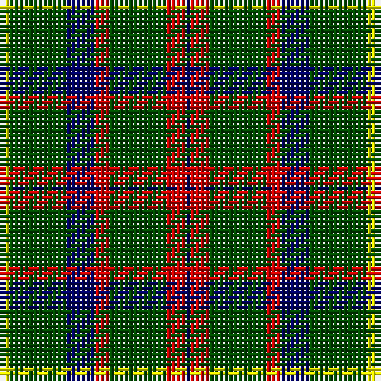

This page is one **sett** — a single exact thread-count. It belongs to the [tartan](/tartans/y2g12db6r3g12r4db1/)
(the same proportion at any scale), whose colour order is pattern [BRGRBGY](/stripes/brgrbgy/).

Sourced from weddslist.  It is a [7 stripe tartan](/stripes/stripes7/).

Original link http://www.weddslist.com/cgi-bin/tartans/pg.pl?source=rb

## Also known as

This cloth is also recorded under:

- MacKintosh Htg

2 attestations — the source records this cloth was collapsed from (oldest owns this page)

<ul>
<li>undated — MacKintosh Hunting (weddslist, <a href="http://www.weddslist.com/cgi-bin/tartans/pg.pl?source=rb">record</a>)</li>
<li>undated — MacKintosh Hunting (weddslist, <a href="http://www.weddslist.com/cgi-bin/tartans/pg.pl?source=x">record</a>)</li>
</ul>

## Thread count
Y/2 G12 DB6 R3 G12 R4 DB/1

## Palette
Each colour and the base-6 reference it is a variant of.

| Colour | Shade | Base |
|---|---|---|
| DB | <code style="background-color:#000064;">#000064</code> `oklch(22.7% 0.158 264.1)` <small>#000064</small> | B <code style="background-color:#2A418A;">#2A418A</code> |
| G | <code style="background-color:#004C00;">#004C00</code> `oklch(36.1% 0.123 142.5)` <small>#004C00</small> | G <code style="background-color:#006100;">#006100</code> |
| R | <code style="background-color:#C80000;">#C80000</code> `oklch(52.3% 0.215 29.2)` <small>#C80000</small> | R <code style="background-color:#CC0000;">#CC0000</code> |
| Y | <code style="background-color:#FFFF00;">#FFFF00</code> `oklch(96.8% 0.211 109.8)` <small>#FFFF00</small> | Y <code style="background-color:#F2BF00;">#F2BF00</code> |

# Sample pattern

## Nearest tartans

The nearest existing variants by ΔTartan distance, with this tartan at the top so the swatches line up against it.

ΔTartan

Tartan

Sett

—

<a href="/ttd/edit/#slug=ly2dg12db6r3dg12r4db1">MacKintosh Hunting</a> <a class="nn-out" href="/setts/s7/ly2dg12db6r3dg12r4db1/" title="open its dictionary page">↗</a>

0.99

<a href="/ttd/edit/#slug=dg3w5dg3t6dg5t1dg12r1~x2">Hasegawa (Akasaka) (Personal)</a> <a class="nn-out" href="/setts/s8/dg3w5dg3t6dg5t1dg12r1~x2/" title="open its dictionary page">↗</a>

1.00

<a href="/ttd/edit/#slug=ly2g12db6r3g12r4db1~x2">MacKintosh Hunting</a> <a class="nn-out" href="/setts/s7/ly2g12db6r3g12r4db1~x2/" title="open its dictionary page">↗</a>

1.00

<a href="/ttd/edit/#slug=dg3w1dg12r6dg3k3g2~x4">Arkansas</a> <a class="nn-out" href="/setts/s7/dg3w1dg12r6dg3k3g2~x4/" title="open its dictionary page">↗</a>

1.01

<a href="/ttd/edit/#slug=g6k16r3k16g28k4g12w3~x2">MacAulay of Lewis</a> <a class="nn-out" href="/setts/s8/g6k16r3k16g28k4g12w3~x2/" title="open its dictionary page">↗</a>

1.04

<a href="/ttd/edit/#slug=w2g12k3g3k16g3k3g12ly2~x2">MacIver Hunting</a> <a class="nn-out" href="/setts/s9/w2g12k3g3k16g3k3g12ly2~x2/" title="open its dictionary page">↗</a>

1.10

<a href="/ttd/edit/#slug=ly2dg12db6r3dg12r4db1~x2">MacKintosh Hunting</a> <a class="nn-out" href="/setts/s7/ly2dg12db6r3dg12r4db1~x2/" title="open its dictionary page">↗</a>

1.14

<a href="/ttd/edit/#slug=k36w3k10w3g28r6k18~x2">Wild Highlanders (Corporate)</a> <a class="nn-out" href="/setts/s7/k36w3k10w3g28r6k18~x2/" title="open its dictionary page">↗</a>

1.15

<a href="/ttd/edit/#slug=r3g10r3g14db16g3ly2~x2">Cameron of Lochiel (Hunting)</a> <a class="nn-out" href="/setts/s7/r3g10r3g14db16g3ly2~x2/" title="open its dictionary page">↗</a>

1.17

<a href="/ttd/edit/#slug=g5k15g5k15g19r2g13lb4~x2">Strath Hallidale (Fashion)</a> <a class="nn-out" href="/setts/s8/g5k15g5k15g19r2g13lb4~x2/" title="open its dictionary page">↗</a>

1.19

<a href="/ttd/edit/#slug=r3g30k12g6k16ly2~x2">MacArthur (Variant)</a> <a class="nn-out" href="/setts/s6/r3g30k12g6k16ly2~x2/" title="open its dictionary page">↗</a>

## Neighbour map

Every grey dot is one of 14299 variants placed by the first two principal components of the ΔTartan feature space (44% of its variance). Red is this tartan; blue dots are its nearest — click one to open its page.

<svg viewBox="0 0 640 380" role="img" style="max-width:100%;height:auto;border:1px solid #e0e0e0;border-radius:4px;display:block" xmlns="http://www.w3.org/2000/svg"><image href="/nn/cloud.v1.png" width="640" height="380"/><a href="/setts/s8/dg3w5dg3t6dg5t1dg12r1~x2/"><circle cx="312.0" cy="198.9" r="4" fill="#3465a4"><title>Hasegawa (Akasaka) (Personal)</title></circle></a><a href="/setts/s7/ly2g12db6r3g12r4db1~x2/"><circle cx="322.7" cy="216.9" r="4" fill="#3465a4"><title>MacKintosh Hunting</title></circle></a><a href="/setts/s7/dg3w1dg12r6dg3k3g2~x4/"><circle cx="295.0" cy="190.5" r="4" fill="#3465a4"><title>Arkansas</title></circle></a><a href="/setts/s8/g6k16r3k16g28k4g12w3~x2/"><circle cx="280.1" cy="221.8" r="4" fill="#3465a4"><title>MacAulay of Lewis</title></circle></a><a href="/setts/s9/w2g12k3g3k16g3k3g12ly2~x2/"><circle cx="273.8" cy="205.1" r="4" fill="#3465a4"><title>MacIver Hunting</title></circle></a><a href="/setts/s7/ly2dg12db6r3dg12r4db1~x2/"><circle cx="334.5" cy="226.4" r="4" fill="#3465a4"><title>MacKintosh Hunting</title></circle></a><a href="/setts/s7/k36w3k10w3g28r6k18~x2/"><circle cx="329.2" cy="209.0" r="4" fill="#3465a4"><title>Wild Highlanders (Corporate)</title></circle></a><a href="/setts/s7/r3g10r3g14db16g3ly2~x2/"><circle cx="260.0" cy="224.9" r="4" fill="#3465a4"><title>Cameron of Lochiel (Hunting)</title></circle></a><a href="/setts/s8/g5k15g5k15g19r2g13lb4~x2/"><circle cx="279.5" cy="238.2" r="4" fill="#3465a4"><title>Strath Hallidale (Fashion)</title></circle></a><a href="/setts/s6/r3g30k12g6k16ly2~x2/"><circle cx="319.5" cy="213.9" r="4" fill="#3465a4"><title>MacArthur (Variant)</title></circle></a><circle cx="302.3" cy="209.5" r="5" fill="#c00000"/></svg>

ID: /setts/s7/ly2dg12db6r3dg12r4db1/
