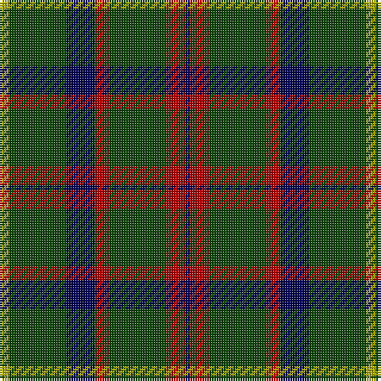

In pattern [BRGRBGY](/stripes/brgrbgy/).

This was sourced from weddslist.  It is a [7 stripe tartan](/stripes/stripes7/).

Original link http://www.weddslist.com/cgi-bin/tartans/pg.pl?source=tinsel

## Register references

External register numbers recorded for this tartan.

- Scottish Register of Tartans: [1166](https://www.tartanregister.gov.uk/tartanDetails.aspx?ref=1166)
- Scottish Register of Tartans: [1510](https://www.tartanregister.gov.uk/tartanDetails.aspx?ref=1510)
- Scottish Register of Tartans: [1758](https://www.tartanregister.gov.uk/tartanDetails.aspx?ref=1758)
- Scottish Register of Tartans: [2307](https://www.tartanregister.gov.uk/tartanDetails.aspx?ref=2307)
- Scottish Register of Tartans: [2349](https://www.tartanregister.gov.uk/tartanDetails.aspx?ref=2349)
- Scottish Register of Tartans: [2540](https://www.tartanregister.gov.uk/tartanDetails.aspx?ref=2540)
- Scottish Register of Tartans: [2582](https://www.tartanregister.gov.uk/tartanDetails.aspx?ref=2582)
- Scottish Register of Tartans: [2585](https://www.tartanregister.gov.uk/tartanDetails.aspx?ref=2585)
- Scottish Register of Tartans: [2625](https://www.tartanregister.gov.uk/tartanDetails.aspx?ref=2625)
- Scottish Register of Tartans: [2730](https://www.tartanregister.gov.uk/tartanDetails.aspx?ref=2730)
- Scottish Register of Tartans: [2862](https://www.tartanregister.gov.uk/tartanDetails.aspx?ref=2862)
- Scottish Register of Tartans: [3072](https://www.tartanregister.gov.uk/tartanDetails.aspx?ref=3072)
- Scottish Register of Tartans: [3555](https://www.tartanregister.gov.uk/tartanDetails.aspx?ref=3555)
- Scottish Register of Tartans: [4925](https://www.tartanregister.gov.uk/tartanDetails.aspx?ref=4925)
- Scottish Register of Tartans: [696](https://www.tartanregister.gov.uk/tartanDetails.aspx?ref=696)
- Scottish Register of Tartans: [697](https://www.tartanregister.gov.uk/tartanDetails.aspx?ref=697)
- Scottish Register of Tartans: [982](https://www.tartanregister.gov.uk/tartanDetails.aspx?ref=982)
- Scottish Tartans Authority (ITI): 1277
- Scottish Tartans Authority (ITI): 1429
- Scottish Tartans Authority (ITI): 218
- Scottish Tartans Authority (ITI): 977
- Scottish Tartans World Register: 1042
- Scottish Tartans World Register: 127
- Scottish Tartans World Register: 1277
- Scottish Tartans World Register: 1399
- Scottish Tartans World Register: 1429
- Scottish Tartans World Register: 1593
- Scottish Tartans World Register: 218
- Scottish Tartans World Register: 2218
- Scottish Tartans World Register: 3061
- Scottish Tartans World Register: 441
- Scottish Tartans World Register: 737
- Scottish Tartans World Register: 858
- Scottish Tartans World Register: 864
- Scottish Tartans World Register: 873
- Scottish Tartans World Register: 897
- Scottish Tartans World Register: 977
- Scottish Tartans World Register: 978

## Thread count
LG/4 DG24 DB12 DR6 DG24 DR8 DB/2

## Palette
Each colour and its ΔE from the base-6 reference it is a variant of.

| Colour | Shade | Base | ΔE (OKLab) |
|---|---|---|---|
| DB | <code style="background-color:#000052;">#000052</code> `#000052` | B <code style="background-color:#2A418A;">#2A418A</code> | 0.20 |
| DG | <code style="background-color:#11450D;">#11450D</code> `#11450D` | G <code style="background-color:#006100;">#006100</code> | 0.09 |
| DR | <code style="background-color:#AA0000;">#AA0000</code> `#AA0000` | R <code style="background-color:#CC0000;">#CC0000</code> | 0.07 |
| LG | <code style="background-color:#AAAA00;">#AAAA00</code> `#AAAA00` | Y <code style="background-color:#F2BF00;">#F2BF00</code> | 0.13 |

# Sample pattern

## Nearest tartans

The nearest existing variants by ΔTartan distance.

1. [Grass of Rasunda (Commemorative)](/setts/s7/k14dg7k2y8k4ly2k1~x4/) — ΔT 0.88
1. [Salvation Army Htg (Corporate)](/setts/s7/db5dg8k1ly2k1dg8db4~x4/) — ΔT 0.95
1. [MacKintosh Hunting](/setts/s7/ly2g12db6r3g12r4db1~x2/) — ΔT 1.00
1. [Grass of Rasunda (2009), The](/setts/s7/k14dg7k2y8k4lo2k1~x4/) — ΔT 1.03
1. [MacHardy (Clan)](/setts/s8/dt6r3g26dt26w2dt27r5g5~x2/) — ΔT 1.04
1. [MacAulay Hunting](/setts/s8/g6k16w1k16g8k4g12r2~x2/) — ΔT 1.07
1. [MacKintosh Hunting](/setts/s7/ly2dg12db6r3dg12r4db1/) — ΔT 1.10
1. [Cameron Hunting](/setts/s7/r3dg10r3dg14db16dg3ly2~x2/) — ΔT 1.11
1. [Lauder (Family)](/setts/s6/g3db8g3k4g15r2~x2/) — ΔT 1.13
1. [Scottish Scouts (1957) (Corporate)](/setts/s7/r3g22db16g14r2g6lo2~x2/) — ΔT 1.17

## Neighbour map

Every grey dot is one of 14299 variants placed by the first two principal components of the ΔTartan feature space (44% of its variance). Red is this tartan; blue dots are its nearest — click one to open its page.

<svg viewBox="0 0 640 380" role="img" style="max-width:100%;height:auto;border:1px solid #e0e0e0;border-radius:4px;display:block" xmlns="http://www.w3.org/2000/svg"><image href="/nn/cloud.v1.png" width="640" height="380"/><a href="/setts/s7/k14dg7k2y8k4ly2k1~x4/"><circle cx="312.8" cy="217.9" r="4" fill="#3465a4"><title>Grass of Rasunda (Commemorative)</title></circle></a><a href="/setts/s7/db5dg8k1ly2k1dg8db4~x4/"><circle cx="295.5" cy="252.0" r="4" fill="#3465a4"><title>Salvation Army Htg (Corporate)</title></circle></a><a href="/setts/s7/ly2g12db6r3g12r4db1~x2/"><circle cx="322.7" cy="216.9" r="4" fill="#3465a4"><title>MacKintosh Hunting</title></circle></a><a href="/setts/s7/k14dg7k2y8k4lo2k1~x4/"><circle cx="320.9" cy="221.0" r="4" fill="#3465a4"><title>Grass of Rasunda (2009), The</title></circle></a><a href="/setts/s8/dt6r3g26dt26w2dt27r5g5~x2/"><circle cx="365.5" cy="216.1" r="4" fill="#3465a4"><title>MacHardy (Clan)</title></circle></a><a href="/setts/s8/g6k16w1k16g8k4g12r2~x2/"><circle cx="326.7" cy="216.4" r="4" fill="#3465a4"><title>MacAulay Hunting</title></circle></a><a href="/setts/s7/ly2dg12db6r3dg12r4db1/"><circle cx="302.3" cy="209.5" r="4" fill="#3465a4"><title>MacKintosh Hunting</title></circle></a><a href="/setts/s7/r3dg10r3dg14db16dg3ly2~x2/"><circle cx="285.4" cy="241.4" r="4" fill="#3465a4"><title>Cameron Hunting</title></circle></a><a href="/setts/s6/g3db8g3k4g15r2~x2/"><circle cx="329.0" cy="253.4" r="4" fill="#3465a4"><title>Lauder (Family)</title></circle></a><a href="/setts/s7/r3g22db16g14r2g6lo2~x2/"><circle cx="365.8" cy="226.6" r="4" fill="#3465a4"><title>Scottish Scouts (1957) (Corporate)</title></circle></a><circle cx="334.5" cy="226.4" r="5" fill="#c00000"/></svg>

ID: /setts/s7/ly2dg12db6r3dg12r4db1~x2/
