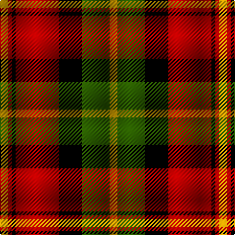

**Bands:** [YRKRKGY](/stripes/yrkrkgy/) · **Stripes:** [LY R K R K DG LY](/stripes/stripes7/) LY R K R K DG LY

This was sourced from register-of-tartans.  It is a [7 band tartan](/bands/bands7/).

Original link https://www.tartanregister.gov.uk/tartanDetails.aspx?ref=289

## Also known as

This cloth is also recorded under:

- Blackstock, Red Dress

## Attestations

This cloth appears in 2 source records; the oldest owns this page.

- 01/01/1983 — Blackstock Red (Dress) (register-of-tartans, [record](https://www.tartanregister.gov.uk/tartanDetails.aspx?ref=289))
- 1983 — Blackstock, Red Dress (Clan) (tartans-authority, [record](http://www.tartansauthority.com/tartan-ferret/display/1881/))

## Register references

External register numbers recorded for this tartan.

- Scottish Register of Tartans: [289](https://www.tartanregister.gov.uk/tartanDetails.aspx?ref=289)
- Scottish Tartans Authority (ITI): 1881
- Scottish Tartans World Register: 1881

## Thread count
DY/8 Ga28 K24 DR44 K4 DR4 DY/8

## Palette
Each colour and its ΔE from the base-6 reference it is a variant of.

| Colour | Shade | Base | ΔE (OKLab) |
|---|---|---|---|
| DG | <code style="background-color:#002008;">#002008</code> `#002008` | K <code style="background-color:#000000;">#000000</code> | 0.22 |
| DR | <code style="background-color:#B00000;">#B00000</code> `#B00000` | R <code style="background-color:#CC0000;">#CC0000</code> | 0.06 |
| DY | <code style="background-color:#C89800;">#C89800</code> `#C89800` | Y <code style="background-color:#F2BF00;">#F2BF00</code> | 0.12 |
| G | <code style="background-color:#006818;">#006818</code> `#006818` | G <code style="background-color:#006100;">#006100</code> | 0.02 |
| Ga | <code style="background-color:#285800;">#285800</code> `#285800` | G <code style="background-color:#006100;">#006100</code> | 0.03 |
| K | <code style="background-color:#000000;">#000000</code> `#000000` | K <code style="background-color:#000000;">#000000</code> | 0.00 |
| R | <code style="background-color:#C80000;">#C80000</code> `#C80000` | R <code style="background-color:#CC0000;">#CC0000</code> | 0.01 |
| Y | <code style="background-color:#E8C000;">#E8C000</code> `#E8C000` | Y <code style="background-color:#F2BF00;">#F2BF00</code> | 0.02 |

# Sample pattern

## Nearest tartans

The nearest existing variants by ΔTartan distance.

1. [Blackstock, dress](/setts/s7/ly2g7k6r12k1r1ly2~x4/) — ΔT 0.70
1. [Dickie](/setts/s8/g8r2g12k6g3db6r24k4~x2/) — ΔT 0.81
1. [MacMillan Varient (Unidentified)](/setts/s6/k3ly18dg6r17k31dg3~x2/) — ΔT 0.83
1. [Island of Innis, The](/setts/s8/k15dg1k3r9dg1r3lo11k1~x4/) — ΔT 0.84
1. [Manson Family Tartan Tartan Number: 987. Earliest known date: 1983 The official recording of the sett shows the letter G for the dark green stripe. In heraldic terms this means 'Gules' - red. The designer, Hugh Kirkwood Rankine, clearly intended dark green and this is reproduced here. See products available Copyright © Blair Urquhart, Comrie, 2015](/setts/s8/g1r9g3k3g3r1k9w1~x2/) — ΔT 0.87
1. [Wcwm 1062](/setts/s7/g3r20g16k22lo6k3g2~x2/) — ΔT 0.97
1. [Montrose](/setts/s9/db1k1r12g12k6db5r12k1db1~x2/) — ΔT 0.98
1. [MacNaughton](/setts/s9/k1db1r16g16k12db8r16db1k1~x2/) — ΔT 0.99
1. [MacMillan Variant (Unidentified)](/setts/s6/k3ly18g6r17k31g3~x2/) — ΔT 1.04
1. [MacLachlan W](/setts/s7/r24lr2ly3dg16k16lr2ly3~x2/) — ΔT 1.05

## Neighbour map

Every grey dot is one of 14299 variants placed by the first two principal components of the ΔTartan feature space (44% of its variance). Red is this tartan; blue dots are its nearest — click one to open its page.

<svg viewBox="0 0 640 380" role="img" style="max-width:100%;height:auto;border:1px solid #e0e0e0;border-radius:4px;display:block" xmlns="http://www.w3.org/2000/svg"><image href="/nn/cloud.v1.png" width="640" height="380"/><a href="/setts/s7/ly2g7k6r12k1r1ly2~x4/"><circle cx="190.5" cy="168.3" r="4" fill="#3465a4"><title>Blackstock, dress</title></circle></a><a href="/setts/s8/g8r2g12k6g3db6r24k4~x2/"><circle cx="200.7" cy="180.3" r="4" fill="#3465a4"><title>Dickie</title></circle></a><a href="/setts/s6/k3ly18dg6r17k31dg3~x2/"><circle cx="189.6" cy="190.8" r="4" fill="#3465a4"><title>MacMillan Varient (Unidentified)</title></circle></a><a href="/setts/s8/k15dg1k3r9dg1r3lo11k1~x4/"><circle cx="233.6" cy="162.8" r="4" fill="#3465a4"><title>Island of Innis, The</title></circle></a><a href="/setts/s8/g1r9g3k3g3r1k9w1~x2/"><circle cx="203.3" cy="192.3" r="4" fill="#3465a4"><title>Manson Family Tartan Tartan Number: 987. Earliest known date: 1983 The official recording of the sett shows the letter G for the dark green stripe. In heraldic terms this means 'Gules' - red. The designer, Hugh Kirkwood Rankine, clearly intended dark green and this is reproduced here. See products available Copyright © Blair Urquhart, Comrie, 2015</title></circle></a><a href="/setts/s7/g3r20g16k22lo6k3g2~x2/"><circle cx="179.7" cy="196.8" r="4" fill="#3465a4"><title>Wcwm 1062</title></circle></a><a href="/setts/s9/db1k1r12g12k6db5r12k1db1~x2/"><circle cx="227.0" cy="168.9" r="4" fill="#3465a4"><title>Montrose</title></circle></a><a href="/setts/s9/k1db1r16g16k12db8r16db1k1~x2/"><circle cx="219.0" cy="159.2" r="4" fill="#3465a4"><title>MacNaughton</title></circle></a><a href="/setts/s6/k3ly18g6r17k31g3~x2/"><circle cx="180.0" cy="190.4" r="4" fill="#3465a4"><title>MacMillan Variant (Unidentified)</title></circle></a><a href="/setts/s7/r24lr2ly3dg16k16lr2ly3~x2/"><circle cx="155.8" cy="160.9" r="4" fill="#3465a4"><title>MacLachlan W</title></circle></a><circle cx="188.5" cy="182.8" r="5" fill="#c00000"/></svg>

ID: /setts/s7/ly2dg7k6r11k1r1ly2~x4/
