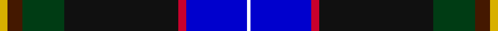
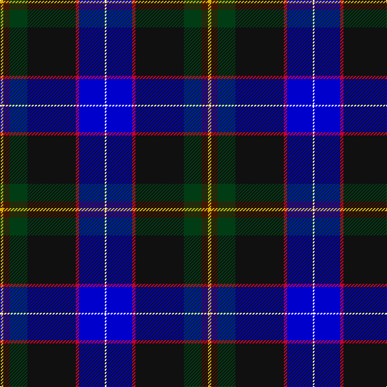

**Bands:** [YBGKRBW](/stripes/ybgkrbw/) · **Stripes:** [LY DO DG K R DB W](/stripes/stripes7/) LY DO DG K R DB W

This was sourced from register-of-tartans.  It is a [7 band tartan](/bands/bands7/).

Original link https://www.tartanregister.gov.uk/tartanDetails.aspx?ref=10899

## Register references

External register numbers recorded for this tartan.

- Scottish Register of Tartans: [10899](https://www.tartanregister.gov.uk/tartanDetails.aspx?ref=10899)

## Thread count
Y/4 DR8 DG22 K60 R4 B32 W/2

## Palette
Each colour and its ΔE from the base-6 reference it is a variant of.

| Colour | Shade | Base | ΔE (OKLab) |
|---|---|---|---|
| B | <code style="background-color:#0000CD;">#0000CD</code> `#0000CD` | B <code style="background-color:#2A418A;">#2A418A</code> | 0.14 |
| DG | <code style="background-color:#003C14;">#003C14</code> `#003C14` | G <code style="background-color:#006100;">#006100</code> | 0.13 |
| DR | <code style="background-color:#441800;">#441800</code> `#441800` | B <code style="background-color:#2A418A;">#2A418A</code> | 0.23 |
| K | <code style="background-color:#101010;">#101010</code> `#101010` | K <code style="background-color:#000000;">#000000</code> | 0.17 |
| R | <code style="background-color:#C8002C;">#C8002C</code> `#C8002C` | R <code style="background-color:#CC0000;">#CC0000</code> | 0.03 |
| W | <code style="background-color:#FFFFFF;">#FFFFFF</code> `#FFFFFF` | W <code style="background-color:#F7F7F7;">#F7F7F7</code> | 0.02 |
| Y | <code style="background-color:#D8B000;">#D8B000</code> `#D8B000` | Y <code style="background-color:#F2BF00;">#F2BF00</code> | 0.06 |

# Sample pattern

## Nearest tartans

The nearest existing variants by ΔTartan distance.

1. [Buschke (Skye) (Personal)](/setts/s7/ly2dr4dg11k30r2db16w1~x2/) — ΔT 1.12
1. [Anne Arundel County](/setts/s8/r4y10k9dy2k9db33k7g4~x2/) — ΔT 1.18
1. [Unidentified, Lady's kilt](/setts/s8/db39o3k14o3t14ly4w2dr2~x2/) — ΔT 1.34
1. [Italian National](/setts/s6/r3w2g5k35db40ly3~x2/) — ΔT 1.38
1. [Unidentified Lady's kilt](/setts/s8/db39dy3k14dy3t14ly4w2dy2~x2/) — ΔT 1.39
1. [Holyrood (Commemorative)](/setts/s11/k48n12lo3n3w3n3o9dy8t2dy10w2~x2/) — ΔT 1.40
1. [National Wedding](/setts/s9/dg22lo2dg4dp3dg4k20db20k1lb3~x2/) — ΔT 1.41
1. [Scout Mapping Service #1 (Corporate)](/setts/s7/db24r8g8r2g8k1ly2~x2/) — ΔT 1.45
1. [St. Columba (one green)](/setts/s8/db20y1w1lo3g14n4y1dp4~x2/) — ΔT 1.48
1. [Scottish Italian](/setts/s8/db11dt5g4w3r3k16dt28lb2~x2/) — ΔT 1.49

## Neighbour map

Every grey dot is one of 14299 variants placed by the first two principal components of the ΔTartan feature space (44% of its variance). Red is this tartan; blue dots are its nearest — click one to open its page.

<svg viewBox="0 0 640 380" role="img" style="max-width:100%;height:auto;border:1px solid #e0e0e0;border-radius:4px;display:block" xmlns="http://www.w3.org/2000/svg"><image href="/nn/cloud.v1.png" width="640" height="380"/><a href="/setts/s7/ly2dr4dg11k30r2db16w1~x2/"><circle cx="253.1" cy="126.2" r="4" fill="#3465a4"><title>Buschke (Skye) (Personal)</title></circle></a><a href="/setts/s8/r4y10k9dy2k9db33k7g4~x2/"><circle cx="162.5" cy="127.8" r="4" fill="#3465a4"><title>Anne Arundel County</title></circle></a><a href="/setts/s8/db39o3k14o3t14ly4w2dr2~x2/"><circle cx="207.9" cy="101.0" r="4" fill="#3465a4"><title>Unidentified, Lady's kilt</title></circle></a><a href="/setts/s6/r3w2g5k35db40ly3~x2/"><circle cx="260.7" cy="143.3" r="4" fill="#3465a4"><title>Italian National</title></circle></a><a href="/setts/s8/db39dy3k14dy3t14ly4w2dy2~x2/"><circle cx="231.5" cy="114.8" r="4" fill="#3465a4"><title>Unidentified Lady's kilt</title></circle></a><a href="/setts/s11/k48n12lo3n3w3n3o9dy8t2dy10w2~x2/"><circle cx="212.9" cy="75.7" r="4" fill="#3465a4"><title>Holyrood (Commemorative)</title></circle></a><a href="/setts/s9/dg22lo2dg4dp3dg4k20db20k1lb3~x2/"><circle cx="190.0" cy="139.1" r="4" fill="#3465a4"><title>National Wedding</title></circle></a><a href="/setts/s7/db24r8g8r2g8k1ly2~x2/"><circle cx="204.8" cy="118.5" r="4" fill="#3465a4"><title>Scout Mapping Service #1 (Corporate)</title></circle></a><a href="/setts/s8/db20y1w1lo3g14n4y1dp4~x2/"><circle cx="206.6" cy="121.1" r="4" fill="#3465a4"><title>St. Columba (one green)</title></circle></a><a href="/setts/s8/db11dt5g4w3r3k16dt28lb2~x2/"><circle cx="195.4" cy="146.9" r="4" fill="#3465a4"><title>Scottish Italian</title></circle></a><circle cx="227.4" cy="115.3" r="5" fill="#c00000"/></svg>

ID: /setts/s7/ly2do4dg11k30r2db16w1~x2/
