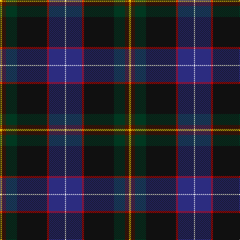

This page is one **sett** — a single exact thread-count. It belongs to the [tartan](/tartans/ly2dr4dg11k30r2db16w1/)
(the same proportion at any scale), whose colour order is pattern [WBRKGBY](/stripes/wbrkgby/).

Sourced from tartans-authority.  It is a [7 stripe tartan](/stripes/stripes7/).

Original link http://www.tartansauthority.com/tartan-ferret/display/10899/

## Register references

External register numbers recorded for this tartan.

- Scottish Register of Tartans: [10899](https://www.tartanregister.gov.uk/tartanDetails?ref=10899)
- Scottish Tartans Authority (ITI): 10899

## Thread count
Y/4 DR8 DG22 K60 R4 DB32 W/2

## Palette

Palette: <strong>Tartan Register</strong> <small style="color:#888">(6 of 7 colours)</small>
<table><thead><tr><th>Colour</th><th>Threads</th><th>Shade</th><th>Base</th><th>OKLCh</th></tr></thead><tbody><tr><td>Y/</td><td style="text-align:right;font-variant-numeric:tabular-nums">4</td><td><code style="background-color:#E8C000;">#E8C000</code> <small style="color:#888">#E8C000</small></td><td>Y <code style="background-color:#F2BF00;">#F2BF00</code></td><td><small style="color:#888">oklch(81.9% 0.168 93.7)</small></td></tr><tr><td>DR</td><td style="text-align:right;font-variant-numeric:tabular-nums">8</td><td><code style="background-color:#501400;">#501400</code> <small style="color:#888">#501400</small></td><td>B <code style="background-color:#2A418A;">#2A418A</code></td><td><small style="color:#888">oklch(29.1% 0.094 38.4)</small></td></tr><tr><td>DG</td><td style="text-align:right;font-variant-numeric:tabular-nums">22</td><td><code style="background-color:#003820;">#003820</code> <small style="color:#888">#003820</small></td><td>G <code style="background-color:#006100;">#006100</code></td><td><small style="color:#888">oklch(30.0% 0.070 158.3)</small></td></tr><tr><td>K</td><td style="text-align:right;font-variant-numeric:tabular-nums">60</td><td><code style="background-color:#101010;">#101010</code> <small style="color:#888">#101010</small></td><td>K <code style="background-color:#000000;">#000000</code></td><td><small style="color:#888">oklch(17.3% 0.000 89.9)</small></td></tr><tr><td>R</td><td style="text-align:right;font-variant-numeric:tabular-nums">4</td><td><code style="background-color:#C80000;">#C80000</code> <small style="color:#888">#C80000</small></td><td>R <code style="background-color:#CC0000;">#CC0000</code></td><td><small style="color:#888">oklch(52.3% 0.215 29.2)</small></td></tr><tr><td>DB</td><td style="text-align:right;font-variant-numeric:tabular-nums">32</td><td><code style="background-color:#2C2C80;">#2C2C80</code> <small style="color:#888">#2C2C80</small></td><td>B <code style="background-color:#2A418A;">#2A418A</code></td><td><small style="color:#888">oklch(35.0% 0.138 276.6)</small></td></tr><tr><td>W/</td><td style="text-align:right;font-variant-numeric:tabular-nums">2</td><td><code style="background-color:#FCFCFC;">#FCFCFC</code> <small style="color:#888">#FCFCFC</small></td><td>W <code style="background-color:#F7F7F7;">#F7F7F7</code></td><td><small style="color:#888">oklch(99.1% 0.000 89.9)</small></td></tr></tbody></table>

# Sample pattern

## Nearest tartans

The nearest existing variants by ΔTartan distance, with this tartan at the top so the swatches line up against it.

ΔTartan

Tartan

Sett

—

<a href="/ttd/edit/#slug=ly2dr4dg11k30r2db16w1~x2">Buschke (Skye) (Personal)</a> <a class="nn-out" href="/setts/s7/ly2dr4dg11k30r2db16w1~x2/" title="open its dictionary page">↗</a>

1.12

<a href="/ttd/edit/#slug=ly2do4dg11k30r2db16w1~x2">Buschke (Skye) (Personal)</a> <a class="nn-out" href="/setts/s7/ly2do4dg11k30r2db16w1~x2/" title="open its dictionary page">↗</a>

1.23

<a href="/ttd/edit/#slug=dp23w1o3w1dp12lo9dg40dp3~x2">Pictou County</a> <a class="nn-out" href="/setts/s8/dp23w1o3w1dp12lo9dg40dp3~x2/" title="open its dictionary page">↗</a>

1.35

<a href="/ttd/edit/#slug=dp3n3dp3n27w1t15k22r3~x2">Beauly Firth and Glens</a> <a class="nn-out" href="/setts/s8/dp3n3dp3n27w1t15k22r3~x2/" title="open its dictionary page">↗</a>

1.41

<a href="/ttd/edit/#slug=g1dt28k11r5w1r5k11lr1k2g1~x2">Scragg Moran (Personal)</a> <a class="nn-out" href="/setts/s10/g1dt28k11r5w1r5k11lr1k2g1~x2/" title="open its dictionary page">↗</a>

1.42

<a href="/ttd/edit/#slug=db20y1w1lo3g14n4y1dp4~x2">St. Columba (one green)</a> <a class="nn-out" href="/setts/s8/db20y1w1lo3g14n4y1dp4~x2/" title="open its dictionary page">↗</a>

1.42

<a href="/ttd/edit/#slug=db4w1k2db25k12b1k2g16k2r1~x2">Sidey Family Tartan (Name)</a> <a class="nn-out" href="/setts/s10/db4w1k2db25k12b1k2g16k2r1~x2/" title="open its dictionary page">↗</a>

1.47

<a href="/ttd/edit/#slug=w1db6dp9r12k12g32k6ly1~x2">Fujitsu</a> <a class="nn-out" href="/setts/s8/w1db6dp9r12k12g32k6ly1~x2/" title="open its dictionary page">↗</a>

1.47

<a href="/ttd/edit/#slug=dgi28r4k3y2k1dg2r3db20ly2~x2">Stirling University</a> <a class="nn-out" href="/setts/s9/dgi28r4k3y2k1dg2r3db20ly2~x2/" title="open its dictionary page">↗</a>

1.47

<a href="/ttd/edit/#slug=r4oi10k9o2k9db33dt7g4~x2">Anne Arundel County</a> <a class="nn-out" href="/setts/s8/r4oi10k9o2k9db33dt7g4~x2/" title="open its dictionary page">↗</a>

1.49

<a href="/ttd/edit/#slug=k12g8ly1dg13lb1db31k8~x2">Chesters, Eric (Personal)</a> <a class="nn-out" href="/setts/s7/k12g8ly1dg13lb1db31k8~x2/" title="open its dictionary page">↗</a>

## Neighbour map

Every grey dot is one of 14359 variants placed by the first two principal components of the ΔTartan feature space (44% of its variance). Red is this tartan; blue dots are its nearest — click one to open its page.

<svg viewBox="0 0 640 380" role="img" style="max-width:100%;height:auto;border:1px solid #e0e0e0;border-radius:4px;display:block" xmlns="http://www.w3.org/2000/svg"><image href="/nn/cloud.v1.png" width="640" height="380"/><a href="/setts/s7/ly2do4dg11k30r2db16w1~x2/"><circle cx="227.1" cy="115.9" r="4" fill="#3465a4"><title>Buschke (Skye) (Personal)</title></circle></a><a href="/setts/s8/dp23w1o3w1dp12lo9dg40dp3~x2/"><circle cx="294.1" cy="124.6" r="4" fill="#3465a4"><title>Pictou County</title></circle></a><a href="/setts/s8/dp3n3dp3n27w1t15k22r3~x2/"><circle cx="233.7" cy="139.1" r="4" fill="#3465a4"><title>Beauly Firth and Glens</title></circle></a><a href="/setts/s10/g1dt28k11r5w1r5k11lr1k2g1~x2/"><circle cx="276.2" cy="116.5" r="4" fill="#3465a4"><title>Scragg Moran (Personal)</title></circle></a><a href="/setts/s8/db20y1w1lo3g14n4y1dp4~x2/"><circle cx="206.4" cy="121.6" r="4" fill="#3465a4"><title>St. Columba (one green)</title></circle></a><a href="/setts/s10/db4w1k2db25k12b1k2g16k2r1~x2/"><circle cx="275.1" cy="130.1" r="4" fill="#3465a4"><title>Sidey Family Tartan (Name)</title></circle></a><a href="/setts/s8/w1db6dp9r12k12g32k6ly1~x2/"><circle cx="200.2" cy="112.5" r="4" fill="#3465a4"><title>Fujitsu</title></circle></a><a href="/setts/s9/dgi28r4k3y2k1dg2r3db20ly2~x2/"><circle cx="247.3" cy="99.9" r="4" fill="#3465a4"><title>Stirling University</title></circle></a><a href="/setts/s8/r4oi10k9o2k9db33dt7g4~x2/"><circle cx="196.3" cy="143.8" r="4" fill="#3465a4"><title>Anne Arundel County</title></circle></a><a href="/setts/s7/k12g8ly1dg13lb1db31k8~x2/"><circle cx="254.0" cy="165.1" r="4" fill="#3465a4"><title>Chesters, Eric (Personal)</title></circle></a><circle cx="252.9" cy="126.7" r="5" fill="#c00000"/></svg>

ID: /setts/s7/ly2dr4dg11k30r2db16w1~x2/
