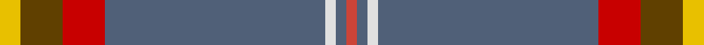
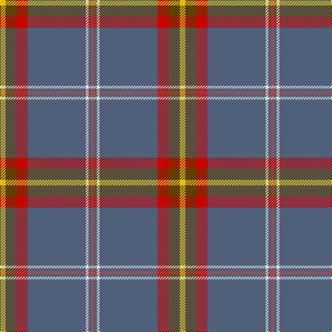

This page is one **sett** — a single exact thread-count. It belongs to the [tartan](/tartans/y2t4ra4n21ln1n1r1/)
(the same proportion at any scale), whose colour order is pattern [RBWBRGY](/stripes/rbwbrgy/).

Sourced from tartans-authority.  It is a [7 stripe tartan](/stripes/stripes7/).

Original link http://www.tartansauthority.com/tartan-ferret/display/7666/

2 attestations — the source records this cloth was collapsed from (oldest owns this page)

<ul>
<li>June 2008 — Edinburgh Fire (Corporate) (tartans-authority, <a href="http://www.tartansauthority.com/tartan-ferret/display/7666/">record</a>)</li>
<li>undated — Edinburgh Fire (register-of-tartans, <a href="https://www.tartanregister.gov.uk/tartanDetails.aspx?ref=5669">record</a>)</li>
</ul>

## Register references

External register numbers recorded for this tartan.

- Scottish Register of Tartans: [5669](https://www.tartanregister.gov.uk/tartanDetails.aspx?ref=5669)
- Scottish Tartans Authority (ITI): 7666

## Thread count
Y/8 T16 Ra16 N84 LN4 N4 R/4

## Palette
Each colour and the base-6 reference it is a variant of.

| Colour | Shade | Base |
|---|---|---|
| LN | <code style="background-color:#E0E0E0;">#E0E0E0</code> `oklch(90.7% 0.000 89.9)` <small>#E0E0E0</small> | W <code style="background-color:#F7F7F7;">#F7F7F7</code> |
| N | <code style="background-color:#506078;">#506078</code> `oklch(48.5% 0.044 258.3)` <small>#506078</small> | B <code style="background-color:#2A418A;">#2A418A</code> |
| R | <code style="background-color:#CC4438;">#CC4438</code> `oklch(57.7% 0.174 28.7)` <small>#CC4438</small> | R <code style="background-color:#CC0000;">#CC0000</code> |
| Ra | <code style="background-color:#C80000;">#C80000</code> `oklch(52.3% 0.215 29.2)` <small>#C80000</small> | R <code style="background-color:#CC0000;">#CC0000</code> |
| T | <code style="background-color:#604000;">#604000</code> `oklch(39.8% 0.083 76.8)` <small>#604000</small> | G <code style="background-color:#006100;">#006100</code> |
| Y | <code style="background-color:#E8C000;">#E8C000</code> `oklch(81.9% 0.168 93.7)` <small>#E8C000</small> | Y <code style="background-color:#F2BF00;">#F2BF00</code> |

# Sample pattern

## Nearest tartans

The nearest existing variants by ΔTartan distance, with this tartan at the top so the swatches line up against it.

ΔTartan

Tartan

Sett

—

<a href="/ttd/edit/#slug=ly2dy4r4n21w1n1r1~x4">Edinburgh Fire (Corporate)</a> <a class="nn-out" href="/setts/s7/ly2dy4r4n21w1n1r1~x4/" title="open its dictionary page">↗</a>

1.03

<a href="/ttd/edit/#slug=n68k4n18o20k3w3k10lb8lo4">Carbon (Corporate)</a> <a class="nn-out" href="/setts/s9/n68k4n18o20k3w3k10lb8lo4/" title="open its dictionary page">↗</a>

1.16

<a href="/ttd/edit/#slug=w2o2t25r3lo3dg1~x4">Pool, Robert David (Personal)</a> <a class="nn-out" href="/setts/s6/w2o2t25r3lo3dg1~x4/" title="open its dictionary page">↗</a>

1.26

<a href="/ttd/edit/#slug=n27k5dp2o1dp1w1dp5~x4">Caledonian Mist</a> <a class="nn-out" href="/setts/s7/n27k5dp2o1dp1w1dp5~x4/" title="open its dictionary page">↗</a>

1.29

<a href="/ttd/edit/#slug=o66m3g3m3g16dr8g3dr3m4~x2">Scottish National Htg (Fashion)</a> <a class="nn-out" href="/setts/s9/o66m3g3m3g16dr8g3dr3m4~x2/" title="open its dictionary page">↗</a>

1.33

<a href="/ttd/edit/#slug=lp6w2lp1db6o30w1r3~x2">Kuehle (Personal)</a> <a class="nn-out" href="/setts/s7/lp6w2lp1db6o30w1r3~x2/" title="open its dictionary page">↗</a>

1.34

<a href="/ttd/edit/#slug=n68b5k9lo3k3lb3k3n20r9k3r5lb4">British Caledonian Airways #2</a> <a class="nn-out" href="/setts/s12/n68b5k9lo3k3lb3k3n20r9k3r5lb4/" title="open its dictionary page">↗</a>

1.39

<a href="/ttd/edit/#slug=y65p3g3p3g16dr8g3dr3dr4~x2">Scottish National (hunting)</a> <a class="nn-out" href="/setts/s9/y65p3g3p3g16dr8g3dr3dr4~x2/" title="open its dictionary page">↗</a>

1.40

<a href="/ttd/edit/#slug=y30db6p1w2p6w2p1db6y30lb1r3~x2">Kuehle Family (Personal)</a> <a class="nn-out" href="/setts/s11/y30db6p1w2p6w2p1db6y30lb1r3~x2/" title="open its dictionary page">↗</a>

1.40

<a href="/ttd/edit/#slug=o38db4o8lo2o4w3o4r14n7o2n4w2~x2">Portree Check</a> <a class="nn-out" href="/setts/s12/o38db4o8lo2o4w3o4r14n7o2n4w2~x2/" title="open its dictionary page">↗</a>

1.45

<a href="/ttd/edit/#slug=dy6ly3n42w4dg18ly2n12r3~x2">Glasgow High (School)</a> <a class="nn-out" href="/setts/s8/dy6ly3n42w4dg18ly2n12r3~x2/" title="open its dictionary page">↗</a>

## Neighbour map

Every grey dot is one of 14299 variants placed by the first two principal components of the ΔTartan feature space (44% of its variance). Red is this tartan; blue dots are its nearest — click one to open its page.

<svg viewBox="0 0 640 380" role="img" style="max-width:100%;height:auto;border:1px solid #e0e0e0;border-radius:4px;display:block" xmlns="http://www.w3.org/2000/svg"><image href="/nn/cloud.v1.png" width="640" height="380"/><a href="/setts/s9/n68k4n18o20k3w3k10lb8lo4/"><circle cx="363.6" cy="115.9" r="4" fill="#3465a4"><title>Carbon (Corporate)</title></circle></a><a href="/setts/s6/w2o2t25r3lo3dg1~x4/"><circle cx="454.6" cy="129.7" r="4" fill="#3465a4"><title>Pool, Robert David (Personal)</title></circle></a><a href="/setts/s7/n27k5dp2o1dp1w1dp5~x4/"><circle cx="441.2" cy="136.2" r="4" fill="#3465a4"><title>Caledonian Mist</title></circle></a><a href="/setts/s9/o66m3g3m3g16dr8g3dr3m4~x2/"><circle cx="400.8" cy="120.5" r="4" fill="#3465a4"><title>Scottish National Htg (Fashion)</title></circle></a><a href="/setts/s7/lp6w2lp1db6o30w1r3~x2/"><circle cx="377.8" cy="105.4" r="4" fill="#3465a4"><title>Kuehle (Personal)</title></circle></a><a href="/setts/s12/n68b5k9lo3k3lb3k3n20r9k3r5lb4/"><circle cx="405.0" cy="96.4" r="4" fill="#3465a4"><title>British Caledonian Airways #2</title></circle></a><a href="/setts/s9/y65p3g3p3g16dr8g3dr3dr4~x2/"><circle cx="397.5" cy="124.0" r="4" fill="#3465a4"><title>Scottish National (hunting)</title></circle></a><a href="/setts/s11/y30db6p1w2p6w2p1db6y30lb1r3~x2/"><circle cx="421.7" cy="100.0" r="4" fill="#3465a4"><title>Kuehle Family (Personal)</title></circle></a><a href="/setts/s12/o38db4o8lo2o4w3o4r14n7o2n4w2~x2/"><circle cx="363.0" cy="114.9" r="4" fill="#3465a4"><title>Portree Check</title></circle></a><a href="/setts/s8/dy6ly3n42w4dg18ly2n12r3~x2/"><circle cx="367.1" cy="150.6" r="4" fill="#3465a4"><title>Glasgow High (School)</title></circle></a><circle cx="408.6" cy="130.6" r="5" fill="#c00000"/></svg>

ID: /setts/s7/ly2dy4r4n21w1n1r1~x4/
