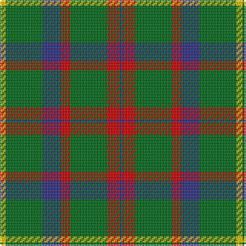

This page is one **sett** — a single exact thread-count. It belongs to the [tartan](/tartans/ly2g12db6r3g12r4db1/)
(the same proportion at any scale), whose colour order is pattern [BRGRBGY](/stripes/brgrbgy/).

Sourced from register-of-tartans.  It is a [7 stripe tartan](/stripes/stripes7/).

Original link https://www.tartanregister.gov.uk/tartanDetails.aspx?ref=2574

## Also known as

This cloth is also recorded under:

- MacKintosh Hunting

2 attestations — the source records this cloth was collapsed from (oldest owns this page)

<ul>
<li>01/01/1951 — MacKintosh Hunting (register-of-tartans, <a href="https://www.tartanregister.gov.uk/tartanDetails.aspx?ref=2574">record</a>)</li>
<li>pre 1951 — MacKintosh Htg (Clan) (tartans-authority, <a href="http://www.tartansauthority.com/tartan-ferret/display/544/">record</a>)</li>
</ul>

## Register references

External register numbers recorded for this tartan.

- Scottish Register of Tartans: [2574](https://www.tartanregister.gov.uk/tartanDetails.aspx?ref=2574)
- Scottish Tartans Authority (ITI): 544
- Scottish Tartans World Register: 544

## Thread count
Y/4 G24 DB12 R6 G24 R8 DB/2

## Palette

Palette: <strong>Tartan Register</strong>
<table><thead><tr><th>Colour</th><th>Threads</th><th>Shade</th><th>Base</th><th>OKLCh</th></tr></thead><tbody><tr><td>Y/</td><td style="text-align:right;font-variant-numeric:tabular-nums">4</td><td><code style="background-color:#E8C000;">#E8C000</code> <small style="color:#888">#E8C000</small></td><td>Y <code style="background-color:#F2BF00;">#F2BF00</code></td><td><small style="color:#888">oklch(81.9% 0.168 93.7)</small></td></tr><tr><td>G</td><td style="text-align:right;font-variant-numeric:tabular-nums">24</td><td><code style="background-color:#006818;">#006818</code> <small style="color:#888">#006818</small></td><td>G <code style="background-color:#006100;">#006100</code></td><td><small style="color:#888">oklch(45.0% 0.142 145.0)</small></td></tr><tr><td>DB</td><td style="text-align:right;font-variant-numeric:tabular-nums">12</td><td><code style="background-color:#2C2C80;">#2C2C80</code> <small style="color:#888">#2C2C80</small></td><td>B <code style="background-color:#2A418A;">#2A418A</code></td><td><small style="color:#888">oklch(35.0% 0.138 276.6)</small></td></tr><tr><td>R</td><td style="text-align:right;font-variant-numeric:tabular-nums">6</td><td><code style="background-color:#C80000;">#C80000</code> <small style="color:#888">#C80000</small></td><td>R <code style="background-color:#CC0000;">#CC0000</code></td><td><small style="color:#888">oklch(52.3% 0.215 29.2)</small></td></tr><tr><td>G</td><td style="text-align:right;font-variant-numeric:tabular-nums">24</td><td><code style="background-color:#006818;">#006818</code> <small style="color:#888">#006818</small></td><td>G <code style="background-color:#006100;">#006100</code></td><td><small style="color:#888">oklch(45.0% 0.142 145.0)</small></td></tr><tr><td>R</td><td style="text-align:right;font-variant-numeric:tabular-nums">8</td><td><code style="background-color:#C80000;">#C80000</code> <small style="color:#888">#C80000</small></td><td>R <code style="background-color:#CC0000;">#CC0000</code></td><td><small style="color:#888">oklch(52.3% 0.215 29.2)</small></td></tr><tr><td>DB/</td><td style="text-align:right;font-variant-numeric:tabular-nums">2</td><td><code style="background-color:#2C2C80;">#2C2C80</code> <small style="color:#888">#2C2C80</small></td><td>B <code style="background-color:#2A418A;">#2A418A</code></td><td><small style="color:#888">oklch(35.0% 0.138 276.6)</small></td></tr></tbody></table>

# Sample pattern

## Nearest tartans

The nearest existing variants by ΔTartan distance, with this tartan at the top so the swatches line up against it.

ΔTartan

Tartan

Sett

—

<a href="/ttd/edit/#slug=ly2g12db6r3g12r4db1~x2">MacKintosh Hunting</a> <a class="nn-out" href="/setts/s7/ly2g12db6r3g12r4db1~x2/" title="open its dictionary page">↗</a>

0.99

<a href="/ttd/edit/#slug=ly2dg12db6r3dg12r4db1">MacKintosh Hunting</a> <a class="nn-out" href="/setts/s7/ly2dg12db6r3dg12r4db1/" title="open its dictionary page">↗</a>

1.00

<a href="/ttd/edit/#slug=ly2dg12db6r3dg12r4db1~x2">MacKintosh Hunting</a> <a class="nn-out" href="/setts/s7/ly2dg12db6r3dg12r4db1~x2/" title="open its dictionary page">↗</a>

1.04

<a href="/ttd/edit/#slug=g3w1g12r6g3k3g2~x4">Arkansas</a> <a class="nn-out" href="/setts/s7/g3w1g12r6g3k3g2~x4/" title="open its dictionary page">↗</a>

1.08

<a href="/ttd/edit/#slug=db6r15g41r15db20g41t6">Bean Hunting</a> <a class="nn-out" href="/setts/s7/db6r15g41r15db20g41t6/" title="open its dictionary page">↗</a>

1.12

<a href="/ttd/edit/#slug=db1r3g11r2db5g11ly1~x2">MacKintosh, hunting</a> <a class="nn-out" href="/setts/s7/db1r3g11r2db5g11ly1~x2/" title="open its dictionary page">↗</a>

1.17

<a href="/ttd/edit/#slug=r3g20k20g20lo2g2lo2~x2">Paton (Personal)</a> <a class="nn-out" href="/setts/s7/r3g20k20g20lo2g2lo2~x2/" title="open its dictionary page">↗</a>

1.18

<a href="/ttd/edit/#slug=r3g22db16g14r2g6lo2~x2">Scottish Scouts (1957) (Corporate)</a> <a class="nn-out" href="/setts/s7/r3g22db16g14r2g6lo2~x2/" title="open its dictionary page">↗</a>

1.22

<a href="/ttd/edit/#slug=n27lr3n14k3n13k3ly23~x2">Grange School</a> <a class="nn-out" href="/setts/s7/n27lr3n14k3n13k3ly23~x2/" title="open its dictionary page">↗</a>

1.28

<a href="/ttd/edit/#slug=g8k2g13r4g12db22g5ly3~x2">Taylor</a> <a class="nn-out" href="/setts/s8/g8k2g13r4g12db22g5ly3~x2/" title="open its dictionary page">↗</a>

1.29

<a href="/ttd/edit/#slug=lo24do2lo3dy6lo3do2dg15lo20do4~x2">Land's End Camel</a> <a class="nn-out" href="/setts/s9/lo24do2lo3dy6lo3do2dg15lo20do4~x2/" title="open its dictionary page">↗</a>

## Neighbour map

Every grey dot is one of 14359 variants placed by the first two principal components of the ΔTartan feature space (44% of its variance). Red is this tartan; blue dots are its nearest — click one to open its page.

<svg viewBox="0 0 640 380" role="img" style="max-width:100%;height:auto;border:1px solid #e0e0e0;border-radius:4px;display:block" xmlns="http://www.w3.org/2000/svg"><image href="/nn/cloud.v1.png" width="640" height="380"/><a href="/setts/s7/ly2dg12db6r3dg12r4db1/"><circle cx="301.7" cy="210.4" r="4" fill="#3465a4"><title>MacKintosh Hunting</title></circle></a><a href="/setts/s7/ly2dg12db6r3dg12r4db1~x2/"><circle cx="334.1" cy="227.2" r="4" fill="#3465a4"><title>MacKintosh Hunting</title></circle></a><a href="/setts/s7/g3w1g12r6g3k3g2~x4/"><circle cx="366.3" cy="209.2" r="4" fill="#3465a4"><title>Arkansas</title></circle></a><a href="/setts/s7/db6r15g41r15db20g41t6/"><circle cx="283.8" cy="247.4" r="4" fill="#3465a4"><title>Bean Hunting</title></circle></a><a href="/setts/s7/db1r3g11r2db5g11ly1~x2/"><circle cx="364.6" cy="218.0" r="4" fill="#3465a4"><title>MacKintosh, hunting</title></circle></a><a href="/setts/s7/r3g20k20g20lo2g2lo2~x2/"><circle cx="347.3" cy="222.1" r="4" fill="#3465a4"><title>Paton (Personal)</title></circle></a><a href="/setts/s7/r3g22db16g14r2g6lo2~x2/"><circle cx="365.3" cy="227.4" r="4" fill="#3465a4"><title>Scottish Scouts (1957) (Corporate)</title></circle></a><a href="/setts/s7/n27lr3n14k3n13k3ly23~x2/"><circle cx="333.5" cy="217.1" r="4" fill="#3465a4"><title>Grange School</title></circle></a><a href="/setts/s8/g8k2g13r4g12db22g5ly3~x2/"><circle cx="265.6" cy="200.2" r="4" fill="#3465a4"><title>Taylor</title></circle></a><a href="/setts/s9/lo24do2lo3dy6lo3do2dg15lo20do4~x2/"><circle cx="364.2" cy="189.6" r="4" fill="#3465a4"><title>Land's End Camel</title></circle></a><circle cx="322.1" cy="217.7" r="5" fill="#c00000"/></svg>

ID: /setts/s7/ly2g12db6r3g12r4db1~x2/
