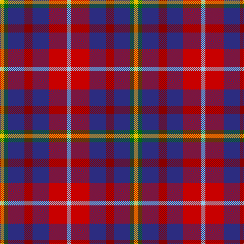

**Bands:** [YGBRBRW](/stripes/ygbrbrw/) · **Stripes:** [LY G DB R DB R LB](/stripes/stripes7/) LY G DB R DB R LB

This was sourced from tartans-authority.  It is a [7 band tartan](/bands/bands7/).

Original link http://www.tartansauthority.com/tartan-ferret/display/7137/

## Thread count
Y/8 G8 DB32 DR16 DB32 R36 LB/8

## Palette
Each colour and its ΔE from the base-6 reference it is a variant of.

| Colour | Shade | Base | ΔE (OKLab) |
|---|---|---|---|
| DB | <code style="background-color:#2C2C80;">#2C2C80</code> `#2C2C80` | B <code style="background-color:#2A418A;">#2A418A</code> | 0.06 |
| DR | <code style="background-color:#880000;">#880000</code> `#880000` | R <code style="background-color:#CC0000;">#CC0000</code> | 0.15 |
| G | <code style="background-color:#006818;">#006818</code> `#006818` | G <code style="background-color:#006100;">#006100</code> | 0.02 |
| LB | <code style="background-color:#98C8E8;">#98C8E8</code> `#98C8E8` | W <code style="background-color:#F7F7F7;">#F7F7F7</code> | 0.18 |
| R | <code style="background-color:#C80000;">#C80000</code> `#C80000` | R <code style="background-color:#CC0000;">#CC0000</code> | 0.01 |
| Y | <code style="background-color:#E8C000;">#E8C000</code> `#E8C000` | Y <code style="background-color:#F2BF00;">#F2BF00</code> | 0.02 |

# Sample pattern

## Nearest tartans

The nearest existing variants by ΔTartan distance.

1. [Feis An Eilein](/setts/s7/y2r9db8m4db8dg2ly2~x8/) — ΔT 0.59
1. [Sustainability (Fashion)](/setts/s8/db20k3g18r12t4r12db15ly4~x2/) — ΔT 1.11
1. [Nicolson of Tiree & Coll (Clan)](/setts/s6/g3db8r11dt3k2dp2~x4/) — ΔT 1.12
1. [Commonwealth](/setts/s10/db12w4r12w5k4o12db20r4db5r4~x2/) — ΔT 1.17
1. [Isle of Gigha (District)](/setts/s7/lo2db4k1db4m4lo4db1~x8/) — ΔT 1.23
1. [Hueg (Formal) (Personal)](/setts/s11/r4w4r5b4r12g4r12g8b13dt3b4~x2/) — ΔT 1.29
1. [Lord's Own Highlanders (Corporate)](/setts/s6/w5o20k8r5dp36lo5~x2/) — ΔT 1.33
1. [Nicolson of Lewis (Clan?)](/setts/s6/dt3dt5n2dg5r11w3~x4/) — ΔT 1.35
1. [Commonwealth](/setts/s10/dt6lo2r6lb3k2lo6dt10r2dt3r2~x4/) — ΔT 1.45
1. [Stewart /Stuart- Fragment Cf 1452 & 1445](/setts/s7/r3t4k11r11g11do3r3~x4/) — ΔT 1.49

## Neighbour map

Every grey dot is one of 14299 variants placed by the first two principal components of the ΔTartan feature space (44% of its variance). Red is this tartan; blue dots are its nearest — click one to open its page.

<svg viewBox="0 0 640 380" role="img" style="max-width:100%;height:auto;border:1px solid #e0e0e0;border-radius:4px;display:block" xmlns="http://www.w3.org/2000/svg"><image href="/nn/cloud.v1.png" width="640" height="380"/><a href="/setts/s7/y2r9db8m4db8dg2ly2~x8/"><circle cx="152.4" cy="220.5" r="4" fill="#3465a4"><title>Feis An Eilein</title></circle></a><a href="/setts/s8/db20k3g18r12t4r12db15ly4~x2/"><circle cx="121.4" cy="202.9" r="4" fill="#3465a4"><title>Sustainability (Fashion)</title></circle></a><a href="/setts/s6/g3db8r11dt3k2dp2~x4/"><circle cx="128.2" cy="203.9" r="4" fill="#3465a4"><title>Nicolson of Tiree &amp; Coll (Clan)</title></circle></a><a href="/setts/s10/db12w4r12w5k4o12db20r4db5r4~x2/"><circle cx="147.1" cy="202.8" r="4" fill="#3465a4"><title>Commonwealth</title></circle></a><a href="/setts/s7/lo2db4k1db4m4lo4db1~x8/"><circle cx="115.5" cy="249.7" r="4" fill="#3465a4"><title>Isle of Gigha (District)</title></circle></a><a href="/setts/s11/r4w4r5b4r12g4r12g8b13dt3b4~x2/"><circle cx="127.0" cy="198.3" r="4" fill="#3465a4"><title>Hueg (Formal) (Personal)</title></circle></a><a href="/setts/s6/w5o20k8r5dp36lo5~x2/"><circle cx="179.0" cy="176.2" r="4" fill="#3465a4"><title>Lord's Own Highlanders (Corporate)</title></circle></a><a href="/setts/s6/dt3dt5n2dg5r11w3~x4/"><circle cx="99.5" cy="207.4" r="4" fill="#3465a4"><title>Nicolson of Lewis (Clan?)</title></circle></a><a href="/setts/s10/dt6lo2r6lb3k2lo6dt10r2dt3r2~x4/"><circle cx="149.7" cy="209.7" r="4" fill="#3465a4"><title>Commonwealth</title></circle></a><a href="/setts/s7/r3t4k11r11g11do3r3~x4/"><circle cx="97.6" cy="233.3" r="4" fill="#3465a4"><title>Stewart /Stuart- Fragment Cf 1452 &amp; 1445</title></circle></a><circle cx="137.6" cy="212.8" r="5" fill="#c00000"/></svg>

ID: /setts/s7/ly2g2db8r4db8r9lb2~x4/
