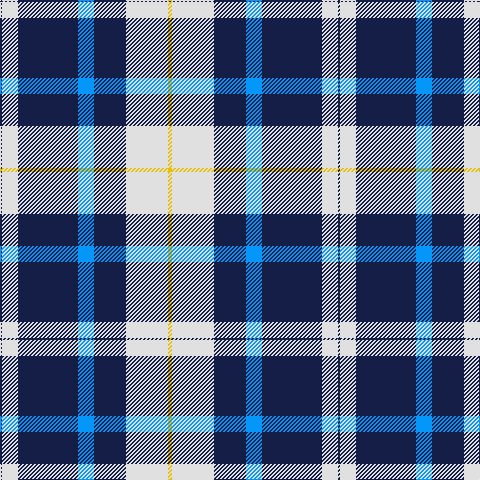

This page is one **sett** — a single exact thread-count. It belongs to the [tartan](/tartans/ly2w21db16b8db30w8db1/)
(the same proportion at any scale), whose colour order is pattern [BWBBBWY](/stripes/bwbbbwy/).

Sourced from register-of-tartans.  It is a [7 stripe tartan](/stripes/stripes7/).

Original link https://www.tartanregister.gov.uk/tartanDetails.aspx?ref=3038

## Register references

External register numbers recorded for this tartan.

- Scottish Register of Tartans: [3038](https://www.tartanregister.gov.uk/tartanDetails.aspx?ref=3038)
- Scottish Tartans World Register: 2682

## Thread count
Y/4 LN42 DB32 B16 DB60 LN16 DB/2

## Palette

Palette: <strong>Tartan Register</strong>
<table><thead><tr><th>Colour</th><th>Threads</th><th>Shade</th><th>Base</th><th>OKLCh</th></tr></thead><tbody><tr><td>Y/</td><td style="text-align:right;font-variant-numeric:tabular-nums">4</td><td><code style="background-color:#E8C000;">#E8C000</code> <small style="color:#888">#E8C000</small></td><td>Y <code style="background-color:#F2BF00;">#F2BF00</code></td><td><small style="color:#888">oklch(81.9% 0.168 93.7)</small></td></tr><tr><td>LN</td><td style="text-align:right;font-variant-numeric:tabular-nums">42</td><td><code style="background-color:#E0E0E0;">#E0E0E0</code> <small style="color:#888">#E0E0E0</small></td><td>W <code style="background-color:#F7F7F7;">#F7F7F7</code></td><td><small style="color:#888">oklch(90.7% 0.000 89.9)</small></td></tr><tr><td>DB</td><td style="text-align:right;font-variant-numeric:tabular-nums">32</td><td><code style="background-color:#141E46;">#141E46</code> <small style="color:#888">#141E46</small></td><td>B <code style="background-color:#2A418A;">#2A418A</code></td><td><small style="color:#888">oklch(25.2% 0.076 269.7)</small></td></tr><tr><td>B</td><td style="text-align:right;font-variant-numeric:tabular-nums">16</td><td><code style="background-color:#0596FA;">#0596FA</code> <small style="color:#888">#0596FA</small></td><td>B <code style="background-color:#2A418A;">#2A418A</code></td><td><small style="color:#888">oklch(66.0% 0.180 248.9)</small></td></tr><tr><td>DB</td><td style="text-align:right;font-variant-numeric:tabular-nums">60</td><td><code style="background-color:#141E46;">#141E46</code> <small style="color:#888">#141E46</small></td><td>B <code style="background-color:#2A418A;">#2A418A</code></td><td><small style="color:#888">oklch(25.2% 0.076 269.7)</small></td></tr><tr><td>LN</td><td style="text-align:right;font-variant-numeric:tabular-nums">16</td><td><code style="background-color:#E0E0E0;">#E0E0E0</code> <small style="color:#888">#E0E0E0</small></td><td>W <code style="background-color:#F7F7F7;">#F7F7F7</code></td><td><small style="color:#888">oklch(90.7% 0.000 89.9)</small></td></tr><tr><td>DB/</td><td style="text-align:right;font-variant-numeric:tabular-nums">2</td><td><code style="background-color:#141E46;">#141E46</code> <small style="color:#888">#141E46</small></td><td>B <code style="background-color:#2A418A;">#2A418A</code></td><td><small style="color:#888">oklch(25.2% 0.076 269.7)</small></td></tr></tbody></table>

# Sample pattern

## Nearest tartans

The nearest existing variants by ΔTartan distance, with this tartan at the top so the swatches line up against it.

ΔTartan

Tartan

Sett

—

<a href="/ttd/edit/#slug=ly2w21db16b8db30w8db1~x2">Muir, John</a> <a class="nn-out" href="/setts/s7/ly2w21db16b8db30w8db1~x2/" title="open its dictionary page">↗</a>

1.10

<a href="/ttd/edit/#slug=db26w28db14ly3k1ly2k1~x2">Gothenburg/Goteborg</a> <a class="nn-out" href="/setts/s7/db26w28db14ly3k1ly2k1~x2/" title="open its dictionary page">↗</a>

1.45

<a href="/ttd/edit/#slug=g30w8db32ly1db8~x2">Wimbledon</a> <a class="nn-out" href="/setts/s5/g30w8db32ly1db8~x2/" title="open its dictionary page">↗</a>

1.48

<a href="/ttd/edit/#slug=r1w10ly2w16db40w1~x2">Caithness Glass (Corporate)</a> <a class="nn-out" href="/setts/s6/r1w10ly2w16db40w1~x2/" title="open its dictionary page">↗</a>

1.50

<a href="/ttd/edit/#slug=db42lbi2lb2lbi2db5dt12lb32db4~x2">Longniddry Eildon Blue Dress Fancy Tartan Tartan Number: 5486. Earliest known date: pre 1992 Dancers tartan See products available Copyright © Blair Urquhart, Comrie, 2015</a> <a class="nn-out" href="/setts/s8/db42lbi2lb2lbi2db5dt12lb32db4~x2/" title="open its dictionary page">↗</a>

1.51

<a href="/ttd/edit/#slug=dt42lbi2lb2lbi2dt5dti12lb32dt4~x2">Longniddry Blue (Dance)</a> <a class="nn-out" href="/setts/s8/dt42lbi2lb2lbi2dt5dti12lb32dt4~x2/" title="open its dictionary page">↗</a>

1.53

<a href="/ttd/edit/#slug=k4lg3k30lg33r1lg4~x2">Intergen (Corporate)</a> <a class="nn-out" href="/setts/s6/k4lg3k30lg33r1lg4~x2/" title="open its dictionary page">↗</a>

1.55

<a href="/ttd/edit/#slug=k5w7k5y20db1~x4">Burberry Grey (Original)</a> <a class="nn-out" href="/setts/s5/k5w7k5y20db1~x4/" title="open its dictionary page">↗</a>

1.55

<a href="/ttd/edit/#slug=lg33r1lg4r1lg33k30ly3k4ly3k30~x2">Intergen</a> <a class="nn-out" href="/setts/s10/lg33r1lg4r1lg33k30ly3k4ly3k30~x2/" title="open its dictionary page">↗</a>

1.57

<a href="/ttd/edit/#slug=db30lb2k9w3db6w4k3lb6~x2">Detroit Lions</a> <a class="nn-out" href="/setts/s8/db30lb2k9w3db6w4k3lb6~x2/" title="open its dictionary page">↗</a>

1.59

<a href="/ttd/edit/#slug=w15ly2k5lb3b40k10">Herriot New Zealand</a> <a class="nn-out" href="/setts/s6/w15ly2k5lb3b40k10/" title="open its dictionary page">↗</a>

## Neighbour map

Every grey dot is one of 14359 variants placed by the first two principal components of the ΔTartan feature space (44% of its variance). Red is this tartan; blue dots are its nearest — click one to open its page.

<svg viewBox="0 0 640 380" role="img" style="max-width:100%;height:auto;border:1px solid #e0e0e0;border-radius:4px;display:block" xmlns="http://www.w3.org/2000/svg"><image href="/nn/cloud.v1.png" width="640" height="380"/><a href="/setts/s7/db26w28db14ly3k1ly2k1~x2/"><circle cx="308.0" cy="133.0" r="4" fill="#3465a4"><title>Gothenburg/Goteborg</title></circle></a><a href="/setts/s5/g30w8db32ly1db8~x2/"><circle cx="304.8" cy="181.1" r="4" fill="#3465a4"><title>Wimbledon</title></circle></a><a href="/setts/s6/r1w10ly2w16db40w1~x2/"><circle cx="352.3" cy="114.0" r="4" fill="#3465a4"><title>Caithness Glass (Corporate)</title></circle></a><a href="/setts/s8/db42lbi2lb2lbi2db5dt12lb32db4~x2/"><circle cx="288.7" cy="139.6" r="4" fill="#3465a4"><title>Longniddry Eildon Blue Dress Fancy Tartan Tartan Number: 5486. Earliest known date: pre 1992 Dancers tartan See products available Copyright © Blair Urquhart, Comrie, 2015</title></circle></a><a href="/setts/s8/dt42lbi2lb2lbi2dt5dti12lb32dt4~x2/"><circle cx="286.7" cy="140.0" r="4" fill="#3465a4"><title>Longniddry Blue (Dance)</title></circle></a><a href="/setts/s6/k4lg3k30lg33r1lg4~x2/"><circle cx="322.8" cy="147.7" r="4" fill="#3465a4"><title>Intergen (Corporate)</title></circle></a><a href="/setts/s5/k5w7k5y20db1~x4/"><circle cx="279.8" cy="176.8" r="4" fill="#3465a4"><title>Burberry Grey (Original)</title></circle></a><a href="/setts/s10/lg33r1lg4r1lg33k30ly3k4ly3k30~x2/"><circle cx="303.2" cy="129.1" r="4" fill="#3465a4"><title>Intergen</title></circle></a><a href="/setts/s8/db30lb2k9w3db6w4k3lb6~x2/"><circle cx="290.8" cy="154.2" r="4" fill="#3465a4"><title>Detroit Lions</title></circle></a><a href="/setts/s6/w15ly2k5lb3b40k10/"><circle cx="251.6" cy="139.2" r="4" fill="#3465a4"><title>Herriot New Zealand</title></circle></a><circle cx="288.1" cy="150.8" r="5" fill="#c00000"/></svg>

ID: /setts/s7/ly2w21db16b8db30w8db1~x2/
