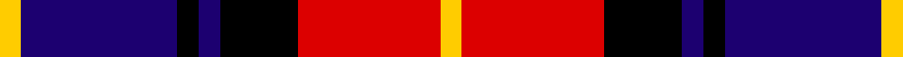

In pattern [YBKBKRY](/stripes/ybkbkry/).

This was sourced from register-of-tartans.  It is a [7 stripe tartan](/stripes/stripes7/).

Original link https://www.tartanregister.gov.uk/tartanDetails.aspx?ref=11100

## Attestations

This cloth appears in 2 source records; the oldest owns this page.

- 26/06/2014 — Biffy Clyro (register-of-tartans, [record](https://www.tartanregister.gov.uk/tartanDetails.aspx?ref=11100))
- 2014 — Biffy Clyro (tartans-authority, [record](http://www.tartansauthority.com/tartan-ferret/display/11100/))

## Register references

External register numbers recorded for this tartan.

- Scottish Register of Tartans: [11100](https://www.tartanregister.gov.uk/tartanDetails.aspx?ref=11100)

## Thread count
Y/6 DB44 K6 DB6 K22 R40 Y/6

## Palette
Each colour and the base-6 reference it is a variant of.

| Colour | Shade | Base |
|---|---|---|
| DB | <code style="background-color:#1C0070;">#1C0070</code> `oklch(26.3% 0.162 277.1)` <small>#1C0070</small> | B <code style="background-color:#2A418A;">#2A418A</code> |
| K | <code style="background-color:#000000;">#000000</code> `oklch(0.0% 0.000 0.0)` <small>#000000</small> | K <code style="background-color:#000000;">#000000</code> |
| R | <code style="background-color:#DC0000;">#DC0000</code> `oklch(56.2% 0.230 29.2)` <small>#DC0000</small> | R <code style="background-color:#CC0000;">#CC0000</code> |
| Y | <code style="background-color:#FFCC00;">#FFCC00</code> `oklch(86.5% 0.177 90.4)` <small>#FFCC00</small> | Y <code style="background-color:#F2BF00;">#F2BF00</code> |

# Sample pattern

## Nearest tartans

The nearest existing variants by ΔTartan distance.

1. [Graham of Menteith, (Red)](/setts/s6/r26t3r4k16db16k4~x2/) — ΔT 1.03
1. [MacTavish](/setts/s6/b2r12db2b6k6b1~x2/) — ΔT 1.08
1. [MacTavish](/setts/s6/b2r12db2b6k6b1/) — ΔT 1.08
1. [Aitken](/setts/s8/lo5db2k2db12k16r20k2r4~x2/) — ΔT 1.09
1. [Baillie](/setts/s7/p3k1p8k6g8k1w2~x2/) — ΔT 1.15
1. [Gipsy](/setts/s9/k1r1k5r1w1r1db5r1k1~x2/) — ΔT 1.15
1. [Dutch](/setts/s6/k4o19k19o2dp22w4~x2/) — ΔT 1.18
1. [Gipsy (Fashion)](/setts/s9/k2r2k8r2w1r2db8r2k2~x4/) — ΔT 1.20
1. [Unidentified #65](/setts/s6/dg3k20k20r20k3r3~x2/) — ΔT 1.22
1. [Ainslie](/setts/s9/db23k4db4r4db4r25w4k4w4~x2/) — ΔT 1.24

## Neighbour map

Every grey dot is one of 14299 variants placed by the first two principal components of the ΔTartan feature space (44% of its variance). Red is this tartan; blue dots are its nearest — click one to open its page.

<svg viewBox="0 0 640 380" role="img" style="max-width:100%;height:auto;border:1px solid #e0e0e0;border-radius:4px;display:block" xmlns="http://www.w3.org/2000/svg"><image href="/nn/cloud.v1.png" width="640" height="380"/><a href="/setts/s6/r26t3r4k16db16k4~x2/"><circle cx="205.9" cy="207.4" r="4" fill="#3465a4"><title>Graham of Menteith, (Red)</title></circle></a><a href="/setts/s6/b2r12db2b6k6b1~x2/"><circle cx="210.5" cy="195.6" r="4" fill="#3465a4"><title>MacTavish</title></circle></a><a href="/setts/s6/b2r12db2b6k6b1/"><circle cx="210.5" cy="195.6" r="4" fill="#3465a4"><title>MacTavish</title></circle></a><a href="/setts/s8/lo5db2k2db12k16r20k2r4~x2/"><circle cx="188.4" cy="189.3" r="4" fill="#3465a4"><title>Aitken</title></circle></a><a href="/setts/s7/p3k1p8k6g8k1w2~x2/"><circle cx="148.2" cy="207.3" r="4" fill="#3465a4"><title>Baillie</title></circle></a><a href="/setts/s9/k1r1k5r1w1r1db5r1k1~x2/"><circle cx="164.5" cy="201.2" r="4" fill="#3465a4"><title>Gipsy</title></circle></a><a href="/setts/s6/k4o19k19o2dp22w4~x2/"><circle cx="152.7" cy="197.2" r="4" fill="#3465a4"><title>Dutch</title></circle></a><a href="/setts/s9/k2r2k8r2w1r2db8r2k2~x4/"><circle cx="179.6" cy="193.7" r="4" fill="#3465a4"><title>Gipsy (Fashion)</title></circle></a><a href="/setts/s6/dg3k20k20r20k3r3~x2/"><circle cx="165.0" cy="226.5" r="4" fill="#3465a4"><title>Unidentified #65</title></circle></a><a href="/setts/s9/db23k4db4r4db4r25w4k4w4~x2/"><circle cx="194.0" cy="177.7" r="4" fill="#3465a4"><title>Ainslie</title></circle></a><circle cx="163.9" cy="191.2" r="5" fill="#c00000"/></svg>

ID: /setts/s7/ly3db22k3db3k11r20ly3~x2/
