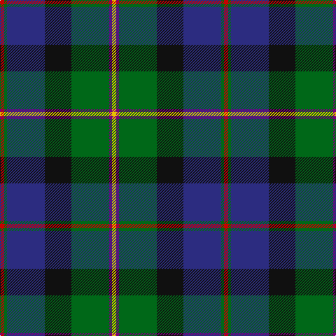

**Bands:** [RGBKGBY](/stripes/rgbkgby/) · **Stripes:** [R G DB K G DP LY](/stripes/stripes7/) R G DB K G DP LY

This was sourced from register-of-tartans.  It is a [7 band tartan](/bands/bands7/).

Original link https://www.tartanregister.gov.uk/tartanDetails.aspx?ref=647

## Attestations

This cloth appears in 2 source records; the oldest owns this page.

- 01/01/2005 — Christian Hunting (Personal) (register-of-tartans, [record](https://www.tartanregister.gov.uk/tartanDetails.aspx?ref=647))
- 2005 January — Christian Htg (Personal) (tartans-authority, [record](http://www.tartansauthority.com/tartan-ferret/display/6830/))

## Register references

External register numbers recorded for this tartan.

- Scottish Register of Tartans: [647](https://www.tartanregister.gov.uk/tartanDetails.aspx?ref=647)
- Scottish Tartans Authority (ITI): 6830

## Thread count
R/6 G4 DB54 K38 G54 P4 Y/6

## Palette
Each colour and its ΔE from the base-6 reference it is a variant of.

| Colour | Shade | Base | ΔE (OKLab) |
|---|---|---|---|
| DB | <code style="background-color:#2C2C80;">#2C2C80</code> `#2C2C80` | B <code style="background-color:#2A418A;">#2A418A</code> | 0.06 |
| G | <code style="background-color:#006818;">#006818</code> `#006818` | G <code style="background-color:#006100;">#006100</code> | 0.02 |
| K | <code style="background-color:#101010;">#101010</code> `#101010` | K <code style="background-color:#000000;">#000000</code> | 0.17 |
| P | <code style="background-color:#780078;">#780078</code> `#780078` | B <code style="background-color:#2A418A;">#2A418A</code> | 0.17 |
| R | <code style="background-color:#C80000;">#C80000</code> `#C80000` | R <code style="background-color:#CC0000;">#CC0000</code> | 0.01 |
| Y | <code style="background-color:#E8C000;">#E8C000</code> `#E8C000` | Y <code style="background-color:#F2BF00;">#F2BF00</code> | 0.02 |

# Sample pattern

## Nearest tartans

The nearest existing variants by ΔTartan distance.

1. [MacNeil - 1840 (Chief's sett)](/setts/s7/ly2k6g33k33db33r3w2~x2/) — ΔT 0.43
1. [James (Personal)](/setts/s7/lr2db6ly1dg12ly1k6r2~x4/) — ΔT 0.68
1. [Sey (Name)](/setts/s8/r2k8ly1k8g13db13lo1r2~x2/) — ΔT 0.69
1. [Macneil of Barra - Chief (Personal)](/setts/s7/ly1k3g15k14b16r2w1~x2/) — ΔT 0.83
1. [McComb (Personal)](/setts/s7/db3r2db18k6g18ly2g3~x2/) — ΔT 0.84
1. [Grandfather Mountain Games (District](/setts/s7/r3dg20k2n11k2db20lr2~x2/) — ΔT 0.84
1. [McComb](/setts/s7/db3r2db18k6dg18ly2g3~x2/) — ΔT 0.86
1. [Royal Burgh of Peebles (District)](/setts/s7/r3g3db4g17k13dt26w3~x2/) — ΔT 0.88
1. [St. Andrews Golf Club (Corporate)](/setts/s9/lo1g3lb1g5k1g1k9db12w1~x4/) — ΔT 0.90
1. [Loch Awe](/setts/s9/lb3k2r3g20k24db20r3k2ly3~x2/) — ΔT 0.93

## Neighbour map

Every grey dot is one of 14313 variants placed by the first two principal components of the ΔTartan feature space (44% of its variance). Red is this tartan; blue dots are its nearest — click one to open its page.

<svg viewBox="0 0 640 380" role="img" style="max-width:100%;height:auto;border:1px solid #e0e0e0;border-radius:4px;display:block" xmlns="http://www.w3.org/2000/svg"><image href="/nn/cloud.v1.png" width="640" height="380"/><a href="/setts/s7/ly2k6g33k33db33r3w2~x2/"><circle cx="182.3" cy="160.4" r="4" fill="#3465a4"><title>MacNeil - 1840 (Chief's sett)</title></circle></a><a href="/setts/s7/lr2db6ly1dg12ly1k6r2~x4/"><circle cx="163.4" cy="169.7" r="4" fill="#3465a4"><title>James (Personal)</title></circle></a><a href="/setts/s8/r2k8ly1k8g13db13lo1r2~x2/"><circle cx="147.8" cy="169.0" r="4" fill="#3465a4"><title>Sey (Name)</title></circle></a><a href="/setts/s7/ly1k3g15k14b16r2w1~x2/"><circle cx="152.2" cy="155.7" r="4" fill="#3465a4"><title>Macneil of Barra - Chief (Personal)</title></circle></a><a href="/setts/s7/db3r2db18k6g18ly2g3~x2/"><circle cx="184.9" cy="184.2" r="4" fill="#3465a4"><title>McComb (Personal)</title></circle></a><a href="/setts/s7/r3dg20k2n11k2db20lr2~x2/"><circle cx="155.0" cy="183.4" r="4" fill="#3465a4"><title>Grandfather Mountain Games (District</title></circle></a><a href="/setts/s7/db3r2db18k6dg18ly2g3~x2/"><circle cx="177.1" cy="181.7" r="4" fill="#3465a4"><title>McComb</title></circle></a><a href="/setts/s7/r3g3db4g17k13dt26w3~x2/"><circle cx="155.4" cy="190.2" r="4" fill="#3465a4"><title>Royal Burgh of Peebles (District)</title></circle></a><a href="/setts/s9/lo1g3lb1g5k1g1k9db12w1~x4/"><circle cx="164.3" cy="149.6" r="4" fill="#3465a4"><title>St. Andrews Golf Club (Corporate)</title></circle></a><a href="/setts/s9/lb3k2r3g20k24db20r3k2ly3~x2/"><circle cx="145.1" cy="144.2" r="4" fill="#3465a4"><title>Loch Awe</title></circle></a><circle cx="174.9" cy="166.7" r="5" fill="#c00000"/></svg>

ID: /setts/s7/ly3dp2g27k19db27g2r3~x2/
