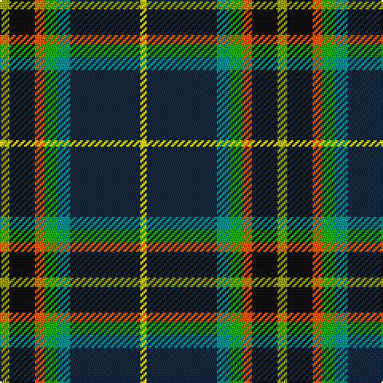

**Bands:** [YBGGRKY](/stripes/ybggrky/) · **Stripes:** [LY DT G G O K LY](/stripes/stripes7/) LY DT G G O K LY

This was sourced from register-of-tartans.  It is a [7 band tartan](/bands/bands7/).

Original link https://www.tartanregister.gov.uk/tartanDetails.aspx?ref=11634

## Register references

External register numbers recorded for this tartan.

- Scottish Register of Tartans: [11634](https://www.tartanregister.gov.uk/tartanDetails.aspx?ref=11634)

## Thread count
LG/6 K16 O6 G8 B8 DN44 Y/4

## Palette
Each colour and its ΔE from the base-6 reference it is a variant of.

| Colour | Shade | Base | ΔE (OKLab) |
|---|---|---|---|
| B | <code style="background-color:#048888;">#048888</code> `#048888` | G <code style="background-color:#006100;">#006100</code> | 0.18 |
| DN | <code style="background-color:#14283C;">#14283C</code> `#14283C` | B <code style="background-color:#2A418A;">#2A418A</code> | 0.15 |
| G | <code style="background-color:#289C18;">#289C18</code> `#289C18` | G <code style="background-color:#006100;">#006100</code> | 0.19 |
| K | <code style="background-color:#101010;">#101010</code> `#101010` | K <code style="background-color:#000000;">#000000</code> | 0.17 |
| LG | <code style="background-color:#9C9C00;">#9C9C00</code> `#9C9C00` | Y <code style="background-color:#F2BF00;">#F2BF00</code> | 0.17 |
| O | <code style="background-color:#E86000;">#E86000</code> `#E86000` | R <code style="background-color:#CC0000;">#CC0000</code> | 0.14 |
| Y | <code style="background-color:#FFFF00;">#FFFF00</code> `#FFFF00` | Y <code style="background-color:#F2BF00;">#F2BF00</code> | 0.16 |

# Sample pattern

## Nearest tartans

The nearest existing variants by ΔTartan distance.

1. [Scottish Ambulance Service (Corporat](/setts/s9/lb3dg2t2dg32k2g2k12t16r3~x2/) — ΔT 1.11
1. [Roderick Dhu](/setts/s9/b3k2r2k12g10ly1k1g2lb2~x4/) — ΔT 1.15
1. [Brooke (D.C.Dalgliesh version)](/setts/s9/db1t1db1k8dg10k8r1w1ly1~x2/) — ΔT 1.18
1. [Carleton College Rugby](/setts/s6/o5dt30w3dg15ly8r4~x2/) — ΔT 1.22
1. [Washington State](/setts/s7/w3r3db16g32t3k3ly2~x2/) — ΔT 1.24
1. [Colorado](/setts/s9/g32lb3dp3lb3g2k20t17r3lo4~x2/) — ΔT 1.24
1. [Colorado (District)](/setts/s9/dg32lb3p3lb3dg2k20db17r3ly4~x2/) — ΔT 1.28
1. [Royal Air Force Lossiemouth](/setts/s10/lo3k5g2k20dt8g3t18r2t18o3~x2/) — ΔT 1.28
1. [Cornish Hunting District Tartan Tartan Number: 1568. Earliest known date: 1984 The Cornish Hunting tartan was first produced in 1984, and was marketed by the firm, Cornovi Creations, Cornwall. It is based on the Cornish National tartan designed by E.E. Morton-Nance, who regarded tartan as the heritage of all Celts, not Scots alone. (P Smith and G Teall, District Tartans, 1992) The hunting sett replaces the 'National' yellow with dark green and the azure with a darker shade of blue. Cornish Hunting is a registered design (No. 514267). See products available Copyright © Blair Urquhart, Comrie, 2015](/setts/s7/w5k26ly2dg24dt7k3r3~x2/) — ΔT 1.30
1. [James (Personal)](/setts/s7/lr2db6ly1dg12ly1k6r2~x4/) — ΔT 1.33

## Neighbour map

Every grey dot is one of 14313 variants placed by the first two principal components of the ΔTartan feature space (44% of its variance). Red is this tartan; blue dots are its nearest — click one to open its page.

<svg viewBox="0 0 640 380" role="img" style="max-width:100%;height:auto;border:1px solid #e0e0e0;border-radius:4px;display:block" xmlns="http://www.w3.org/2000/svg"><image href="/nn/cloud.v1.png" width="640" height="380"/><a href="/setts/s9/lb3dg2t2dg32k2g2k12t16r3~x2/"><circle cx="185.1" cy="104.1" r="4" fill="#3465a4"><title>Scottish Ambulance Service (Corporat</title></circle></a><a href="/setts/s9/b3k2r2k12g10ly1k1g2lb2~x4/"><circle cx="187.3" cy="145.8" r="4" fill="#3465a4"><title>Roderick Dhu</title></circle></a><a href="/setts/s9/db1t1db1k8dg10k8r1w1ly1~x2/"><circle cx="217.4" cy="145.0" r="4" fill="#3465a4"><title>Brooke (D.C.Dalgliesh version)</title></circle></a><a href="/setts/s6/o5dt30w3dg15ly8r4~x2/"><circle cx="172.0" cy="167.9" r="4" fill="#3465a4"><title>Carleton College Rugby</title></circle></a><a href="/setts/s7/w3r3db16g32t3k3ly2~x2/"><circle cx="225.1" cy="118.6" r="4" fill="#3465a4"><title>Washington State</title></circle></a><a href="/setts/s9/g32lb3dp3lb3g2k20t17r3lo4~x2/"><circle cx="127.6" cy="102.9" r="4" fill="#3465a4"><title>Colorado</title></circle></a><a href="/setts/s9/dg32lb3p3lb3dg2k20db17r3ly4~x2/"><circle cx="135.2" cy="107.7" r="4" fill="#3465a4"><title>Colorado (District)</title></circle></a><a href="/setts/s10/lo3k5g2k20dt8g3t18r2t18o3~x2/"><circle cx="151.6" cy="141.0" r="4" fill="#3465a4"><title>Royal Air Force Lossiemouth</title></circle></a><a href="/setts/s7/w5k26ly2dg24dt7k3r3~x2/"><circle cx="196.1" cy="163.3" r="4" fill="#3465a4"><title>Cornish Hunting District Tartan Tartan Number: 1568. Earliest known date: 1984 The Cornish Hunting tartan was first produced in 1984, and was marketed by the firm, Cornovi Creations, Cornwall. It is based on the Cornish National tartan designed by E.E. Morton-Nance, who regarded tartan as the heritage of all Celts, not Scots alone. (P Smith and G Teall, District Tartans, 1992) The hunting sett replaces the 'National' yellow with dark green and the azure with a darker shade of blue. Cornish Hunting is a registered design (No. 514267). See products available Copyright © Blair Urquhart, Comrie, 2015</title></circle></a><a href="/setts/s7/lr2db6ly1dg12ly1k6r2~x4/"><circle cx="163.4" cy="169.7" r="4" fill="#3465a4"><title>James (Personal)</title></circle></a><circle cx="171.3" cy="139.9" r="5" fill="#c00000"/></svg>

ID: /setts/s7/ly3k8o3g4g4dt22ly2~x2/
