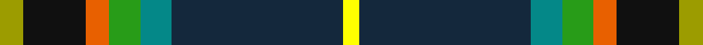

This page is one **sett** — a single exact thread-count. It belongs to the [tartan](/tartans/ly3k8o3g4gi4dt22lyi2/)
(the same proportion at any scale), whose colour order is pattern [YBGGRKY](/stripes/ybggrky/).

Sourced from register-of-tartans.  It is a [7 stripe tartan](/stripes/stripes7/).

Original link https://www.tartanregister.gov.uk/tartanDetails.aspx?ref=11634

## Register references

External register numbers recorded for this tartan.

- Scottish Register of Tartans: [11634](https://www.tartanregister.gov.uk/tartanDetails.aspx?ref=11634)

## Thread count
LG/6 K16 O6 G8 B8 DN44 Y/4

## Palette

Palette: <strong>Tartan Register</strong>
<table><thead><tr><th>Colour</th><th>Threads</th><th>Shade</th><th>Base</th><th>OKLCh</th></tr></thead><tbody><tr><td>LG/</td><td style="text-align:right;font-variant-numeric:tabular-nums">6</td><td><code style="background-color:#9C9C00;">#9C9C00</code> <small style="color:#888">#9C9C00</small></td><td>Y <code style="background-color:#F2BF00;">#F2BF00</code></td><td><small style="color:#888">oklch(67.1% 0.146 109.8)</small></td></tr><tr><td>K</td><td style="text-align:right;font-variant-numeric:tabular-nums">16</td><td><code style="background-color:#101010;">#101010</code> <small style="color:#888">#101010</small></td><td>K <code style="background-color:#000000;">#000000</code></td><td><small style="color:#888">oklch(17.3% 0.000 89.9)</small></td></tr><tr><td>O</td><td style="text-align:right;font-variant-numeric:tabular-nums">6</td><td><code style="background-color:#E86000;">#E86000</code> <small style="color:#888">#E86000</small></td><td>R <code style="background-color:#CC0000;">#CC0000</code></td><td><small style="color:#888">oklch(65.3% 0.187 44.9)</small></td></tr><tr><td>G</td><td style="text-align:right;font-variant-numeric:tabular-nums">8</td><td><code style="background-color:#289C18;">#289C18</code> <small style="color:#888">#289C18</small></td><td>G <code style="background-color:#006100;">#006100</code></td><td><small style="color:#888">oklch(60.6% 0.191 141.6)</small></td></tr><tr><td>B</td><td style="text-align:right;font-variant-numeric:tabular-nums">8</td><td><code style="background-color:#048888;">#048888</code> <small style="color:#888">#048888</small></td><td>G <code style="background-color:#006100;">#006100</code></td><td><small style="color:#888">oklch(56.8% 0.096 194.8)</small></td></tr><tr><td>DN</td><td style="text-align:right;font-variant-numeric:tabular-nums">44</td><td><code style="background-color:#14283C;">#14283C</code> <small style="color:#888">#14283C</small></td><td>B <code style="background-color:#2A418A;">#2A418A</code></td><td><small style="color:#888">oklch(27.1% 0.046 249.9)</small></td></tr><tr><td>Y/</td><td style="text-align:right;font-variant-numeric:tabular-nums">4</td><td><code style="background-color:#FFFF00;">#FFFF00</code> <small style="color:#888">#FFFF00</small></td><td>Y <code style="background-color:#F2BF00;">#F2BF00</code></td><td><small style="color:#888">oklch(96.8% 0.211 109.8)</small></td></tr></tbody></table>

# Sample pattern

## Nearest tartans

The nearest existing variants by ΔTartan distance, with this tartan at the top so the swatches line up against it.

ΔTartan

Tartan

Sett

—

<a href="/ttd/edit/#slug=ly3k8o3g4gi4dt22lyi2~x2">Young Enterprise Scotland</a> <a class="nn-out" href="/setts/s7/ly3k8o3g4gi4dt22lyi2~x2/" title="open its dictionary page">↗</a>

1.11

<a href="/ttd/edit/#slug=r3ti16k12g2k2dg32t2dg2lb3~x2">Scottish Ambulance Service (Corporat</a> <a class="nn-out" href="/setts/s9/r3ti16k12g2k2dg32t2dg2lb3~x2/" title="open its dictionary page">↗</a>

1.15

<a href="/ttd/edit/#slug=b3k2r2k12g10ly1k1g2lb2~x4">Roderick Dhu</a> <a class="nn-out" href="/setts/s9/b3k2r2k12g10ly1k1g2lb2~x4/" title="open its dictionary page">↗</a>

1.18

<a href="/ttd/edit/#slug=db1t1db1k8dg10k8r1w1ly1~x2">Brooke (D.C.Dalgliesh version)</a> <a class="nn-out" href="/setts/s9/db1t1db1k8dg10k8r1w1ly1~x2/" title="open its dictionary page">↗</a>

1.22

<a href="/ttd/edit/#slug=o5dt30w3dg15ly8r4~x2">Carleton College Rugby</a> <a class="nn-out" href="/setts/s6/o5dt30w3dg15ly8r4~x2/" title="open its dictionary page">↗</a>

1.24

<a href="/ttd/edit/#slug=w3r3db16g32t3k3ly2~x2">Washington State</a> <a class="nn-out" href="/setts/s7/w3r3db16g32t3k3ly2~x2/" title="open its dictionary page">↗</a>

1.24

<a href="/ttd/edit/#slug=g32lb3dp3lb3g2k20t17r3lo4~x2">Colorado</a> <a class="nn-out" href="/setts/s9/g32lb3dp3lb3g2k20t17r3lo4~x2/" title="open its dictionary page">↗</a>

1.28

<a href="/ttd/edit/#slug=dg32lb3p3lb3dg2k20db17r3ly4~x2">Colorado (District)</a> <a class="nn-out" href="/setts/s9/dg32lb3p3lb3dg2k20db17r3ly4~x2/" title="open its dictionary page">↗</a>

1.28

<a href="/ttd/edit/#slug=o3t18r2t18g3dt8k20g2k5lo3~x2">Royal Air Force Lossiemouth</a> <a class="nn-out" href="/setts/s10/o3t18r2t18g3dt8k20g2k5lo3~x2/" title="open its dictionary page">↗</a>

1.30

<a href="/ttd/edit/#slug=w5k26ly2dg24dt7k3r3~x2">Cornish Hunting District Tartan Tartan Number: 1568. Earliest known date: 1984 The Cornish Hunting tartan was first produced in 1984, and was marketed by the firm, Cornovi Creations, Cornwall. It is based on the Cornish National tartan designed by E.E. Morton-Nance, who regarded tartan as the heritage of all Celts, not Scots alone. (P Smith and G Teall, District Tartans, 1992) The hunting sett replaces the 'National' yellow with dark green and the azure with a darker shade of blue. Cornish Hunting is a registered design (No. 514267). See products available Copyright © Blair Urquhart, Comrie, 2015</a> <a class="nn-out" href="/setts/s7/w5k26ly2dg24dt7k3r3~x2/" title="open its dictionary page">↗</a>

1.33

<a href="/ttd/edit/#slug=r2k6ly1dg12ly1db6lr2~x4">James (Personal)</a> <a class="nn-out" href="/setts/s7/r2k6ly1dg12ly1db6lr2~x4/" title="open its dictionary page">↗</a>

## Neighbour map

Every grey dot is one of 14359 variants placed by the first two principal components of the ΔTartan feature space (44% of its variance). Red is this tartan; blue dots are its nearest — click one to open its page.

<svg viewBox="0 0 640 380" role="img" style="max-width:100%;height:auto;border:1px solid #e0e0e0;border-radius:4px;display:block" xmlns="http://www.w3.org/2000/svg"><image href="/nn/cloud.v1.png" width="640" height="380"/><a href="/setts/s9/r3ti16k12g2k2dg32t2dg2lb3~x2/"><circle cx="184.6" cy="104.7" r="4" fill="#3465a4"><title>Scottish Ambulance Service (Corporat</title></circle></a><a href="/setts/s9/b3k2r2k12g10ly1k1g2lb2~x4/"><circle cx="187.0" cy="146.6" r="4" fill="#3465a4"><title>Roderick Dhu</title></circle></a><a href="/setts/s9/db1t1db1k8dg10k8r1w1ly1~x2/"><circle cx="217.2" cy="145.8" r="4" fill="#3465a4"><title>Brooke (D.C.Dalgliesh version)</title></circle></a><a href="/setts/s6/o5dt30w3dg15ly8r4~x2/"><circle cx="171.4" cy="168.8" r="4" fill="#3465a4"><title>Carleton College Rugby</title></circle></a><a href="/setts/s7/w3r3db16g32t3k3ly2~x2/"><circle cx="224.6" cy="119.1" r="4" fill="#3465a4"><title>Washington State</title></circle></a><a href="/setts/s9/g32lb3dp3lb3g2k20t17r3lo4~x2/"><circle cx="127.2" cy="103.7" r="4" fill="#3465a4"><title>Colorado</title></circle></a><a href="/setts/s9/dg32lb3p3lb3dg2k20db17r3ly4~x2/"><circle cx="135.0" cy="108.6" r="4" fill="#3465a4"><title>Colorado (District)</title></circle></a><a href="/setts/s10/o3t18r2t18g3dt8k20g2k5lo3~x2/"><circle cx="151.3" cy="141.9" r="4" fill="#3465a4"><title>Royal Air Force Lossiemouth</title></circle></a><a href="/setts/s7/w5k26ly2dg24dt7k3r3~x2/"><circle cx="196.0" cy="164.2" r="4" fill="#3465a4"><title>Cornish Hunting District Tartan Tartan Number: 1568. Earliest known date: 1984 The Cornish Hunting tartan was first produced in 1984, and was marketed by the firm, Cornovi Creations, Cornwall. It is based on the Cornish National tartan designed by E.E. Morton-Nance, who regarded tartan as the heritage of all Celts, not Scots alone. (P Smith and G Teall, District Tartans, 1992) The hunting sett replaces the 'National' yellow with dark green and the azure with a darker shade of blue. Cornish Hunting is a registered design (No. 514267). See products available Copyright © Blair Urquhart, Comrie, 2015</title></circle></a><a href="/setts/s7/r2k6ly1dg12ly1db6lr2~x4/"><circle cx="163.4" cy="170.7" r="4" fill="#3465a4"><title>James (Personal)</title></circle></a><circle cx="171.0" cy="140.7" r="5" fill="#c00000"/></svg>

ID: /setts/s7/ly3k8o3g4gi4dt22lyi2~x2/
