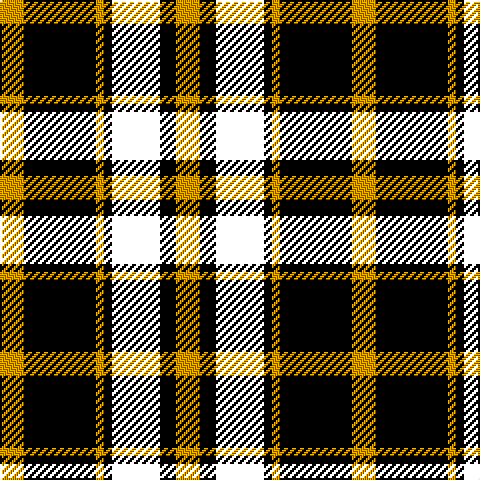

This page is one **sett** — a single exact thread-count. It belongs to the [tartan](/tartans/ly3k9ly1k1ki6k2ly3/)
(the same proportion at any scale), whose colour order is pattern [YKKKYKY](/stripes/ykkkyky/).

Sourced from tartans-authority.  It is a [7 stripe tartan](/stripes/stripes7/).

Original link http://www.tartansauthority.com/tartan-ferret/display/4949/

## Register references

External register numbers recorded for this tartan.

- Scottish Tartans Authority (ITI): 4949

## Thread count
DY/12 K36 DYa4 K4 DR24 K8 DY/12

## Palette

Palette: <strong>Tartan Register</strong>
<table><thead><tr><th>Colour</th><th>Threads</th><th>Shade</th><th>Base</th><th>OKLCh</th></tr></thead><tbody><tr><td>DY/</td><td style="text-align:right;font-variant-numeric:tabular-nums">12</td><td><code style="background-color:#C89800;">#C89800</code> <small style="color:#888">#C89800</small></td><td>Y <code style="background-color:#F2BF00;">#F2BF00</code></td><td><small style="color:#888">oklch(70.6% 0.144 85.9)</small></td></tr><tr><td>K</td><td style="text-align:right;font-variant-numeric:tabular-nums">36</td><td><code style="background-color:#000000;">#000000</code> <small style="color:#888">#000000</small></td><td>K <code style="background-color:#000000;">#000000</code></td><td><small style="color:#888">oklch(0.0% 0.000 0.0)</small></td></tr><tr><td>DYa</td><td style="text-align:right;font-variant-numeric:tabular-nums">4</td><td><code style="background-color:#C89800;">#C89800</code> <small style="color:#888">#C89800</small></td><td>Y <code style="background-color:#F2BF00;">#F2BF00</code></td><td><small style="color:#888">oklch(70.6% 0.144 85.9)</small></td></tr><tr><td>K</td><td style="text-align:right;font-variant-numeric:tabular-nums">4</td><td><code style="background-color:#000000;">#000000</code> <small style="color:#888">#000000</small></td><td>K <code style="background-color:#000000;">#000000</code></td><td><small style="color:#888">oklch(0.0% 0.000 0.0)</small></td></tr><tr><td></td><td style="text-align:right;font-variant-numeric:tabular-nums">24</td><td><code style="background-color:;"></code> <small style="color:#888"></small></td><td> <code style="background-color:;"></code></td><td><small style="color:#888"></small></td></tr><tr><td>K</td><td style="text-align:right;font-variant-numeric:tabular-nums">8</td><td><code style="background-color:#000000;">#000000</code> <small style="color:#888">#000000</small></td><td>K <code style="background-color:#000000;">#000000</code></td><td><small style="color:#888">oklch(0.0% 0.000 0.0)</small></td></tr><tr><td>DY/</td><td style="text-align:right;font-variant-numeric:tabular-nums">12</td><td><code style="background-color:#C89800;">#C89800</code> <small style="color:#888">#C89800</small></td><td>Y <code style="background-color:#F2BF00;">#F2BF00</code></td><td><small style="color:#888">oklch(70.6% 0.144 85.9)</small></td></tr></tbody></table>

# Sample pattern

## Nearest tartans

The nearest existing variants by ΔTartan distance, with this tartan at the top so the swatches line up against it.

ΔTartan

Tartan

Sett

—

<a href="/ttd/edit/#slug=ly3k9ly1k1ki6k2ly3~x4">LP Cover (Dance)</a> <a class="nn-out" href="/setts/s7/ly3k9ly1k1ki6k2ly3~x4/" title="open its dictionary page">↗</a>

1.07

<a href="/ttd/edit/#slug=ly3k9b1k1r6k2ly3~x4">LP Cover (Dance)</a> <a class="nn-out" href="/setts/s7/ly3k9b1k1r6k2ly3~x4/" title="open its dictionary page">↗</a>

1.14

<a href="/ttd/edit/#slug=k1g8k9r1k1r1k9db8r1~x6">Guthrie</a> <a class="nn-out" href="/setts/s9/k1g8k9r1k1r1k9db8r1~x6/" title="open its dictionary page">↗</a>

1.26

<a href="/ttd/edit/#slug=r1k8g2db4r1~x4">Nairn</a> <a class="nn-out" href="/setts/s5/r1k8g2db4r1~x4/" title="open its dictionary page">↗</a>

1.26

<a href="/ttd/edit/#slug=g6r2g13k6w2k16r3~x2">Sinclair, hunting</a> <a class="nn-out" href="/setts/s7/g6r2g13k6w2k16r3~x2/" title="open its dictionary page">↗</a>

1.32

<a href="/ttd/edit/#slug=k5lr2dg18k17n16k3~x2">Melville</a> <a class="nn-out" href="/setts/s6/k5lr2dg18k17n16k3~x2/" title="open its dictionary page">↗</a>

1.32

<a href="/ttd/edit/#slug=k5lr2dg18k17n16k3">Melville</a> <a class="nn-out" href="/setts/s6/k5lr2dg18k17n16k3/" title="open its dictionary page">↗</a>

1.38

<a href="/ttd/edit/#slug=k7g7k1g7k7t1p7k1~x4">Wilson's, No 108</a> <a class="nn-out" href="/setts/s8/k7g7k1g7k7t1p7k1~x4/" title="open its dictionary page">↗</a>

1.42

<a href="/ttd/edit/#slug=k1r1g7k8lb1k8r1g2r1g4r1~x4">Episcopal Clergy (Corporate)</a> <a class="nn-out" href="/setts/s11/k1r1g7k8lb1k8r1g2r1g4r1~x4/" title="open its dictionary page">↗</a>

1.45

<a href="/setts/s10/k30ki5k19ki5k2n20ly2n20ki5ly4~x2/">Sonsub Corporate Tartan Tartan Number: 6984. Earliest known date: 2006 Corporate colours for Sonsub Ltd, Bridge of Don, Aberdeen. Sonsub is a well known provider of remote subsea systems technology, and provides services to the North Atlantic, Mediterranean, Africa, Caspian and Middle East. See products available Copyright © Blair Urquhart, Comrie, 2015</a>

1.47

<a href="/ttd/edit/#slug=k40dp5k6o26lr13k9dy3~x2">de Meuron (Neuchâtel) Dress, The</a> <a class="nn-out" href="/setts/s7/k40dp5k6o26lr13k9dy3~x2/" title="open its dictionary page">↗</a>

## Neighbour map

Every grey dot is one of 14359 variants placed by the first two principal components of the ΔTartan feature space (44% of its variance). Red is this tartan; blue dots are its nearest — click one to open its page.

<svg viewBox="0 0 640 380" role="img" style="max-width:100%;height:auto;border:1px solid #e0e0e0;border-radius:4px;display:block" xmlns="http://www.w3.org/2000/svg"><image href="/nn/cloud.v1.png" width="640" height="380"/><a href="/setts/s7/ly3k9b1k1r6k2ly3~x4/"><circle cx="209.9" cy="200.0" r="4" fill="#3465a4"><title>LP Cover (Dance)</title></circle></a><a href="/setts/s9/k1g8k9r1k1r1k9db8r1~x6/"><circle cx="233.0" cy="198.2" r="4" fill="#3465a4"><title>Guthrie</title></circle></a><a href="/setts/s5/r1k8g2db4r1~x4/"><circle cx="233.5" cy="228.3" r="4" fill="#3465a4"><title>Nairn</title></circle></a><a href="/setts/s7/g6r2g13k6w2k16r3~x2/"><circle cx="203.0" cy="217.0" r="4" fill="#3465a4"><title>Sinclair, hunting</title></circle></a><a href="/setts/s6/k5lr2dg18k17n16k3~x2/"><circle cx="195.2" cy="236.0" r="4" fill="#3465a4"><title>Melville</title></circle></a><a href="/setts/s6/k5lr2dg18k17n16k3/"><circle cx="195.2" cy="236.0" r="4" fill="#3465a4"><title>Melville</title></circle></a><a href="/setts/s8/k7g7k1g7k7t1p7k1~x4/"><circle cx="163.6" cy="229.9" r="4" fill="#3465a4"><title>Wilson's, No 108</title></circle></a><a href="/setts/s11/k1r1g7k8lb1k8r1g2r1g4r1~x4/"><circle cx="232.6" cy="192.1" r="4" fill="#3465a4"><title>Episcopal Clergy (Corporate)</title></circle></a><a href="/setts/s10/k30ki5k19ki5k2n20ly2n20ki5ly4~x2/"><circle cx="237.7" cy="176.8" r="4" fill="#3465a4"><title>Sonsub Corporate Tartan Tartan Number: 6984. Earliest known date: 2006 Corporate colours for Sonsub Ltd, Bridge of Don, Aberdeen. Sonsub is a well known provider of remote subsea systems technology, and provides services to the North Atlantic, Mediterranean, Africa, Caspian and Middle East. See products available Copyright © Blair Urquhart, Comrie, 2015</title></circle></a><a href="/setts/s7/k40dp5k6o26lr13k9dy3~x2/"><circle cx="238.9" cy="165.5" r="4" fill="#3465a4"><title>de Meuron (Neuchâtel) Dress, The</title></circle></a><circle cx="210.2" cy="211.3" r="5" fill="#c00000"/></svg>

ID: /setts/s7/ly3k9ly1k1ki6k2ly3~x4/
