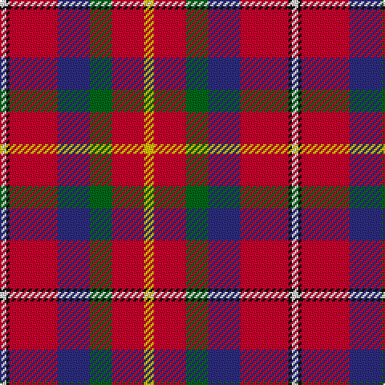

This page is one **sett** — a single exact thread-count. It belongs to the [tartan](/tartans/ly3r10g7db10r15k1w2/)
(the same proportion at any scale), whose colour order is pattern [WKRBGRY](/stripes/wkrbgry/).

Sourced from house-of-tartan.  It is a [7 stripe tartan](/stripes/stripes7/).

Original link http://www.house-of-tartan.scotland.net/house/TartanViewjs.asp?colr=Def&tnam=2061

## Thread count
Y/6 R20 G14 DB20 R30 K2 LN/4

## Palette

Palette: <strong>Tartan Register</strong>
<table><thead><tr><th>Colour</th><th>Threads</th><th>Shade</th><th>Base</th><th>OKLCh</th></tr></thead><tbody><tr><td>Y/</td><td style="text-align:right;font-variant-numeric:tabular-nums">6</td><td><code style="background-color:#E8C000;">#E8C000</code> <small style="color:#888">#E8C000</small></td><td>Y <code style="background-color:#F2BF00;">#F2BF00</code></td><td><small style="color:#888">oklch(81.9% 0.168 93.7)</small></td></tr><tr><td>R</td><td style="text-align:right;font-variant-numeric:tabular-nums">20</td><td><code style="background-color:#C8002C;">#C8002C</code> <small style="color:#888">#C8002C</small></td><td>R <code style="background-color:#CC0000;">#CC0000</code></td><td><small style="color:#888">oklch(52.6% 0.212 22.0)</small></td></tr><tr><td>G</td><td style="text-align:right;font-variant-numeric:tabular-nums">14</td><td><code style="background-color:#006818;">#006818</code> <small style="color:#888">#006818</small></td><td>G <code style="background-color:#006100;">#006100</code></td><td><small style="color:#888">oklch(45.0% 0.142 145.0)</small></td></tr><tr><td>DB</td><td style="text-align:right;font-variant-numeric:tabular-nums">20</td><td><code style="background-color:#2C2C80;">#2C2C80</code> <small style="color:#888">#2C2C80</small></td><td>B <code style="background-color:#2A418A;">#2A418A</code></td><td><small style="color:#888">oklch(35.0% 0.138 276.6)</small></td></tr><tr><td>R</td><td style="text-align:right;font-variant-numeric:tabular-nums">30</td><td><code style="background-color:#C8002C;">#C8002C</code> <small style="color:#888">#C8002C</small></td><td>R <code style="background-color:#CC0000;">#CC0000</code></td><td><small style="color:#888">oklch(52.6% 0.212 22.0)</small></td></tr><tr><td>K</td><td style="text-align:right;font-variant-numeric:tabular-nums">2</td><td><code style="background-color:#101010;">#101010</code> <small style="color:#888">#101010</small></td><td>K <code style="background-color:#000000;">#000000</code></td><td><small style="color:#888">oklch(17.3% 0.000 89.9)</small></td></tr><tr><td>LN/</td><td style="text-align:right;font-variant-numeric:tabular-nums">4</td><td><code style="background-color:#E0E0E0;">#E0E0E0</code> <small style="color:#888">#E0E0E0</small></td><td>W <code style="background-color:#F7F7F7;">#F7F7F7</code></td><td><small style="color:#888">oklch(90.7% 0.000 89.9)</small></td></tr></tbody></table>

# Sample pattern

## Nearest tartans

The nearest existing variants by ΔTartan distance, with this tartan at the top so the swatches line up against it.

ΔTartan

Tartan

Sett

—

<a href="/ttd/edit/#slug=ly3r10g7db10r15k1w2~x2">East Kilbride (Original) District Tartan Tartan Number: 2061. Earliest known date: 1990 Colours chosen echo the symbolism of the armorial ensigns granted by Lord Lyon: White/Silver and Blue - Stewarts of Torrance White/Silver and Black - Maxwells of Calderwood Red and White - Lindsays White/Silver and Black - Industry Green and Gold - Agriculture. Black guards are added to the blue stripe when woven in reproduction colours. See products available Copyright © Blair Urquhart, Comrie, 2015</a> <a class="nn-out" href="/setts/s7/ly3r10g7db10r15k1w2~x2/" title="open its dictionary page">↗</a>

0.40

<a href="/ttd/edit/#slug=lo3r10dg7db10r15k1w2~x2">East Kilbride</a> <a class="nn-out" href="/setts/s7/lo3r10dg7db10r15k1w2~x2/" title="open its dictionary page">↗</a>

0.49

<a href="/ttd/edit/#slug=y3r10g7db10r15k1w2~x2">East Kilbride</a> <a class="nn-out" href="/setts/s7/y3r10g7db10r15k1w2~x2/" title="open its dictionary page">↗</a>

1.01

<a href="/ttd/edit/#slug=r48t16lo5dg17w8k3~x2">Scottish American Society of Michigan (Official)</a> <a class="nn-out" href="/setts/s6/r48t16lo5dg17w8k3~x2/" title="open its dictionary page">↗</a>

1.11

<a href="/ttd/edit/#slug=dp2r11t9dp11ly2g13r21w2~x2">Wilson's, No 2</a> <a class="nn-out" href="/setts/s8/dp2r11t9dp11ly2g13r21w2~x2/" title="open its dictionary page">↗</a>

1.30

<a href="/ttd/edit/#slug=r6w1r6db2r6dg12ly1db8t4r4~x2">Unidentified No 57</a> <a class="nn-out" href="/setts/s10/r6w1r6db2r6dg12ly1db8t4r4~x2/" title="open its dictionary page">↗</a>

1.30

<a href="/ttd/edit/#slug=r48b16lo5g17w8dy3~x2">Scottish American Soc. of Michigan</a> <a class="nn-out" href="/setts/s6/r48b16lo5g17w8dy3~x2/" title="open its dictionary page">↗</a>

1.31

<a href="/ttd/edit/#slug=r30db12k6dg12ly2dg3w2~x2">Hewitt</a> <a class="nn-out" href="/setts/s7/r30db12k6dg12ly2dg3w2~x2/" title="open its dictionary page">↗</a>

1.32

<a href="/ttd/edit/#slug=r40t11w2k12dg36r32~x2">Thompson/Thomson/MacTavish (Mackinlay)</a> <a class="nn-out" href="/setts/s6/r40t11w2k12dg36r32~x2/" title="open its dictionary page">↗</a>

1.37

<a href="/ttd/edit/#slug=r30g12k5w2db6r30db12w2k5g12~x2">Sinclair</a> <a class="nn-out" href="/setts/s10/r30g12k5w2db6r30db12w2k5g12~x2/" title="open its dictionary page">↗</a>

1.38

<a href="/ttd/edit/#slug=r40t11w2k12g36r32~x2">Caithness (1848) (District?)</a> <a class="nn-out" href="/setts/s6/r40t11w2k12g36r32~x2/" title="open its dictionary page">↗</a>

## Neighbour map

Every grey dot is one of 14359 variants placed by the first two principal components of the ΔTartan feature space (44% of its variance). Red is this tartan; blue dots are its nearest — click one to open its page.

<svg viewBox="0 0 640 380" role="img" style="max-width:100%;height:auto;border:1px solid #e0e0e0;border-radius:4px;display:block" xmlns="http://www.w3.org/2000/svg"><image href="/nn/cloud.v1.png" width="640" height="380"/><a href="/setts/s7/lo3r10dg7db10r15k1w2~x2/"><circle cx="240.8" cy="159.8" r="4" fill="#3465a4"><title>East Kilbride</title></circle></a><a href="/setts/s7/y3r10g7db10r15k1w2~x2/"><circle cx="238.0" cy="160.3" r="4" fill="#3465a4"><title>East Kilbride</title></circle></a><a href="/setts/s6/r48t16lo5dg17w8k3~x2/"><circle cx="231.2" cy="135.4" r="4" fill="#3465a4"><title>Scottish American Society of Michigan (Official)</title></circle></a><a href="/setts/s8/dp2r11t9dp11ly2g13r21w2~x2/"><circle cx="170.0" cy="160.5" r="4" fill="#3465a4"><title>Wilson's, No 2</title></circle></a><a href="/setts/s10/r6w1r6db2r6dg12ly1db8t4r4~x2/"><circle cx="172.8" cy="158.7" r="4" fill="#3465a4"><title>Unidentified No 57</title></circle></a><a href="/setts/s6/r48b16lo5g17w8dy3~x2/"><circle cx="242.6" cy="140.8" r="4" fill="#3465a4"><title>Scottish American Soc. of Michigan</title></circle></a><a href="/setts/s7/r30db12k6dg12ly2dg3w2~x2/"><circle cx="206.9" cy="131.9" r="4" fill="#3465a4"><title>Hewitt</title></circle></a><a href="/setts/s6/r40t11w2k12dg36r32~x2/"><circle cx="281.8" cy="174.4" r="4" fill="#3465a4"><title>Thompson/Thomson/MacTavish (Mackinlay)</title></circle></a><a href="/setts/s10/r30g12k5w2db6r30db12w2k5g12~x2/"><circle cx="256.8" cy="145.4" r="4" fill="#3465a4"><title>Sinclair</title></circle></a><a href="/setts/s6/r40t11w2k12g36r32~x2/"><circle cx="293.5" cy="180.4" r="4" fill="#3465a4"><title>Caithness (1848) (District?)</title></circle></a><circle cx="229.1" cy="153.5" r="5" fill="#c00000"/></svg>

ID: /setts/s7/ly3r10g7db10r15k1w2~x2/
