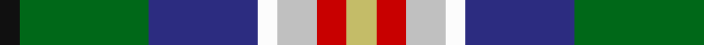
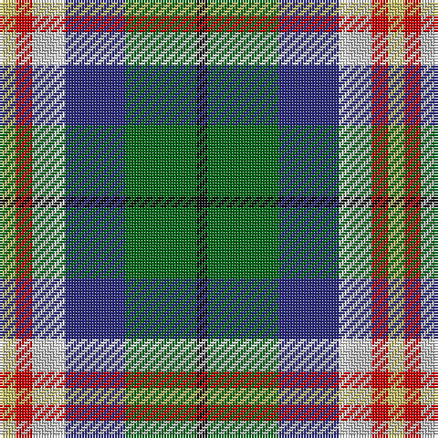

This page is one **sett** — a single exact thread-count. It belongs to the [tartan](/tartans/lg3r3n4w2db11g13k2/)
(the same proportion at any scale), whose colour order is pattern [KGBWWRY](/stripes/kgbwwry/).

Sourced from tartans-authority.  It is a [7 stripe tartan](/stripes/stripes7/).

Original link http://www.tartansauthority.com/tartan-ferret/display/2667/

## Also known as

This cloth is also recorded under:

- Kentucky, State of

2 attestations — the source records this cloth was collapsed from (oldest owns this page)

<ul>
<li>2000 — Kentucky, State of (District) (tartans-authority, <a href="http://www.tartansauthority.com/tartan-ferret/display/2667/">record</a>)</li>
<li>undated — Kentucky State American District Tartan Tartan Number: 2667. Earliest known date: 2000 Designed by Rupert Furgerson and Pat Murray-Schweitzer. On April 20th 2000, Gov. Paul Patton of the Commonwealth of Kentucky signed a proclamation establishing this new statewide Kentucky Tartan. Adopted by House Resolution No. 52 and Senate Resolution No. 27. January 19, 2000. See products available Copyright © Blair Urquhart, Comrie, 2015 (house-of-tartan, <a href="http://www.house-of-tartan.scotland.net/house/TartanViewjs.asp?colr=Def&tnam=2667">record</a>)</li>
</ul>

## Thread count
LG/6 R6 N8 W4 DB22 G26 K/4

## Palette
Each colour and the base-6 reference it is a variant of.

| Colour | Shade | Base |
|---|---|---|
| DB | <code style="background-color:#2C2C80;">#2C2C80</code> `oklch(35.0% 0.138 276.6)` <small>#2C2C80</small> | B <code style="background-color:#2A418A;">#2A418A</code> |
| G | <code style="background-color:#006818;">#006818</code> `oklch(45.0% 0.142 145.0)` <small>#006818</small> | G <code style="background-color:#006100;">#006100</code> |
| K | <code style="background-color:#101010;">#101010</code> `oklch(17.3% 0.000 89.9)` <small>#101010</small> | K <code style="background-color:#000000;">#000000</code> |
| LG | <code style="background-color:#C4BC68;">#C4BC68</code> `oklch(78.4% 0.107 103.7)` <small>#C4BC68</small> | Y <code style="background-color:#F2BF00;">#F2BF00</code> |
| N | <code style="background-color:#C0C0C0;">#C0C0C0</code> `oklch(80.8% 0.000 89.9)` <small>#C0C0C0</small> | W <code style="background-color:#F7F7F7;">#F7F7F7</code> |
| R | <code style="background-color:#C80000;">#C80000</code> `oklch(52.3% 0.215 29.2)` <small>#C80000</small> | R <code style="background-color:#CC0000;">#CC0000</code> |
| W | <code style="background-color:#FCFCFC;">#FCFCFC</code> `oklch(99.1% 0.000 89.9)` <small>#FCFCFC</small> | W <code style="background-color:#F7F7F7;">#F7F7F7</code> |

# Sample pattern

## Nearest tartans

The nearest existing variants by ΔTartan distance, with this tartan at the top so the swatches line up against it.

ΔTartan

Tartan

Sett

—

<a href="/ttd/edit/#slug=ly3r3lb4w2db11g13k2~x2">Kentucky, State of (District)</a> <a class="nn-out" href="/setts/s7/ly3r3lb4w2db11g13k2~x2/" title="open its dictionary page">↗</a>

1.00

<a href="/ttd/edit/#slug=w3db4dg8k5db20g3ly13g4w2~x2">Armagh County Crest (Fashion)</a> <a class="nn-out" href="/setts/s9/w3db4dg8k5db20g3ly13g4w2~x2/" title="open its dictionary page">↗</a>

1.15

<a href="/ttd/edit/#slug=g13db11w2lb4r3ly3r3lb4w2db11g13k2~x2">Kentucky, State of</a> <a class="nn-out" href="/setts/s12/g13db11w2lb4r3ly3r3lb4w2db11g13k2~x2/" title="open its dictionary page">↗</a>

1.16

<a href="/ttd/edit/#slug=o4k1w1k1w1k1o4n2dg6r1~x6">Mitsukoshi Sendai</a> <a class="nn-out" href="/setts/s10/o4k1w1k1w1k1o4n2dg6r1~x6/" title="open its dictionary page">↗</a>

1.19

<a href="/ttd/edit/#slug=m21lg4do5lg4m5k21g21lo5~x2">Caledonian Labrador Retrievers</a> <a class="nn-out" href="/setts/s8/m21lg4do5lg4m5k21g21lo5~x2/" title="open its dictionary page">↗</a>

1.20

<a href="/ttd/edit/#slug=w2r2db16k14g15r2ly2~x2">Council of Scottish Clans &amp; Ass. (Co</a> <a class="nn-out" href="/setts/s7/w2r2db16k14g15r2ly2~x2/" title="open its dictionary page">↗</a>

1.21

<a href="/ttd/edit/#slug=k20ly4db13w4g30w4r13~x2">South Africa 1994 (Fashion)</a> <a class="nn-out" href="/setts/s7/k20ly4db13w4g30w4r13~x2/" title="open its dictionary page">↗</a>

1.22

<a href="/ttd/edit/#slug=r3dt20dt20g2lr4lr17w3~x2">Silversea</a> <a class="nn-out" href="/setts/s7/r3dt20dt20g2lr4lr17w3~x2/" title="open its dictionary page">↗</a>

1.23

<a href="/ttd/edit/#slug=k9ly6db9lr2o3lr2dg17db17lb5~x2">Coats (New Zealand)</a> <a class="nn-out" href="/setts/s9/k9ly6db9lr2o3lr2dg17db17lb5~x2/" title="open its dictionary page">↗</a>

1.27

<a href="/ttd/edit/#slug=k3ly3db20g25lb18w3~x2">Porteous (Clan)</a> <a class="nn-out" href="/setts/s6/k3ly3db20g25lb18w3~x2/" title="open its dictionary page">↗</a>

1.29

<a href="/ttd/edit/#slug=o21ly4dy5ly4o5k21g21lo5~x2">Labrador Club of Scotland (Corporate</a> <a class="nn-out" href="/setts/s8/o21ly4dy5ly4o5k21g21lo5~x2/" title="open its dictionary page">↗</a>

## Neighbour map

Every grey dot is one of 14299 variants placed by the first two principal components of the ΔTartan feature space (44% of its variance). Red is this tartan; blue dots are its nearest — click one to open its page.

<svg viewBox="0 0 640 380" role="img" style="max-width:100%;height:auto;border:1px solid #e0e0e0;border-radius:4px;display:block" xmlns="http://www.w3.org/2000/svg"><image href="/nn/cloud.v1.png" width="640" height="380"/><a href="/setts/s9/w3db4dg8k5db20g3ly13g4w2~x2/"><circle cx="50.3" cy="131.0" r="4" fill="#3465a4"><title>Armagh County Crest (Fashion)</title></circle></a><a href="/setts/s12/g13db11w2lb4r3ly3r3lb4w2db11g13k2~x2/"><circle cx="68.2" cy="147.1" r="4" fill="#3465a4"><title>Kentucky, State of</title></circle></a><a href="/setts/s10/o4k1w1k1w1k1o4n2dg6r1~x6/"><circle cx="79.2" cy="165.4" r="4" fill="#3465a4"><title>Mitsukoshi Sendai</title></circle></a><a href="/setts/s8/m21lg4do5lg4m5k21g21lo5~x2/"><circle cx="64.6" cy="188.8" r="4" fill="#3465a4"><title>Caledonian Labrador Retrievers</title></circle></a><a href="/setts/s7/w2r2db16k14g15r2ly2~x2/"><circle cx="84.7" cy="167.4" r="4" fill="#3465a4"><title>Council of Scottish Clans &amp; Ass. (Co</title></circle></a><a href="/setts/s7/k20ly4db13w4g30w4r13~x2/"><circle cx="79.8" cy="179.3" r="4" fill="#3465a4"><title>South Africa 1994 (Fashion)</title></circle></a><a href="/setts/s7/r3dt20dt20g2lr4lr17w3~x2/"><circle cx="77.1" cy="151.1" r="4" fill="#3465a4"><title>Silversea</title></circle></a><a href="/setts/s9/k9ly6db9lr2o3lr2dg17db17lb5~x2/"><circle cx="86.1" cy="161.8" r="4" fill="#3465a4"><title>Coats (New Zealand)</title></circle></a><a href="/setts/s6/k3ly3db20g25lb18w3~x2/"><circle cx="99.1" cy="179.0" r="4" fill="#3465a4"><title>Porteous (Clan)</title></circle></a><a href="/setts/s8/o21ly4dy5ly4o5k21g21lo5~x2/"><circle cx="70.7" cy="192.2" r="4" fill="#3465a4"><title>Labrador Club of Scotland (Corporate</title></circle></a><circle cx="63.4" cy="163.7" r="5" fill="#c00000"/></svg>

ID: /setts/s7/ly3r3lb4w2db11g13k2~x2/
