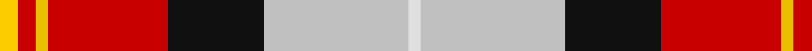
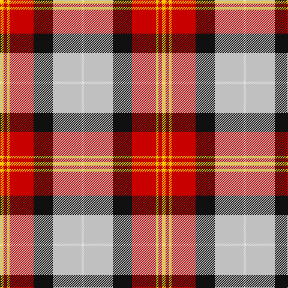

In pattern [WWKRYRY](/stripes/wwkryry/).

This was sourced from tartans-authority.  It is a [7 stripe tartan](/stripes/stripes7/).

Original link http://www.tartansauthority.com/tartan-ferret/display/10356/

## Thread count
Y/6 R6 Ya4 R40 K32 N48 LN/4

## Palette
Each colour and its ΔE from the base-6 reference it is a variant of.

| Colour | Shade | Base | ΔE (OKLab) |
|---|---|---|---|
| K | <code style="background-color:#101010;">#101010</code> `#101010` | K <code style="background-color:#000000;">#000000</code> | 0.17 |
| LN | <code style="background-color:#E0E0E0;">#E0E0E0</code> `#E0E0E0` | W <code style="background-color:#F7F7F7;">#F7F7F7</code> | 0.07 |
| N | <code style="background-color:#C0C0C0;">#C0C0C0</code> `#C0C0C0` | W <code style="background-color:#F7F7F7;">#F7F7F7</code> | 0.17 |
| R | <code style="background-color:#C80000;">#C80000</code> `#C80000` | R <code style="background-color:#CC0000;">#CC0000</code> | 0.01 |
| Y | <code style="background-color:#FCCC00;">#FCCC00</code> `#FCCC00` | Y <code style="background-color:#F2BF00;">#F2BF00</code> | 0.04 |
| Ya | <code style="background-color:#E8C000;">#E8C000</code> `#E8C000` | Y <code style="background-color:#F2BF00;">#F2BF00</code> | 0.02 |

# Sample pattern

## Nearest tartans

The nearest existing variants by ΔTartan distance.

1. [Oor Wullie Corporate Tartan Tartan Number: 10356. Earliest known date: August 2010 Oor Wullie's tartan is based on the Black Watch which was his Uncle Wattie's regiment and in this new design the red is from the hackle on their famous bonnets. The silver grey is for Wullie's iconic bucket and for his faithful pet, Jeemie the moose. The black is for his mentor PC Murdoch and for Wullie's dungarees, the yellow is for his tousled gold locks that never see a comb. The three lines on the yellow are for his best pals Fat Bob, Soapy Soutar and Wee Eck. The black and white are for the newsprint of The Sunday Post in which Wullie and his pals have lived for 75 years. See products available Copyright © Blair Urquhart, Comrie, 2015](/setts/s7/k3r3lo2r20k16lb24w2~x2/) — ΔT 0.39
1. [Oor Wullie (DC Thomson)](/setts/s7/ly3r3lo2r20k16w24w2~x2/) — ΔT 0.74
1. [Edinburgh Napier University (Corp.)](/setts/s8/t4w4t4w5k8g2r19lo1~x2/) — ΔT 0.93
1. [Gillies, dress Red](/setts/s10/ly6k2r15g5r8k12w24t2w4t2~x2/) — ΔT 1.00
1. [Glasgow](/setts/s7/dg20r3y3r15w19dg3t2~x2/) — ΔT 1.12
1. [Gillies Red Dress](/setts/s10/ly6k2r12dg4r8k10w24t2w3t2~x2/) — ΔT 1.15
1. [Ball](/setts/s6/lo13b8r5k3w2g1~x4/) — ΔT 1.16
1. [Humming Bird (Fashion)](/setts/s8/r6t3m20ly2k20w20k2w5~x2/) — ΔT 1.18
1. [MacLachlan Dress](/setts/s7/r36w3lo4g24w24k3lo6~x2/) — ΔT 1.22
1. [Wilson's, No 227](/setts/s9/r26t7p8ly3r3w3g20p10w2~x2/) — ΔT 1.24

## Neighbour map

Every grey dot is one of 14299 variants placed by the first two principal components of the ΔTartan feature space (44% of its variance). Red is this tartan; blue dots are its nearest — click one to open its page.

<svg viewBox="0 0 640 380" role="img" style="max-width:100%;height:auto;border:1px solid #e0e0e0;border-radius:4px;display:block" xmlns="http://www.w3.org/2000/svg"><image href="/nn/cloud.v1.png" width="640" height="380"/><a href="/setts/s7/k3r3lo2r20k16lb24w2~x2/"><circle cx="128.2" cy="128.7" r="4" fill="#3465a4"><title>Oor Wullie Corporate Tartan Tartan Number: 10356. Earliest known date: August 2010 Oor Wullie's tartan is based on the Black Watch which was his Uncle Wattie's regiment and in this new design the red is from the hackle on their famous bonnets. The silver grey is for Wullie's iconic bucket and for his faithful pet, Jeemie the moose. The black is for his mentor PC Murdoch and for Wullie's dungarees, the yellow is for his tousled gold locks that never see a comb. The three lines on the yellow are for his best pals Fat Bob, Soapy Soutar and Wee Eck. The black and white are for the newsprint of The Sunday Post in which Wullie and his pals have lived for 75 years. See products available Copyright © Blair Urquhart, Comrie, 2015</title></circle></a><a href="/setts/s7/ly3r3lo2r20k16w24w2~x2/"><circle cx="120.4" cy="117.3" r="4" fill="#3465a4"><title>Oor Wullie (DC Thomson)</title></circle></a><a href="/setts/s8/t4w4t4w5k8g2r19lo1~x2/"><circle cx="161.8" cy="107.0" r="4" fill="#3465a4"><title>Edinburgh Napier University (Corp.)</title></circle></a><a href="/setts/s10/ly6k2r15g5r8k12w24t2w4t2~x2/"><circle cx="93.0" cy="111.2" r="4" fill="#3465a4"><title>Gillies, dress Red</title></circle></a><a href="/setts/s7/dg20r3y3r15w19dg3t2~x2/"><circle cx="134.8" cy="157.9" r="4" fill="#3465a4"><title>Glasgow</title></circle></a><a href="/setts/s10/ly6k2r12dg4r8k10w24t2w3t2~x2/"><circle cx="104.2" cy="104.3" r="4" fill="#3465a4"><title>Gillies Red Dress</title></circle></a><a href="/setts/s6/lo13b8r5k3w2g1~x4/"><circle cx="151.1" cy="151.4" r="4" fill="#3465a4"><title>Ball</title></circle></a><a href="/setts/s8/r6t3m20ly2k20w20k2w5~x2/"><circle cx="91.0" cy="133.3" r="4" fill="#3465a4"><title>Humming Bird (Fashion)</title></circle></a><a href="/setts/s7/r36w3lo4g24w24k3lo6~x2/"><circle cx="140.3" cy="146.4" r="4" fill="#3465a4"><title>MacLachlan Dress</title></circle></a><a href="/setts/s9/r26t7p8ly3r3w3g20p10w2~x2/"><circle cx="145.8" cy="131.6" r="4" fill="#3465a4"><title>Wilson's, No 227</title></circle></a><circle cx="129.5" cy="127.7" r="5" fill="#c00000"/></svg>

ID: /setts/s7/ly3r3ly2r20k16lb24w2~x2/
