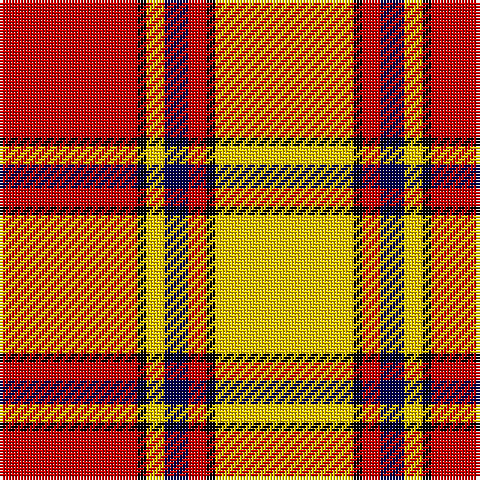

**Bands:** [RKYBRKY](/stripes/rkybrky/) · **Stripes:** [R K LY DB R K LY](/stripes/stripes7/) R K LY DB R K LY

This was sourced from weddslist.  It is a [7 band tartan](/bands/bands7/).

Original link http://www.weddslist.com/cgi-bin/tartans/pg.pl?source=rb

## Register references

External register numbers recorded for this tartan.

- Scottish Register of Tartans: [2540](https://www.tartanregister.gov.uk/tartanDetails.aspx?ref=2540)
- Scottish Register of Tartans: [2666](https://www.tartanregister.gov.uk/tartanDetails.aspx?ref=2666)
- Scottish Register of Tartans: [3808](https://www.tartanregister.gov.uk/tartanDetails.aspx?ref=3808)
- Scottish Tartans Authority (ITI): 218
- Scottish Tartans World Register: 1010
- Scottish Tartans World Register: 1585
- Scottish Tartans World Register: 218

## Variants

Other setts woven to the same stripe pattern.

- [Scrymgeour](/setts/s7/ly15k1r2db3ly2k1r15~x6/)
- [Scrymgeour](/setts/s7/ly15k1r2db3ly2k1r15~x3/)

## Thread count
R/46 K3 Y6 DB8 R6 K3 Y/46

## Palette
Each colour and its ΔE from the base-6 reference it is a variant of.

| Colour | Shade | Base | ΔE (OKLab) |
|---|---|---|---|
| DB | <code style="background-color:#00004C;">#00004C</code> `#00004C` | B <code style="background-color:#2A418A;">#2A418A</code> | 0.21 |
| K | <code style="background-color:#000000;">#000000</code> `#000000` | K <code style="background-color:#000000;">#000000</code> | 0.00 |
| R | <code style="background-color:#C80000;">#C80000</code> `#C80000` | R <code style="background-color:#CC0000;">#CC0000</code> | 0.01 |
| Y | <code style="background-color:#FFC800;">#FFC800</code> `#FFC800` | Y <code style="background-color:#F2BF00;">#F2BF00</code> | 0.03 |

# Sample pattern

## Nearest tartans

The nearest existing variants by ΔTartan distance.

1. [Fernandes (Personal)](/setts/s7/g5ly5g5ly35r44r3r3~x2/) — ΔT 0.96
1. [Scrymgeour Family Tartan Tartan Number: 1627. Earliest known date: 1971 Yellow ochre. A note in STS files says "Not Adopted" with no explanation. The STS research report reads, "The tartan detailed above was displayed at a gathering of Scrymgeours held at Dudhope Castle, Dundee, in 1971 and was later adopted as the official tartan. The sett was designed by Donald C Stewart, author of 'The Setts of the Scottish Tartans' in 1970." See products available Copyright © Blair Urquhart, Comrie, 2015](/setts/s7/ly15k1o2db3ly2k1o15~x4/) — ΔT 0.99
1. [Scrymgeour](/setts/s7/ly15k1r2db3ly2k1r15~x6/) — ΔT 1.25
1. [Scrymgeour](/setts/s7/ly15k1r2db3ly2k1r15~x3/) — ΔT 1.25
1. [Torridon, Cherry (Dance)](/setts/s7/r3r2db2r30w30db2w3~x2/) — ΔT 1.30
1. [Glassary #3](/setts/s8/db4ly1r12ly2r2ly12r1ly4~x4/) — ΔT 1.44
1. [Glassary #2](/setts/s8/db4ly1r12ly2r2ly12r1db4~x4/) — ΔT 1.51
1. [Maver (Buckie)](/setts/s7/g1ly1g1w1g10r20ly1~x4/) — ΔT 1.53
1. [Longniddry Burgundy (Dance)](/setts/s8/r42r2w2r2r5r12w32r4~x2/) — ΔT 1.54
1. [Masai Shuka 16 (Artefact)](/setts/s6/ly8k3ly4k2r30ly6~x2/) — ΔT 1.61

## Neighbour map

Every grey dot is one of 14313 variants placed by the first two principal components of the ΔTartan feature space (44% of its variance). Red is this tartan; blue dots are its nearest — click one to open its page.

<svg viewBox="0 0 640 380" role="img" style="max-width:100%;height:auto;border:1px solid #e0e0e0;border-radius:4px;display:block" xmlns="http://www.w3.org/2000/svg"><image href="/nn/cloud.v1.png" width="640" height="380"/><a href="/setts/s7/g5ly5g5ly35r44r3r3~x2/"><circle cx="285.1" cy="143.3" r="4" fill="#3465a4"><title>Fernandes (Personal)</title></circle></a><a href="/setts/s7/ly15k1o2db3ly2k1o15~x4/"><circle cx="268.0" cy="145.9" r="4" fill="#3465a4"><title>Scrymgeour Family Tartan Tartan Number: 1627. Earliest known date: 1971 Yellow ochre. A note in STS files says &quot;Not Adopted&quot; with no explanation. The STS research report reads, &quot;The tartan detailed above was displayed at a gathering of Scrymgeours held at Dudhope Castle, Dundee, in 1971 and was later adopted as the official tartan. The sett was designed by Donald C Stewart, author of 'The Setts of the Scottish Tartans' in 1970.&quot; See products available Copyright © Blair Urquhart, Comrie, 2015</title></circle></a><a href="/setts/s7/ly15k1r2db3ly2k1r15~x6/"><circle cx="267.4" cy="149.2" r="4" fill="#3465a4"><title>Scrymgeour</title></circle></a><a href="/setts/s7/ly15k1r2db3ly2k1r15~x3/"><circle cx="267.4" cy="149.2" r="4" fill="#3465a4"><title>Scrymgeour</title></circle></a><a href="/setts/s7/r3r2db2r30w30db2w3~x2/"><circle cx="285.2" cy="126.5" r="4" fill="#3465a4"><title>Torridon, Cherry (Dance)</title></circle></a><a href="/setts/s8/db4ly1r12ly2r2ly12r1ly4~x4/"><circle cx="298.6" cy="171.7" r="4" fill="#3465a4"><title>Glassary #3</title></circle></a><a href="/setts/s8/db4ly1r12ly2r2ly12r1db4~x4/"><circle cx="236.2" cy="170.0" r="4" fill="#3465a4"><title>Glassary #2</title></circle></a><a href="/setts/s7/g1ly1g1w1g10r20ly1~x4/"><circle cx="370.1" cy="118.0" r="4" fill="#3465a4"><title>Maver (Buckie)</title></circle></a><a href="/setts/s8/r42r2w2r2r5r12w32r4~x2/"><circle cx="302.2" cy="116.2" r="4" fill="#3465a4"><title>Longniddry Burgundy (Dance)</title></circle></a><a href="/setts/s6/ly8k3ly4k2r30ly6~x2/"><circle cx="362.5" cy="162.9" r="4" fill="#3465a4"><title>Masai Shuka 16 (Artefact)</title></circle></a><circle cx="263.4" cy="130.5" r="5" fill="#c00000"/></svg>

ID: /setts/s7/ly46k3r6db8ly6k3r46/
