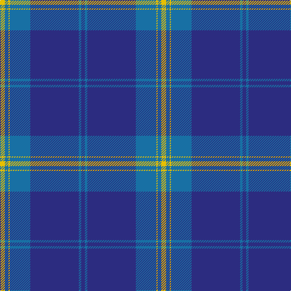

**Bands:** [YBYBBBB](/stripes/ybybbbb/) · **Stripes:** [LY B LY B DB B DB](/stripes/stripes7/) LY B LY B DB B DB

This was sourced from register-of-tartans.  It is a [7 band tartan](/bands/bands7/).

Original link https://www.tartanregister.gov.uk/tartanDetails.aspx?ref=888

## Attestations

This cloth appears in 2 source records; the oldest owns this page.

- 01/02/2000 — Danzas (register-of-tartans, [record](https://www.tartanregister.gov.uk/tartanDetails.aspx?ref=888))
- Feb. 2000 — Danzas (Corporate) (tartans-authority, [record](http://www.tartansauthority.com/tartan-ferret/display/2666/))

## Register references

External register numbers recorded for this tartan.

- Scottish Register of Tartans: [888](https://www.tartanregister.gov.uk/tartanDetails.aspx?ref=888)
- Scottish Tartans Authority (ITI): 2666
- Scottish Tartans World Register: 2666

## Thread count
Y/8 B6 Y2 B34 DB80 B4 DB/6

## Palette
Each colour and its ΔE from the base-6 reference it is a variant of.

| Colour | Shade | Base | ΔE (OKLab) |
|---|---|---|---|
| B | <code style="background-color:#1870A4;">#1870A4</code> `#1870A4` | B <code style="background-color:#2A418A;">#2A418A</code> | 0.13 |
| DB | <code style="background-color:#2C2C80;">#2C2C80</code> `#2C2C80` | B <code style="background-color:#2A418A;">#2A418A</code> | 0.06 |
| Y | <code style="background-color:#E8C000;">#E8C000</code> `#E8C000` | Y <code style="background-color:#F2BF00;">#F2BF00</code> | 0.02 |

# Sample pattern

## Nearest tartans

The nearest existing variants by ΔTartan distance.

1. [Danzas](/setts/s7/ly4dt3ly1dt17db40dt2db3~x2/) — ΔT 0.82
1. [S.C.O.T.S](/setts/s6/b136db45w7db4r4db16/) — ΔT 1.31
1. [North Tyneside Pipe Band](/setts/s7/b62db22w3db2w2db3r1~x2/) — ΔT 1.33
1. [S.C.O.T.S.](/setts/s6/db55db18w3db2r2db6~x2/) — ΔT 1.34
1. [St Andrews Earl of Royal family Tartan Tartan Number: 85. Earliest known date: c.1930 Count taken from a 'MacKinlay Strip'. Prince George is reputed to have worn this tartan at a Scottish Society dinner in 1919 and kept everyone guessing the name of the tartan. However, MacKinlay's record shows the design dating to 1930. No further details can be found. The sett has much in common with the Clan Donald. Royal titles of territorial origin provide a precedent for considering tartans of the name, District tartans. See products available Copyright © Blair Urquhart, Comrie, 2015](/setts/s6/t52db28w3db2w2db10~x2/) — ΔT 1.35
1. [Scottish Tourist Board (1990) (Corp)](/setts/s5/b50db15w3db4w2~x2/) — ΔT 1.54
1. [Tyneside Blue, North Tyneside Pipe Band](/setts/s7/db62k22w3k2w2k3r1~x2/) — ΔT 1.58
1. [Royal Conservatoire of Scotland](/setts/s8/dp11t90dy3t11dp7dy11dp13t11/) — ΔT 1.60
1. [Navy-Radar](/setts/s6/db51b8w4b30r1b9~x2/) — ΔT 1.60
1. [NHS Grampian](/setts/s7/k4w1t2w1k16db36t4~x2/) — ΔT 1.61

## Neighbour map

Every grey dot is one of 14299 variants placed by the first two principal components of the ΔTartan feature space (44% of its variance). Red is this tartan; blue dots are its nearest — click one to open its page.

<svg viewBox="0 0 640 380" role="img" style="max-width:100%;height:auto;border:1px solid #e0e0e0;border-radius:4px;display:block" xmlns="http://www.w3.org/2000/svg"><image href="/nn/cloud.v1.png" width="640" height="380"/><a href="/setts/s7/ly4dt3ly1dt17db40dt2db3~x2/"><circle cx="476.4" cy="171.1" r="4" fill="#3465a4"><title>Danzas</title></circle></a><a href="/setts/s6/b136db45w7db4r4db16/"><circle cx="452.4" cy="156.9" r="4" fill="#3465a4"><title>S.C.O.T.S</title></circle></a><a href="/setts/s7/b62db22w3db2w2db3r1~x2/"><circle cx="482.0" cy="129.0" r="4" fill="#3465a4"><title>North Tyneside Pipe Band</title></circle></a><a href="/setts/s6/db55db18w3db2r2db6~x2/"><circle cx="468.7" cy="179.1" r="4" fill="#3465a4"><title>S.C.O.T.S.</title></circle></a><a href="/setts/s6/t52db28w3db2w2db10~x2/"><circle cx="401.7" cy="191.4" r="4" fill="#3465a4"><title>St Andrews Earl of Royal family Tartan Tartan Number: 85. Earliest known date: c.1930 Count taken from a 'MacKinlay Strip'. Prince George is reputed to have worn this tartan at a Scottish Society dinner in 1919 and kept everyone guessing the name of the tartan. However, MacKinlay's record shows the design dating to 1930. No further details can be found. The sett has much in common with the Clan Donald. Royal titles of territorial origin provide a precedent for considering tartans of the name, District tartans. See products available Copyright © Blair Urquhart, Comrie, 2015</title></circle></a><a href="/setts/s5/b50db15w3db4w2~x2/"><circle cx="496.2" cy="207.6" r="4" fill="#3465a4"><title>Scottish Tourist Board (1990) (Corp)</title></circle></a><a href="/setts/s7/db62k22w3k2w2k3r1~x2/"><circle cx="476.9" cy="126.6" r="4" fill="#3465a4"><title>Tyneside Blue, North Tyneside Pipe Band</title></circle></a><a href="/setts/s8/dp11t90dy3t11dp7dy11dp13t11/"><circle cx="514.4" cy="164.1" r="4" fill="#3465a4"><title>Royal Conservatoire of Scotland</title></circle></a><a href="/setts/s6/db51b8w4b30r1b9~x2/"><circle cx="389.0" cy="162.3" r="4" fill="#3465a4"><title>Navy-Radar</title></circle></a><a href="/setts/s7/k4w1t2w1k16db36t4~x2/"><circle cx="395.5" cy="147.4" r="4" fill="#3465a4"><title>NHS Grampian</title></circle></a><circle cx="469.9" cy="166.8" r="5" fill="#c00000"/></svg>

ID: /setts/s7/ly4b3ly1b17db40b2db3~x2/
