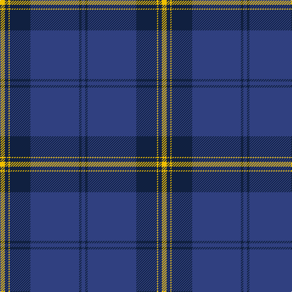

This page is one **sett** — a single exact thread-count. It belongs to the [tartan](/tartans/ly4dt3ly1dt17db40dt2db3/)
(the same proportion at any scale), whose colour order is pattern [BBBBYBY](/stripes/bbbbyby/).

Sourced from weddslist.  It is a [7 stripe tartan](/stripes/stripes7/).

Original link http://www.weddslist.com/cgi-bin/tartans/pg.pl?source=sts

## Thread count
Y/8 DB6 Y2 DB34 B80 DB4 B/6

## Palette

Palette: <strong>custom</strong>
<table><thead><tr><th>Colour</th><th>Threads</th><th>Shade</th><th>Base</th><th>OKLCh</th></tr></thead><tbody><tr><td>Y/</td><td style="text-align:right;font-variant-numeric:tabular-nums">8</td><td><code style="background-color:#F0C000;">#F0C000</code> <small style="color:#888">#F0C000</small></td><td>Y <code style="background-color:#F2BF00;">#F2BF00</code></td><td><small style="color:#888">oklch(82.7% 0.169 90.5)</small></td></tr><tr><td>DB</td><td style="text-align:right;font-variant-numeric:tabular-nums">6</td><td><code style="background-color:#102040;">#102040</code> <small style="color:#888">#102040</small></td><td>B <code style="background-color:#2A418A;">#2A418A</code></td><td><small style="color:#888">oklch(24.9% 0.065 262.6)</small></td></tr><tr><td>Y</td><td style="text-align:right;font-variant-numeric:tabular-nums">2</td><td><code style="background-color:#F0C000;">#F0C000</code> <small style="color:#888">#F0C000</small></td><td>Y <code style="background-color:#F2BF00;">#F2BF00</code></td><td><small style="color:#888">oklch(82.7% 0.169 90.5)</small></td></tr><tr><td>DB</td><td style="text-align:right;font-variant-numeric:tabular-nums">34</td><td><code style="background-color:#102040;">#102040</code> <small style="color:#888">#102040</small></td><td>B <code style="background-color:#2A418A;">#2A418A</code></td><td><small style="color:#888">oklch(24.9% 0.065 262.6)</small></td></tr><tr><td>B</td><td style="text-align:right;font-variant-numeric:tabular-nums">80</td><td><code style="background-color:#304080;">#304080</code> <small style="color:#888">#304080</small></td><td>B <code style="background-color:#2A418A;">#2A418A</code></td><td><small style="color:#888">oklch(39.4% 0.109 270.2)</small></td></tr><tr><td>DB</td><td style="text-align:right;font-variant-numeric:tabular-nums">4</td><td><code style="background-color:#102040;">#102040</code> <small style="color:#888">#102040</small></td><td>B <code style="background-color:#2A418A;">#2A418A</code></td><td><small style="color:#888">oklch(24.9% 0.065 262.6)</small></td></tr><tr><td>B/</td><td style="text-align:right;font-variant-numeric:tabular-nums">6</td><td><code style="background-color:#304080;">#304080</code> <small style="color:#888">#304080</small></td><td>B <code style="background-color:#2A418A;">#2A418A</code></td><td><small style="color:#888">oklch(39.4% 0.109 270.2)</small></td></tr></tbody></table>

# Sample pattern

## Nearest tartans

The nearest existing variants by ΔTartan distance, with this tartan at the top so the swatches line up against it.

ΔTartan

Tartan

Sett

—

<a href="/ttd/edit/#slug=ly4dt3ly1dt17db40dt2db3~x2">Danzas</a> <a class="nn-out" href="/setts/s7/ly4dt3ly1dt17db40dt2db3~x2/" title="open its dictionary page">↗</a>

0.82

<a href="/ttd/edit/#slug=ly4b3ly1b17db40b2db3~x2">Danzas</a> <a class="nn-out" href="/setts/s7/ly4b3ly1b17db40b2db3~x2/" title="open its dictionary page">↗</a>

1.34

<a href="/ttd/edit/#slug=db55dbi18w3dbi2r2dbi6~x2">S.C.O.T.S.</a> <a class="nn-out" href="/setts/s6/db55dbi18w3dbi2r2dbi6~x2/" title="open its dictionary page">↗</a>

1.46

<a href="/ttd/edit/#slug=k4w1t2w1k16db36t4~x2">NHS Grampian</a> <a class="nn-out" href="/setts/s7/k4w1t2w1k16db36t4~x2/" title="open its dictionary page">↗</a>

1.50

<a href="/ttd/edit/#slug=db48dg14r3dg2r3dg2~x2">Wilson #2</a> <a class="nn-out" href="/setts/s6/db48dg14r3dg2r3dg2~x2/" title="open its dictionary page">↗</a>

1.52

<a href="/ttd/edit/#slug=k8m26k22dt110w4k5w4">Edinburgh, The University of</a> <a class="nn-out" href="/setts/s7/k8m26k22dt110w4k5w4/" title="open its dictionary page">↗</a>

1.54

<a href="/ttd/edit/#slug=db48g14r3g2r3g2~x2">Wilson</a> <a class="nn-out" href="/setts/s6/db48g14r3g2r3g2~x2/" title="open its dictionary page">↗</a>

1.54

<a href="/ttd/edit/#slug=db80k5g12k2ly2g2k10~x2">Affara (Personal)</a> <a class="nn-out" href="/setts/s7/db80k5g12k2ly2g2k10~x2/" title="open its dictionary page">↗</a>

1.57

<a href="/ttd/edit/#slug=db64dg20r4dg3r4dg3">Wilson</a> <a class="nn-out" href="/setts/s6/db64dg20r4dg3r4dg3/" title="open its dictionary page">↗</a>

1.59

<a href="/ttd/edit/#slug=db62k22w3k2w2k3r1~x2">Tyneside Blue, North Tyneside Pipe Band</a> <a class="nn-out" href="/setts/s7/db62k22w3k2w2k3r1~x2/" title="open its dictionary page">↗</a>

1.64

<a href="/ttd/edit/#slug=db64g20r4g3r4g3">Wilson</a> <a class="nn-out" href="/setts/s6/db64g20r4g3r4g3/" title="open its dictionary page">↗</a>

## Neighbour map

Every grey dot is one of 14359 variants placed by the first two principal components of the ΔTartan feature space (44% of its variance). Red is this tartan; blue dots are its nearest — click one to open its page.

<svg viewBox="0 0 640 380" role="img" style="max-width:100%;height:auto;border:1px solid #e0e0e0;border-radius:4px;display:block" xmlns="http://www.w3.org/2000/svg"><image href="/nn/cloud.v1.png" width="640" height="380"/><a href="/setts/s7/ly4b3ly1b17db40b2db3~x2/"><circle cx="469.4" cy="167.1" r="4" fill="#3465a4"><title>Danzas</title></circle></a><a href="/setts/s6/db55dbi18w3dbi2r2dbi6~x2/"><circle cx="468.3" cy="179.5" r="4" fill="#3465a4"><title>S.C.O.T.S.</title></circle></a><a href="/setts/s7/k4w1t2w1k16db36t4~x2/"><circle cx="395.1" cy="147.9" r="4" fill="#3465a4"><title>NHS Grampian</title></circle></a><a href="/setts/s6/db48dg14r3dg2r3dg2~x2/"><circle cx="520.3" cy="205.4" r="4" fill="#3465a4"><title>Wilson #2</title></circle></a><a href="/setts/s7/k8m26k22dt110w4k5w4/"><circle cx="427.0" cy="160.0" r="4" fill="#3465a4"><title>Edinburgh, The University of</title></circle></a><a href="/setts/s6/db48g14r3g2r3g2~x2/"><circle cx="489.6" cy="188.6" r="4" fill="#3465a4"><title>Wilson</title></circle></a><a href="/setts/s7/db80k5g12k2ly2g2k10~x2/"><circle cx="535.2" cy="149.2" r="4" fill="#3465a4"><title>Affara (Personal)</title></circle></a><a href="/setts/s6/db64dg20r4dg3r4dg3/"><circle cx="506.4" cy="211.2" r="4" fill="#3465a4"><title>Wilson</title></circle></a><a href="/setts/s7/db62k22w3k2w2k3r1~x2/"><circle cx="476.3" cy="126.9" r="4" fill="#3465a4"><title>Tyneside Blue, North Tyneside Pipe Band</title></circle></a><a href="/setts/s6/db64g20r4g3r4g3/"><circle cx="474.1" cy="193.5" r="4" fill="#3465a4"><title>Wilson</title></circle></a><circle cx="476.0" cy="171.4" r="5" fill="#c00000"/></svg>

ID: /setts/s7/ly4dt3ly1dt17db40dt2db3~x2/
