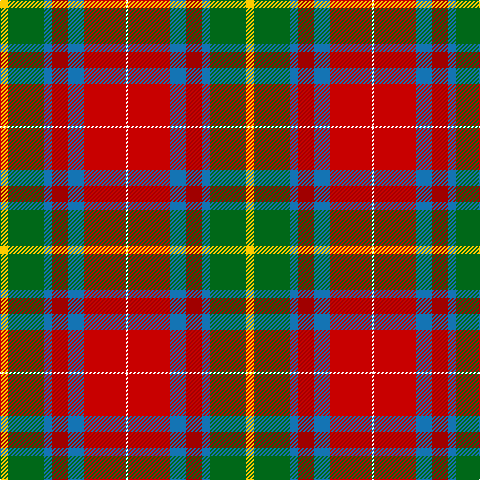

**Bands:** [YGBRBRW](/stripes/ygbrbrw/) · **Stripes:** [LY G B R B R W](/stripes/stripes7/) LY G B R B R W

This was sourced from tartans-authority.  It is a [7 band tartan](/bands/bands7/).

Original link http://www.tartansauthority.com/tartan-ferret/display/10690/

## Thread count
Y/8 G36 B8 DR16 B16 R42 W/2

## Palette
Each colour and its ΔE from the base-6 reference it is a variant of.

| Colour | Shade | Base | ΔE (OKLab) |
|---|---|---|---|
| B | <code style="background-color:#1474B4;">#1474B4</code> `#1474B4` | B <code style="background-color:#2A418A;">#2A418A</code> | 0.15 |
| DR | <code style="background-color:#A00000;">#A00000</code> `#A00000` | R <code style="background-color:#CC0000;">#CC0000</code> | 0.09 |
| G | <code style="background-color:#006818;">#006818</code> `#006818` | G <code style="background-color:#006100;">#006100</code> | 0.02 |
| R | <code style="background-color:#C80000;">#C80000</code> `#C80000` | R <code style="background-color:#CC0000;">#CC0000</code> | 0.01 |
| W | <code style="background-color:#FCFCFC;">#FCFCFC</code> `#FCFCFC` | W <code style="background-color:#F7F7F7;">#F7F7F7</code> | 0.01 |
| Y | <code style="background-color:#FCCC00;">#FCCC00</code> `#FCCC00` | Y <code style="background-color:#F2BF00;">#F2BF00</code> | 0.04 |

# Sample pattern

## Nearest tartans

The nearest existing variants by ΔTartan distance.

1. [G P Bathija (Shikarpur, Sindh) Name Tartan Tartan Number: 10690. Earliest known date: 6 September 2012 This tartan was designed in Toronto, Canada by Hans Girdhari Bathija, Esq., born Feb 18, 1969, at Queen Mary's Maternity Home in Hampstead, London, England, United Kingdom. It is designed in honour of Mr. Girdhari Pribhdas Bathija, born to Mr. Pribhdas Jiwandas Bathija and Mrs. Laxmibai Bathija (née Chugh) on Feb. 6, 1940 in Shikarpur, Sindh, India (British) and Mrs. Susan Bathija, née Tan Saw Gaik, born to Mr. Tan Eng Hock and Ooi Cheng Kee on June 7, 1943 in Kampung Jawa, Butterworth, Province Wellesley, Penang, Straits Settlements, UK (Japanese Malai). It is to be worn primarily by their offspring, and their respective families. Other individuals who share the family name Bathija, or who are associated with a Bathija, are also invited to wear this tartan. See products available Copyright © Blair Urquhart, Comrie, 2015](/setts/s7/ly4g18t4o8t8r21w1~x2/) — ΔT 1.05
1. [Elystan Glodrydd (Name)](/setts/s7/w3g24r13g4lo11r8db2~x2/) — ΔT 1.19
1. [G P Bathija (Shikarpur, Sindh)](/setts/s7/ly4dg18db4o8db8r21w1~x2/) — ΔT 1.22
1. [Wilson's, No 227](/setts/s9/r26t7p8ly3r3w3g20p10w2~x2/) — ΔT 1.23
1. [Porcupine City of](/setts/s7/r10n3db1lb8db1lo2g5~x4/) — ΔT 1.24
1. [Nicolson of Taransay (Personal)](/setts/s7/w6g10r22db16g2g4g5~x2/) — ΔT 1.30
1. [Forrester / Foster](/setts/s9/w4db6w1db15r23g15ly1g6ly4~x2/) — ΔT 1.32
1. [Etienne Paschal Tache Sir... Canadian Tartan Tartan Number: 1877. Earliest known date: 1983 Nothing See products available Copyright © Blair Urquhart, Comrie, 2015](/setts/s8/w3dy1r29dy16g23db3g3ly2~x2/) — ΔT 1.36
1. [Forrester (Clan)](/setts/s9/w3dt4w1dt15r24dg15ly1dg4ly3~x4/) — ΔT 1.36
1. [Tache, Sir Etienne Paschal #2](/setts/s8/w3dy1r29dy16dg23db3dg3lo2~x2/) — ΔT 1.37

## Neighbour map

Every grey dot is one of 14299 variants placed by the first two principal components of the ΔTartan feature space (44% of its variance). Red is this tartan; blue dots are its nearest — click one to open its page.

<svg viewBox="0 0 640 380" role="img" style="max-width:100%;height:auto;border:1px solid #e0e0e0;border-radius:4px;display:block" xmlns="http://www.w3.org/2000/svg"><image href="/nn/cloud.v1.png" width="640" height="380"/><a href="/setts/s7/ly4g18t4o8t8r21w1~x2/"><circle cx="176.6" cy="149.5" r="4" fill="#3465a4"><title>G P Bathija (Shikarpur, Sindh) Name Tartan Tartan Number: 10690. Earliest known date: 6 September 2012 This tartan was designed in Toronto, Canada by Hans Girdhari Bathija, Esq., born Feb 18, 1969, at Queen Mary's Maternity Home in Hampstead, London, England, United Kingdom. It is designed in honour of Mr. Girdhari Pribhdas Bathija, born to Mr. Pribhdas Jiwandas Bathija and Mrs. Laxmibai Bathija (née Chugh) on Feb. 6, 1940 in Shikarpur, Sindh, India (British) and Mrs. Susan Bathija, née Tan Saw Gaik, born to Mr. Tan Eng Hock and Ooi Cheng Kee on June 7, 1943 in Kampung Jawa, Butterworth, Province Wellesley, Penang, Straits Settlements, UK (Japanese Malai). It is to be worn primarily by their offspring, and their respective families. Other individuals who share the family name Bathija, or who are associated with a Bathija, are also invited to wear this tartan. See products available Copyright © Blair Urquhart, Comrie, 2015</title></circle></a><a href="/setts/s7/w3g24r13g4lo11r8db2~x2/"><circle cx="162.6" cy="166.2" r="4" fill="#3465a4"><title>Elystan Glodrydd (Name)</title></circle></a><a href="/setts/s7/ly4dg18db4o8db8r21w1~x2/"><circle cx="149.7" cy="145.8" r="4" fill="#3465a4"><title>G P Bathija (Shikarpur, Sindh)</title></circle></a><a href="/setts/s9/r26t7p8ly3r3w3g20p10w2~x2/"><circle cx="145.8" cy="131.6" r="4" fill="#3465a4"><title>Wilson's, No 227</title></circle></a><a href="/setts/s7/r10n3db1lb8db1lo2g5~x4/"><circle cx="116.5" cy="163.3" r="4" fill="#3465a4"><title>Porcupine City of</title></circle></a><a href="/setts/s7/w6g10r22db16g2g4g5~x2/"><circle cx="105.7" cy="161.2" r="4" fill="#3465a4"><title>Nicolson of Taransay (Personal)</title></circle></a><a href="/setts/s9/w4db6w1db15r23g15ly1g6ly4~x2/"><circle cx="161.5" cy="132.1" r="4" fill="#3465a4"><title>Forrester / Foster</title></circle></a><a href="/setts/s8/w3dy1r29dy16g23db3g3ly2~x2/"><circle cx="227.8" cy="114.8" r="4" fill="#3465a4"><title>Etienne Paschal Tache Sir... Canadian Tartan Tartan Number: 1877. Earliest known date: 1983 Nothing See products available Copyright © Blair Urquhart, Comrie, 2015</title></circle></a><a href="/setts/s9/w3dt4w1dt15r24dg15ly1dg4ly3~x4/"><circle cx="200.1" cy="124.3" r="4" fill="#3465a4"><title>Forrester (Clan)</title></circle></a><a href="/setts/s8/w3dy1r29dy16dg23db3dg3lo2~x2/"><circle cx="226.6" cy="114.4" r="4" fill="#3465a4"><title>Tache, Sir Etienne Paschal #2</title></circle></a><circle cx="154.9" cy="142.2" r="5" fill="#c00000"/></svg>

ID: /setts/s7/ly4g18b4r8b8r21w1~x2/
