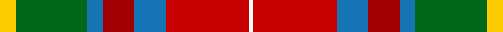

This page is one **sett** — a single exact thread-count. It belongs to the [tartan](/tartans/ly4g18b4ri8b8r21w1/)
(the same proportion at any scale), whose colour order is pattern [WRBRBGY](/stripes/wrbrbgy/).

Sourced from tartans-authority.  It is a [7 stripe tartan](/stripes/stripes7/).

Original link http://www.tartansauthority.com/tartan-ferret/display/10690/

## Register references

External register numbers recorded for this tartan.

- Scottish Register of Tartans: [10690](https://www.tartanregister.gov.uk/tartanDetails?ref=10690)
- Scottish Tartans Authority (ITI): 10690

## Thread count
Y/8 G36 B8 DR16 B16 R42 W/2

## Palette

Palette: <strong>Tartan Register</strong>
<table><thead><tr><th>Colour</th><th>Threads</th><th>Shade</th><th>Base</th><th>OKLCh</th></tr></thead><tbody><tr><td>Y/</td><td style="text-align:right;font-variant-numeric:tabular-nums">8</td><td><code style="background-color:#FCCC00;">#FCCC00</code> <small style="color:#888">#FCCC00</small></td><td>Y <code style="background-color:#F2BF00;">#F2BF00</code></td><td><small style="color:#888">oklch(86.2% 0.176 91.5)</small></td></tr><tr><td>G</td><td style="text-align:right;font-variant-numeric:tabular-nums">36</td><td><code style="background-color:#006818;">#006818</code> <small style="color:#888">#006818</small></td><td>G <code style="background-color:#006100;">#006100</code></td><td><small style="color:#888">oklch(45.0% 0.142 145.0)</small></td></tr><tr><td>B</td><td style="text-align:right;font-variant-numeric:tabular-nums">8</td><td><code style="background-color:#1474B4;">#1474B4</code> <small style="color:#888">#1474B4</small></td><td>B <code style="background-color:#2A418A;">#2A418A</code></td><td><small style="color:#888">oklch(54.0% 0.129 245.1)</small></td></tr><tr><td>DR</td><td style="text-align:right;font-variant-numeric:tabular-nums">16</td><td><code style="background-color:#A00000;">#A00000</code> <small style="color:#888">#A00000</small></td><td>R <code style="background-color:#CC0000;">#CC0000</code></td><td><small style="color:#888">oklch(44.3% 0.182 29.2)</small></td></tr><tr><td>B</td><td style="text-align:right;font-variant-numeric:tabular-nums">16</td><td><code style="background-color:#1474B4;">#1474B4</code> <small style="color:#888">#1474B4</small></td><td>B <code style="background-color:#2A418A;">#2A418A</code></td><td><small style="color:#888">oklch(54.0% 0.129 245.1)</small></td></tr><tr><td>R</td><td style="text-align:right;font-variant-numeric:tabular-nums">42</td><td><code style="background-color:#C80000;">#C80000</code> <small style="color:#888">#C80000</small></td><td>R <code style="background-color:#CC0000;">#CC0000</code></td><td><small style="color:#888">oklch(52.3% 0.215 29.2)</small></td></tr><tr><td>W/</td><td style="text-align:right;font-variant-numeric:tabular-nums">2</td><td><code style="background-color:#FCFCFC;">#FCFCFC</code> <small style="color:#888">#FCFCFC</small></td><td>W <code style="background-color:#F7F7F7;">#F7F7F7</code></td><td><small style="color:#888">oklch(99.1% 0.000 89.9)</small></td></tr></tbody></table>

# Sample pattern

## Nearest tartans

The nearest existing variants by ΔTartan distance, with this tartan at the top so the swatches line up against it.

ΔTartan

Tartan

Sett

—

<a href="/ttd/edit/#slug=ly4g18b4ri8b8r21w1~x2">Bathija (Name)</a> <a class="nn-out" href="/setts/s7/ly4g18b4ri8b8r21w1~x2/" title="open its dictionary page">↗</a>

1.04

<a href="/ttd/edit/#slug=ly4g18t4o8t8r21w1~x2">G P Bathija (Shikarpur, Sindh) Name Tartan Tartan Number: 10690. Earliest known date: 6 September 2012 This tartan was designed in Toronto, Canada by Hans Girdhari Bathija, Esq., born Feb 18, 1969, at Queen Mary's Maternity Home in Hampstead, London, England, United Kingdom. It is designed in honour of Mr. Girdhari Pribhdas Bathija, born to Mr. Pribhdas Jiwandas Bathija and Mrs. Laxmibai Bathija (née Chugh) on Feb. 6, 1940 in Shikarpur, Sindh, India (British) and Mrs. Susan Bathija, née Tan Saw Gaik, born to Mr. Tan Eng Hock and Ooi Cheng Kee on June 7, 1943 in Kampung Jawa, Butterworth, Province Wellesley, Penang, Straits Settlements, UK (Japanese Malai). It is to be worn primarily by their offspring, and their respective families. Other individuals who share the family name Bathija, or who are associated with a Bathija, are also invited to wear this tartan. See products available Copyright © Blair Urquhart, Comrie, 2015</a> <a class="nn-out" href="/setts/s7/ly4g18t4o8t8r21w1~x2/" title="open its dictionary page">↗</a>

1.19

<a href="/ttd/edit/#slug=w3g24r13gi4lo11r8db2~x2">Elystan Glodrydd (Name)</a> <a class="nn-out" href="/setts/s7/w3g24r13gi4lo11r8db2~x2/" title="open its dictionary page">↗</a>

1.22

<a href="/ttd/edit/#slug=ly4dg18db4o8db8r21w1~x2">G P Bathija (Shikarpur, Sindh)</a> <a class="nn-out" href="/setts/s7/ly4dg18db4o8db8r21w1~x2/" title="open its dictionary page">↗</a>

1.23

<a href="/ttd/edit/#slug=r26t7p8ly3r3w3g20p10w2~x2">Wilson's, No 227</a> <a class="nn-out" href="/setts/s9/r26t7p8ly3r3w3g20p10w2~x2/" title="open its dictionary page">↗</a>

1.24

<a href="/ttd/edit/#slug=r10n3db1lb8db1lo2g5~x4">Porcupine City of</a> <a class="nn-out" href="/setts/s7/r10n3db1lb8db1lo2g5~x4/" title="open its dictionary page">↗</a>

1.30

<a href="/ttd/edit/#slug=w6gi10r22db16g2g4g5~x2">Nicolson of Taransay (Personal)</a> <a class="nn-out" href="/setts/s7/w6gi10r22db16g2g4g5~x2/" title="open its dictionary page">↗</a>

1.31

<a href="/ttd/edit/#slug=w4db6w1db15r23g15ly1g6ly4~x2">Forrester / Foster</a> <a class="nn-out" href="/setts/s9/w4db6w1db15r23g15ly1g6ly4~x2/" title="open its dictionary page">↗</a>

1.36

<a href="/ttd/edit/#slug=w3dy1r29dy16g23db3g3ly2~x2">Etienne Paschal Tache Sir... Canadian Tartan Tartan Number: 1877. Earliest known date: 1983 Nothing See products available Copyright © Blair Urquhart, Comrie, 2015</a> <a class="nn-out" href="/setts/s8/w3dy1r29dy16g23db3g3ly2~x2/" title="open its dictionary page">↗</a>

1.36

<a href="/ttd/edit/#slug=w3dt4w1dt15r24dg15ly1dg4ly3~x4">Forrester (Clan)</a> <a class="nn-out" href="/setts/s9/w3dt4w1dt15r24dg15ly1dg4ly3~x4/" title="open its dictionary page">↗</a>

1.37

<a href="/ttd/edit/#slug=w3dy1r29dy16dg23db3dg3lo2~x2">Tache, Sir Etienne Paschal #2</a> <a class="nn-out" href="/setts/s8/w3dy1r29dy16dg23db3dg3lo2~x2/" title="open its dictionary page">↗</a>

## Neighbour map

Every grey dot is one of 14359 variants placed by the first two principal components of the ΔTartan feature space (44% of its variance). Red is this tartan; blue dots are its nearest — click one to open its page.

<svg viewBox="0 0 640 380" role="img" style="max-width:100%;height:auto;border:1px solid #e0e0e0;border-radius:4px;display:block" xmlns="http://www.w3.org/2000/svg"><image href="/nn/cloud.v1.png" width="640" height="380"/><a href="/setts/s7/ly4g18t4o8t8r21w1~x2/"><circle cx="175.9" cy="150.0" r="4" fill="#3465a4"><title>G P Bathija (Shikarpur, Sindh) Name Tartan Tartan Number: 10690. Earliest known date: 6 September 2012 This tartan was designed in Toronto, Canada by Hans Girdhari Bathija, Esq., born Feb 18, 1969, at Queen Mary's Maternity Home in Hampstead, London, England, United Kingdom. It is designed in honour of Mr. Girdhari Pribhdas Bathija, born to Mr. Pribhdas Jiwandas Bathija and Mrs. Laxmibai Bathija (née Chugh) on Feb. 6, 1940 in Shikarpur, Sindh, India (British) and Mrs. Susan Bathija, née Tan Saw Gaik, born to Mr. Tan Eng Hock and Ooi Cheng Kee on June 7, 1943 in Kampung Jawa, Butterworth, Province Wellesley, Penang, Straits Settlements, UK (Japanese Malai). It is to be worn primarily by their offspring, and their respective families. Other individuals who share the family name Bathija, or who are associated with a Bathija, are also invited to wear this tartan. See products available Copyright © Blair Urquhart, Comrie, 2015</title></circle></a><a href="/setts/s7/w3g24r13gi4lo11r8db2~x2/"><circle cx="162.0" cy="166.9" r="4" fill="#3465a4"><title>Elystan Glodrydd (Name)</title></circle></a><a href="/setts/s7/ly4dg18db4o8db8r21w1~x2/"><circle cx="149.2" cy="146.6" r="4" fill="#3465a4"><title>G P Bathija (Shikarpur, Sindh)</title></circle></a><a href="/setts/s9/r26t7p8ly3r3w3g20p10w2~x2/"><circle cx="145.1" cy="132.4" r="4" fill="#3465a4"><title>Wilson's, No 227</title></circle></a><a href="/setts/s7/r10n3db1lb8db1lo2g5~x4/"><circle cx="115.9" cy="164.2" r="4" fill="#3465a4"><title>Porcupine City of</title></circle></a><a href="/setts/s7/w6gi10r22db16g2g4g5~x2/"><circle cx="105.1" cy="162.2" r="4" fill="#3465a4"><title>Nicolson of Taransay (Personal)</title></circle></a><a href="/setts/s9/w4db6w1db15r23g15ly1g6ly4~x2/"><circle cx="160.9" cy="132.8" r="4" fill="#3465a4"><title>Forrester / Foster</title></circle></a><a href="/setts/s8/w3dy1r29dy16g23db3g3ly2~x2/"><circle cx="227.1" cy="115.1" r="4" fill="#3465a4"><title>Etienne Paschal Tache Sir... Canadian Tartan Tartan Number: 1877. Earliest known date: 1983 Nothing See products available Copyright © Blair Urquhart, Comrie, 2015</title></circle></a><a href="/setts/s9/w3dt4w1dt15r24dg15ly1dg4ly3~x4/"><circle cx="199.4" cy="124.8" r="4" fill="#3465a4"><title>Forrester (Clan)</title></circle></a><a href="/setts/s8/w3dy1r29dy16dg23db3dg3lo2~x2/"><circle cx="225.9" cy="114.8" r="4" fill="#3465a4"><title>Tache, Sir Etienne Paschal #2</title></circle></a><circle cx="154.2" cy="142.9" r="5" fill="#c00000"/></svg>

ID: /setts/s7/ly4g18b4ri8b8r21w1~x2/
