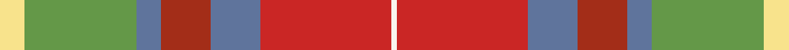

This page is one **sett** — a single exact thread-count. It belongs to the [tartan](/tartans/ly4g18t4o8t8r21w1/)
(the same proportion at any scale), whose colour order is pattern [WRBRBGY](/stripes/wrbrbgy/).

Sourced from house-of-tartan.  It is a [7 stripe tartan](/stripes/stripes7/).

Original link http://www.house-of-tartan.scotland.net/house/TartanViewjs.asp?colr=Def&tnam=10690

## Thread count
LY/8 LG36 B8 Ra16 B16 R42 W/2

## Palette

Palette: <strong>Tartan Register</strong> <small style="color:#888">(3 of 6 colours)</small>
<table><thead><tr><th>Colour</th><th>Threads</th><th>Shade</th><th>Base</th><th>OKLCh</th></tr></thead><tbody><tr><td>LY/</td><td style="text-align:right;font-variant-numeric:tabular-nums">8</td><td><code style="background-color:#F8E38C;">#F8E38C</code> <small style="color:#888">#F8E38C</small></td><td>Y <code style="background-color:#F2BF00;">#F2BF00</code></td><td><small style="color:#888">oklch(91.4% 0.110 96.2)</small></td></tr><tr><td>LG</td><td style="text-align:right;font-variant-numeric:tabular-nums">36</td><td><code style="background-color:#649848;">#649848</code> <small style="color:#888">#649848</small></td><td>G <code style="background-color:#006100;">#006100</code></td><td><small style="color:#888">oklch(62.4% 0.125 135.7)</small></td></tr><tr><td>B</td><td style="text-align:right;font-variant-numeric:tabular-nums">8</td><td><code style="background-color:#5F749C;">#5F749C</code> <small style="color:#888">#5F749C</small></td><td>B <code style="background-color:#2A418A;">#2A418A</code></td><td><small style="color:#888">oklch(55.8% 0.067 262.9)</small></td></tr><tr><td>Ra</td><td style="text-align:right;font-variant-numeric:tabular-nums">16</td><td><code style="background-color:#A32D18;">#A32D18</code> <small style="color:#888">#A32D18</small></td><td>R <code style="background-color:#CC0000;">#CC0000</code></td><td><small style="color:#888">oklch(47.8% 0.158 32.4)</small></td></tr><tr><td>B</td><td style="text-align:right;font-variant-numeric:tabular-nums">16</td><td><code style="background-color:#5F749C;">#5F749C</code> <small style="color:#888">#5F749C</small></td><td>B <code style="background-color:#2A418A;">#2A418A</code></td><td><small style="color:#888">oklch(55.8% 0.067 262.9)</small></td></tr><tr><td>R</td><td style="text-align:right;font-variant-numeric:tabular-nums">42</td><td><code style="background-color:#CA2625;">#CA2625</code> <small style="color:#888">#CA2625</small></td><td>R <code style="background-color:#CC0000;">#CC0000</code></td><td><small style="color:#888">oklch(54.4% 0.199 27.2)</small></td></tr><tr><td>W/</td><td style="text-align:right;font-variant-numeric:tabular-nums">2</td><td><code style="background-color:#F9F5EF;">#F9F5EF</code> <small style="color:#888">#F9F5EF</small></td><td>W <code style="background-color:#F7F7F7;">#F7F7F7</code></td><td><small style="color:#888">oklch(97.2% 0.009 78.3)</small></td></tr></tbody></table>

# Sample pattern

## Nearest tartans

The nearest existing variants by ΔTartan distance, with this tartan at the top so the swatches line up against it.

ΔTartan

Tartan

Sett

—

<a href="/ttd/edit/#slug=ly4g18t4o8t8r21w1~x2">G P Bathija (Shikarpur, Sindh) Name Tartan Tartan Number: 10690. Earliest known date: 6 September 2012 This tartan was designed in Toronto, Canada by Hans Girdhari Bathija, Esq., born Feb 18, 1969, at Queen Mary's Maternity Home in Hampstead, London, England, United Kingdom. It is designed in honour of Mr. Girdhari Pribhdas Bathija, born to Mr. Pribhdas Jiwandas Bathija and Mrs. Laxmibai Bathija (née Chugh) on Feb. 6, 1940 in Shikarpur, Sindh, India (British) and Mrs. Susan Bathija, née Tan Saw Gaik, born to Mr. Tan Eng Hock and Ooi Cheng Kee on June 7, 1943 in Kampung Jawa, Butterworth, Province Wellesley, Penang, Straits Settlements, UK (Japanese Malai). It is to be worn primarily by their offspring, and their respective families. Other individuals who share the family name Bathija, or who are associated with a Bathija, are also invited to wear this tartan. See products available Copyright © Blair Urquhart, Comrie, 2015</a> <a class="nn-out" href="/setts/s7/ly4g18t4o8t8r21w1~x2/" title="open its dictionary page">↗</a>

1.05

<a href="/ttd/edit/#slug=ly4g18b4r8b8r21w1~x2">Bathija (Name)</a> <a class="nn-out" href="/setts/s7/ly4g18b4r8b8r21w1~x2/" title="open its dictionary page">↗</a>

1.41

<a href="/ttd/edit/#slug=w3o1r29o16g23db3g3ly2~x2">Etienne, Paschal Tache Sir...</a> <a class="nn-out" href="/setts/s8/w3o1r29o16g23db3g3ly2~x2/" title="open its dictionary page">↗</a>

1.55

<a href="/ttd/edit/#slug=w3g24r13g4lo11r8db2~x2">Elystan Glodrydd (Name)</a> <a class="nn-out" href="/setts/s7/w3g24r13g4lo11r8db2~x2/" title="open its dictionary page">↗</a>

1.56

<a href="/ttd/edit/#slug=o24r24w3g21ly2r1ly2o6r2~x2">Henry, W.A.</a> <a class="nn-out" href="/setts/s9/o24r24w3g21ly2r1ly2o6r2~x2/" title="open its dictionary page">↗</a>

1.56

<a href="/ttd/edit/#slug=o4do2o21db11w2o20r3~x2">Barbour Dress</a> <a class="nn-out" href="/setts/s7/o4do2o21db11w2o20r3~x2/" title="open its dictionary page">↗</a>

1.58

<a href="/ttd/edit/#slug=w3dy1r29dy16g23db3g3ly2~x2">Etienne Paschal Tache Sir... Canadian Tartan Tartan Number: 1877. Earliest known date: 1983 Nothing See products available Copyright © Blair Urquhart, Comrie, 2015</a> <a class="nn-out" href="/setts/s8/w3dy1r29dy16g23db3g3ly2~x2/" title="open its dictionary page">↗</a>

1.59

<a href="/ttd/edit/#slug=r19lr5b2w12b2ly4g8~x2">Northern Ontario (District)</a> <a class="nn-out" href="/setts/s7/r19lr5b2w12b2ly4g8~x2/" title="open its dictionary page">↗</a>

1.60

<a href="/ttd/edit/#slug=r10n3db1lb8db1lo2g5~x4">Porcupine City of</a> <a class="nn-out" href="/setts/s7/r10n3db1lb8db1lo2g5~x4/" title="open its dictionary page">↗</a>

1.67

<a href="/ttd/edit/#slug=lr6o5k2y18r28w2~x2">Dundhuin</a> <a class="nn-out" href="/setts/s6/lr6o5k2y18r28w2~x2/" title="open its dictionary page">↗</a>

1.68

<a href="/ttd/edit/#slug=r26t7p8ly3r3w3g20p10w2~x2">Wilson's, No 227</a> <a class="nn-out" href="/setts/s9/r26t7p8ly3r3w3g20p10w2~x2/" title="open its dictionary page">↗</a>

## Neighbour map

Every grey dot is one of 14299 variants placed by the first two principal components of the ΔTartan feature space (44% of its variance). Red is this tartan; blue dots are its nearest — click one to open its page.

<svg viewBox="0 0 640 380" role="img" style="max-width:100%;height:auto;border:1px solid #e0e0e0;border-radius:4px;display:block" xmlns="http://www.w3.org/2000/svg"><image href="/nn/cloud.v1.png" width="640" height="380"/><a href="/setts/s7/ly4g18b4r8b8r21w1~x2/"><circle cx="154.9" cy="142.2" r="4" fill="#3465a4"><title>Bathija (Name)</title></circle></a><a href="/setts/s8/w3o1r29o16g23db3g3ly2~x2/"><circle cx="229.8" cy="115.4" r="4" fill="#3465a4"><title>Etienne, Paschal Tache Sir...</title></circle></a><a href="/setts/s7/w3g24r13g4lo11r8db2~x2/"><circle cx="162.6" cy="166.2" r="4" fill="#3465a4"><title>Elystan Glodrydd (Name)</title></circle></a><a href="/setts/s9/o24r24w3g21ly2r1ly2o6r2~x2/"><circle cx="246.8" cy="137.5" r="4" fill="#3465a4"><title>Henry, W.A.</title></circle></a><a href="/setts/s7/o4do2o21db11w2o20r3~x2/"><circle cx="189.8" cy="167.4" r="4" fill="#3465a4"><title>Barbour Dress</title></circle></a><a href="/setts/s8/w3dy1r29dy16g23db3g3ly2~x2/"><circle cx="227.8" cy="114.8" r="4" fill="#3465a4"><title>Etienne Paschal Tache Sir... Canadian Tartan Tartan Number: 1877. Earliest known date: 1983 Nothing See products available Copyright © Blair Urquhart, Comrie, 2015</title></circle></a><a href="/setts/s7/r19lr5b2w12b2ly4g8~x2/"><circle cx="135.6" cy="160.7" r="4" fill="#3465a4"><title>Northern Ontario (District)</title></circle></a><a href="/setts/s7/r10n3db1lb8db1lo2g5~x4/"><circle cx="116.5" cy="163.3" r="4" fill="#3465a4"><title>Porcupine City of</title></circle></a><a href="/setts/s6/lr6o5k2y18r28w2~x2/"><circle cx="258.0" cy="163.0" r="4" fill="#3465a4"><title>Dundhuin</title></circle></a><a href="/setts/s9/r26t7p8ly3r3w3g20p10w2~x2/"><circle cx="145.8" cy="131.6" r="4" fill="#3465a4"><title>Wilson's, No 227</title></circle></a><circle cx="176.6" cy="149.5" r="5" fill="#c00000"/></svg>

ID: /setts/s7/ly4g18t4o8t8r21w1~x2/
