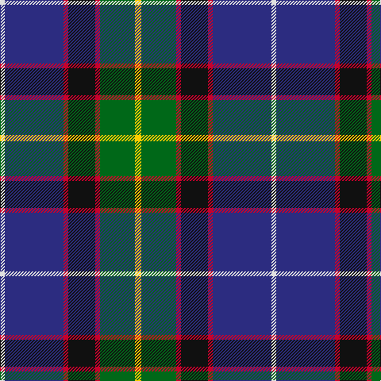

This page is one **sett** — a single exact thread-count. It belongs to the [tartan](/tartans/ly4g22r3k17r3db37w3/)
(the same proportion at any scale), whose colour order is pattern [WBRKRGY](/stripes/wbrkrgy/).

Sourced from tartans-authority.  It is a [7 stripe tartan](/stripes/stripes7/).

Original link http://www.tartansauthority.com/tartan-ferret/display/2651/

2 attestations — the source records this cloth was collapsed from (oldest owns this page)

<ul>
<li>1997 — Souza Nery (Personal) (tartans-authority, <a href="http://www.tartansauthority.com/tartan-ferret/display/2651/">record</a>)</li>
<li>undated — Souza Nery (weddslist, <a href="http://www.weddslist.com/cgi-bin/tartans/pg.pl?source=sts">record</a>)</li>
</ul>

## Register references

External register numbers recorded for this tartan.

- Scottish Tartans Authority (ITI): 2651

## Thread count
Y/8 G44 R6 K34 R6 DB74 LN/6

## Palette

Palette: <strong>Tartan Register</strong>
<table><thead><tr><th>Colour</th><th>Threads</th><th>Shade</th><th>Base</th><th>OKLCh</th></tr></thead><tbody><tr><td>Y/</td><td style="text-align:right;font-variant-numeric:tabular-nums">8</td><td><code style="background-color:#FCCC00;">#FCCC00</code> <small style="color:#888">#FCCC00</small></td><td>Y <code style="background-color:#F2BF00;">#F2BF00</code></td><td><small style="color:#888">oklch(86.2% 0.176 91.5)</small></td></tr><tr><td>G</td><td style="text-align:right;font-variant-numeric:tabular-nums">44</td><td><code style="background-color:#006818;">#006818</code> <small style="color:#888">#006818</small></td><td>G <code style="background-color:#006100;">#006100</code></td><td><small style="color:#888">oklch(45.0% 0.142 145.0)</small></td></tr><tr><td>R</td><td style="text-align:right;font-variant-numeric:tabular-nums">6</td><td><code style="background-color:#C8002C;">#C8002C</code> <small style="color:#888">#C8002C</small></td><td>R <code style="background-color:#CC0000;">#CC0000</code></td><td><small style="color:#888">oklch(52.6% 0.212 22.0)</small></td></tr><tr><td>K</td><td style="text-align:right;font-variant-numeric:tabular-nums">34</td><td><code style="background-color:#101010;">#101010</code> <small style="color:#888">#101010</small></td><td>K <code style="background-color:#000000;">#000000</code></td><td><small style="color:#888">oklch(17.3% 0.000 89.9)</small></td></tr><tr><td>R</td><td style="text-align:right;font-variant-numeric:tabular-nums">6</td><td><code style="background-color:#C8002C;">#C8002C</code> <small style="color:#888">#C8002C</small></td><td>R <code style="background-color:#CC0000;">#CC0000</code></td><td><small style="color:#888">oklch(52.6% 0.212 22.0)</small></td></tr><tr><td>DB</td><td style="text-align:right;font-variant-numeric:tabular-nums">74</td><td><code style="background-color:#2C2C80;">#2C2C80</code> <small style="color:#888">#2C2C80</small></td><td>B <code style="background-color:#2A418A;">#2A418A</code></td><td><small style="color:#888">oklch(35.0% 0.138 276.6)</small></td></tr><tr><td>LN/</td><td style="text-align:right;font-variant-numeric:tabular-nums">6</td><td><code style="background-color:#E0E0E0;">#E0E0E0</code> <small style="color:#888">#E0E0E0</small></td><td>W <code style="background-color:#F7F7F7;">#F7F7F7</code></td><td><small style="color:#888">oklch(90.7% 0.000 89.9)</small></td></tr></tbody></table>

# Sample pattern

## Nearest tartans

The nearest existing variants by ΔTartan distance, with this tartan at the top so the swatches line up against it.

ΔTartan

Tartan

Sett

—

<a href="/ttd/edit/#slug=ly4g22r3k17r3db37w3~x2">Souza Nery (Personal)</a> <a class="nn-out" href="/setts/s7/ly4g22r3k17r3db37w3~x2/" title="open its dictionary page">↗</a>

0.62

<a href="/ttd/edit/#slug=db60t5w4o12g42p12t5p12">St Columba</a> <a class="nn-out" href="/setts/s8/db60t5w4o12g42p12t5p12/" title="open its dictionary page">↗</a>

0.72

<a href="/ttd/edit/#slug=p4db2t8db25k8g13ly4~x2">Renfrewshire Tartan</a> <a class="nn-out" href="/setts/s7/p4db2t8db25k8g13ly4~x2/" title="open its dictionary page">↗</a>

0.74

<a href="/ttd/edit/#slug=m4k7m2db25k19w2g13k2ly3~x2">Leung (Personal)</a> <a class="nn-out" href="/setts/s9/m4k7m2db25k19w2g13k2ly3~x2/" title="open its dictionary page">↗</a>

0.78

<a href="/ttd/edit/#slug=k6w3k2db30r9k4g20ly3~x2">Minnesota (District)</a> <a class="nn-out" href="/setts/s8/k6w3k2db30r9k4g20ly3~x2/" title="open its dictionary page">↗</a>

0.80

<a href="/ttd/edit/#slug=r2ly2db9dy1dg9r1w1~x2">Unidentified (ex Tony Murray)</a> <a class="nn-out" href="/setts/s7/r2ly2db9dy1dg9r1w1~x2/" title="open its dictionary page">↗</a>

0.84

<a href="/ttd/edit/#slug=r2k6ly1dg12ly1db6lr2~x4">James (Personal)</a> <a class="nn-out" href="/setts/s7/r2k6ly1dg12ly1db6lr2~x4/" title="open its dictionary page">↗</a>

0.85

<a href="/ttd/edit/#slug=dp4db2t8db25k8g13ly4~x2">Renfrewshire</a> <a class="nn-out" href="/setts/s7/dp4db2t8db25k8g13ly4~x2/" title="open its dictionary page">↗</a>

0.87

<a href="/ttd/edit/#slug=w10k52db52dg24ly10dg5r5">Harvey of Cornwall (Personal)</a> <a class="nn-out" href="/setts/s7/w10k52db52dg24ly10dg5r5/" title="open its dictionary page">↗</a>

0.89

<a href="/ttd/edit/#slug=w1db12k9g1k1g5lb1g3lo1~x4">St. Andrews Golf Club (Corporate)</a> <a class="nn-out" href="/setts/s9/w1db12k9g1k1g5lb1g3lo1~x4/" title="open its dictionary page">↗</a>

0.90

<a href="/ttd/edit/#slug=w2db20r3k10g20lo2~x2">Morris of Eddergoll (Personal)</a> <a class="nn-out" href="/setts/s6/w2db20r3k10g20lo2~x2/" title="open its dictionary page">↗</a>

## Neighbour map

Every grey dot is one of 14359 variants placed by the first two principal components of the ΔTartan feature space (44% of its variance). Red is this tartan; blue dots are its nearest — click one to open its page.

<svg viewBox="0 0 640 380" role="img" style="max-width:100%;height:auto;border:1px solid #e0e0e0;border-radius:4px;display:block" xmlns="http://www.w3.org/2000/svg"><image href="/nn/cloud.v1.png" width="640" height="380"/><a href="/setts/s8/db60t5w4o12g42p12t5p12/"><circle cx="166.3" cy="138.4" r="4" fill="#3465a4"><title>St Columba</title></circle></a><a href="/setts/s7/p4db2t8db25k8g13ly4~x2/"><circle cx="149.0" cy="165.6" r="4" fill="#3465a4"><title>Renfrewshire Tartan</title></circle></a><a href="/setts/s9/m4k7m2db25k19w2g13k2ly3~x2/"><circle cx="152.2" cy="148.8" r="4" fill="#3465a4"><title>Leung (Personal)</title></circle></a><a href="/setts/s8/k6w3k2db30r9k4g20ly3~x2/"><circle cx="154.3" cy="133.7" r="4" fill="#3465a4"><title>Minnesota (District)</title></circle></a><a href="/setts/s7/r2ly2db9dy1dg9r1w1~x2/"><circle cx="148.3" cy="163.0" r="4" fill="#3465a4"><title>Unidentified (ex Tony Murray)</title></circle></a><a href="/setts/s7/r2k6ly1dg12ly1db6lr2~x4/"><circle cx="163.4" cy="170.7" r="4" fill="#3465a4"><title>James (Personal)</title></circle></a><a href="/setts/s7/dp4db2t8db25k8g13ly4~x2/"><circle cx="168.0" cy="174.7" r="4" fill="#3465a4"><title>Renfrewshire</title></circle></a><a href="/setts/s7/w10k52db52dg24ly10dg5r5/"><circle cx="123.4" cy="168.4" r="4" fill="#3465a4"><title>Harvey of Cornwall (Personal)</title></circle></a><a href="/setts/s9/w1db12k9g1k1g5lb1g3lo1~x4/"><circle cx="164.4" cy="150.6" r="4" fill="#3465a4"><title>St. Andrews Golf Club (Corporate)</title></circle></a><a href="/setts/s6/w2db20r3k10g20lo2~x2/"><circle cx="138.8" cy="182.4" r="4" fill="#3465a4"><title>Morris of Eddergoll (Personal)</title></circle></a><circle cx="176.0" cy="156.3" r="5" fill="#c00000"/></svg>

ID: /setts/s7/ly4g22r3k17r3db37w3~x2/
