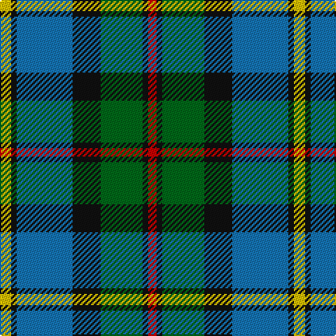

This page is one **sett** — a single exact thread-count. It belongs to the [tartan](/tartans/ly4k2b20k10g15k2r3/)
(the same proportion at any scale), whose colour order is pattern [RKGKBKY](/stripes/rkgkbky/).

Sourced from register-of-tartans.  It is a [7 stripe tartan](/stripes/stripes7/).

Original link https://www.tartanregister.gov.uk/tartanDetails.aspx?ref=2629

## Also known as

This cloth is also recorded under:

- MacLeod

2 attestations — the source records this cloth was collapsed from (oldest owns this page)

<ul>
<li>01/01/1831 — Green MacLeod (register-of-tartans, <a href="https://www.tartanregister.gov.uk/tartanDetails.aspx?ref=2629">record</a>)</li>
<li>1831 — MacLeod (Clan) (tartans-authority, <a href="http://www.tartansauthority.com/tartan-ferret/display/1583/">record</a>)</li>
</ul>

## Register references

External register numbers recorded for this tartan.

- Scottish Register of Tartans: [2629](https://www.tartanregister.gov.uk/tartanDetails.aspx?ref=2629)
- Scottish Tartans Authority (ITI): 1583
- Scottish Tartans World Register: 1583

## Thread count
Y/8 K4 B40 K20 G30 K4 R/6

## Palette

Palette: <strong>Tartan Register</strong>
<table><thead><tr><th>Colour</th><th>Threads</th><th>Shade</th><th>Base</th><th>OKLCh</th></tr></thead><tbody><tr><td>Y/</td><td style="text-align:right;font-variant-numeric:tabular-nums">8</td><td><code style="background-color:#E8C000;">#E8C000</code> <small style="color:#888">#E8C000</small></td><td>Y <code style="background-color:#F2BF00;">#F2BF00</code></td><td><small style="color:#888">oklch(81.9% 0.168 93.7)</small></td></tr><tr><td>K</td><td style="text-align:right;font-variant-numeric:tabular-nums">4</td><td><code style="background-color:#101010;">#101010</code> <small style="color:#888">#101010</small></td><td>K <code style="background-color:#000000;">#000000</code></td><td><small style="color:#888">oklch(17.3% 0.000 89.9)</small></td></tr><tr><td>B</td><td style="text-align:right;font-variant-numeric:tabular-nums">40</td><td><code style="background-color:#1474B4;">#1474B4</code> <small style="color:#888">#1474B4</small></td><td>B <code style="background-color:#2A418A;">#2A418A</code></td><td><small style="color:#888">oklch(54.0% 0.129 245.1)</small></td></tr><tr><td>K</td><td style="text-align:right;font-variant-numeric:tabular-nums">20</td><td><code style="background-color:#101010;">#101010</code> <small style="color:#888">#101010</small></td><td>K <code style="background-color:#000000;">#000000</code></td><td><small style="color:#888">oklch(17.3% 0.000 89.9)</small></td></tr><tr><td>G</td><td style="text-align:right;font-variant-numeric:tabular-nums">30</td><td><code style="background-color:#006818;">#006818</code> <small style="color:#888">#006818</small></td><td>G <code style="background-color:#006100;">#006100</code></td><td><small style="color:#888">oklch(45.0% 0.142 145.0)</small></td></tr><tr><td>K</td><td style="text-align:right;font-variant-numeric:tabular-nums">4</td><td><code style="background-color:#101010;">#101010</code> <small style="color:#888">#101010</small></td><td>K <code style="background-color:#000000;">#000000</code></td><td><small style="color:#888">oklch(17.3% 0.000 89.9)</small></td></tr><tr><td>R/</td><td style="text-align:right;font-variant-numeric:tabular-nums">6</td><td><code style="background-color:#C80000;">#C80000</code> <small style="color:#888">#C80000</small></td><td>R <code style="background-color:#CC0000;">#CC0000</code></td><td><small style="color:#888">oklch(52.3% 0.215 29.2)</small></td></tr></tbody></table>

# Sample pattern

## Nearest tartans

The nearest existing variants by ΔTartan distance, with this tartan at the top so the swatches line up against it.

ΔTartan

Tartan

Sett

—

<a href="/ttd/edit/#slug=ly4k2b20k10g15k2r3~x2">Green MacLeod</a> <a class="nn-out" href="/setts/s7/ly4k2b20k10g15k2r3~x2/" title="open its dictionary page">↗</a>

0.58

<a href="/ttd/edit/#slug=r2g8w1k8b8k1b1~x6">Colquhoun #2</a> <a class="nn-out" href="/setts/s7/r2g8w1k8b8k1b1~x6/" title="open its dictionary page">↗</a>

0.59

<a href="/ttd/edit/#slug=r3k2g20k10b20ly2~x2">MacLeod of Assynt</a> <a class="nn-out" href="/setts/s6/r3k2g20k10b20ly2~x2/" title="open its dictionary page">↗</a>

0.61

<a href="/ttd/edit/#slug=k5g30ly3b15k15b7w3~x2">Dick (Personal)</a> <a class="nn-out" href="/setts/s7/k5g30ly3b15k15b7w3~x2/" title="open its dictionary page">↗</a>

0.70

<a href="/ttd/edit/#slug=g2b22r2k21g23ly2~x2">Royal Ashburn Golf Club</a> <a class="nn-out" href="/setts/s6/g2b22r2k21g23ly2~x2/" title="open its dictionary page">↗</a>

0.87

<a href="/ttd/edit/#slug=g9t2g1k6db6r1db1~x2">MacTaggert</a> <a class="nn-out" href="/setts/s7/g9t2g1k6db6r1db1~x2/" title="open its dictionary page">↗</a>

0.89

<a href="/ttd/edit/#slug=db18r3k9r3g23ly3~x2">Royal College of Physicians (Corp)</a> <a class="nn-out" href="/setts/s6/db18r3k9r3g23ly3~x2/" title="open its dictionary page">↗</a>

0.89

<a href="/ttd/edit/#slug=t30ly3t4k25y26k3y3r4~x2">Ogilvie Hunting Clan/Family Tartan Tartan Number: 6082. Earliest known date: pre 2000 Samples in STA Dalgety Collection labelled &quot;Restricted, Hunting Ogilvie, Family Only&quot;. However, the major weavers have this in their swatch books so the restriction mentioned above seems to have been lifted at some stage. See products available Copyright © Blair Urquhart, Comrie, 2015</a> <a class="nn-out" href="/setts/s8/t30ly3t4k25y26k3y3r4~x2/" title="open its dictionary page">↗</a>

0.89

<a href="/setts/s8/dp19w2g12t3k4~x2/">Wilson's No.111</a>

0.90

<a href="/ttd/edit/#slug=db24k4r3k4g24k4lo4~x2">Skene</a> <a class="nn-out" href="/setts/s7/db24k4r3k4g24k4lo4~x2/" title="open its dictionary page">↗</a>

0.91

<a href="/ttd/edit/#slug=db27g5ly8k20ly3g15r3~x2">Nelson Mandela (Personal)</a> <a class="nn-out" href="/setts/s7/db27g5ly8k20ly3g15r3~x2/" title="open its dictionary page">↗</a>

## Neighbour map

Every grey dot is one of 14359 variants placed by the first two principal components of the ΔTartan feature space (44% of its variance). Red is this tartan; blue dots are its nearest — click one to open its page.

<svg viewBox="0 0 640 380" role="img" style="max-width:100%;height:auto;border:1px solid #e0e0e0;border-radius:4px;display:block" xmlns="http://www.w3.org/2000/svg"><image href="/nn/cloud.v1.png" width="640" height="380"/><a href="/setts/s7/r2g8w1k8b8k1b1~x6/"><circle cx="125.0" cy="199.6" r="4" fill="#3465a4"><title>Colquhoun #2</title></circle></a><a href="/setts/s6/r3k2g20k10b20ly2~x2/"><circle cx="169.4" cy="203.8" r="4" fill="#3465a4"><title>MacLeod of Assynt</title></circle></a><a href="/setts/s7/k5g30ly3b15k15b7w3~x2/"><circle cx="160.0" cy="191.6" r="4" fill="#3465a4"><title>Dick (Personal)</title></circle></a><a href="/setts/s6/g2b22r2k21g23ly2~x2/"><circle cx="175.5" cy="200.3" r="4" fill="#3465a4"><title>Royal Ashburn Golf Club</title></circle></a><a href="/setts/s7/g9t2g1k6db6r1db1~x2/"><circle cx="144.8" cy="193.8" r="4" fill="#3465a4"><title>MacTaggert</title></circle></a><a href="/setts/s6/db18r3k9r3g23ly3~x2/"><circle cx="168.5" cy="212.0" r="4" fill="#3465a4"><title>Royal College of Physicians (Corp)</title></circle></a><a href="/setts/s8/t30ly3t4k25y26k3y3r4~x2/"><circle cx="158.7" cy="170.0" r="4" fill="#3465a4"><title>Ogilvie Hunting Clan/Family Tartan Tartan Number: 6082. Earliest known date: pre 2000 Samples in STA Dalgety Collection labelled &quot;Restricted, Hunting Ogilvie, Family Only&quot;. However, the major weavers have this in their swatch books so the restriction mentioned above seems to have been lifted at some stage. See products available Copyright © Blair Urquhart, Comrie, 2015</title></circle></a><a href="/setts/s8/dp19w2g12t3k4~x2/"><circle cx="183.0" cy="184.4" r="4" fill="#3465a4"><title>Wilson's No.111</title></circle></a><a href="/setts/s7/db24k4r3k4g24k4lo4~x2/"><circle cx="149.3" cy="183.6" r="4" fill="#3465a4"><title>Skene</title></circle></a><a href="/setts/s7/db27g5ly8k20ly3g15r3~x2/"><circle cx="121.3" cy="197.2" r="4" fill="#3465a4"><title>Nelson Mandela (Personal)</title></circle></a><circle cx="148.2" cy="189.4" r="5" fill="#c00000"/></svg>

ID: /setts/s7/ly4k2b20k10g15k2r3~x2/
