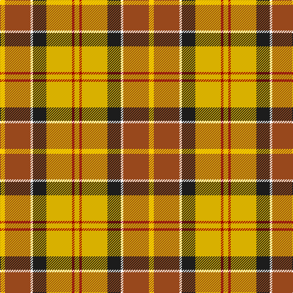

In pattern [YRWBYRY](/stripes/yrwbyry/).

This was sourced from tartans-authority.  It is a [7 stripe tartan](/stripes/stripes7/).

Original link http://www.tartansauthority.com/tartan-ferret/display/8735/

## Thread count
Y/8 T42 W4 K22 Ya42 DR4 Ya/8

## Palette
Each colour and its ΔE from the base-6 reference it is a variant of.

| Colour | Shade | Base | ΔE (OKLab) |
|---|---|---|---|
| DR | <code style="background-color:#A00000;">#A00000</code> `#A00000` | R <code style="background-color:#CC0000;">#CC0000</code> | 0.09 |
| K | <code style="background-color:#1C1C1C;">#1C1C1C</code> `#1C1C1C` | B <code style="background-color:#2A418A;">#2A418A</code> | 0.21 |
| T | <code style="background-color:#98481C;">#98481C</code> `#98481C` | R <code style="background-color:#CC0000;">#CC0000</code> | 0.11 |
| W | <code style="background-color:#FCFCFC;">#FCFCFC</code> `#FCFCFC` | W <code style="background-color:#F7F7F7;">#F7F7F7</code> | 0.01 |
| Y | <code style="background-color:#FCCC00;">#FCCC00</code> `#FCCC00` | Y <code style="background-color:#F2BF00;">#F2BF00</code> | 0.04 |
| Ya | <code style="background-color:#D8B000;">#D8B000</code> `#D8B000` | Y <code style="background-color:#F2BF00;">#F2BF00</code> | 0.06 |

# Sample pattern

## Nearest tartans

The nearest existing variants by ΔTartan distance.

1. [Prince Charles Edward](/setts/s9/r12g3ly4k2ly4g12ly2r3w1~x4/) — ΔT 1.14
1. [Elystan Glodrydd (Name)](/setts/s7/w3g24r13g4lo11r8db2~x2/) — ΔT 1.21
1. [MacLachlan, dress](/setts/s7/r34w3dg4g23w24k3dg4~x2/) — ΔT 1.28
1. [Red Rum Commemorative Tartan Tartan Number: 1217. Earliest known date: 1982 Red Remony See products available Copyright © Blair Urquhart, Comrie, 2015](/setts/s7/k2ly30g4w2g14r13ly2~x2/) — ΔT 1.29
1. [Bruce of Kinnaird (Fashion)](/setts/s10/lo22ly22dr2lb6dr2lo2dr16lg5lo8lb2~x2/) — ΔT 1.29
1. [Unidentified from Winnipeg](/setts/s8/w24r8dy2r8dy2r8dy15dg2~x2/) — ΔT 1.31
1. [Brittany Hunting French Fancy Tartan Tartan Number: 5977. Earliest known date: 2003 For Richard and Anne-Marie Duclos of Le Coudray-Montceaux, France. Based on the Breton National at 3902. The term Randonnée (Walking) is used in the sense of the Scottish category, Hunting. See products available Copyright © Blair Urquhart, Comrie, 2015](/setts/s9/t4dy27lr8k4lr8k4lr8r11ly3~x2/) — ΔT 1.31
1. [Unidentified Silk Plaid #2](/setts/s7/lo7ly12dg30o12r14r11ly2~x2/) — ΔT 1.32
1. [Jacobite, Silk sash](/setts/s10/w2r8o5ly6w5g21w6r8r4w2/) — ΔT 1.33
1. [Satchidananda (Personal)](/setts/s9/dy18ly4t10w2r20ly5r2w2dy6~x2/) — ΔT 1.34

## Neighbour map

Every grey dot is one of 14299 variants placed by the first two principal components of the ΔTartan feature space (44% of its variance). Red is this tartan; blue dots are its nearest — click one to open its page.

<svg viewBox="0 0 640 380" role="img" style="max-width:100%;height:auto;border:1px solid #e0e0e0;border-radius:4px;display:block" xmlns="http://www.w3.org/2000/svg"><image href="/nn/cloud.v1.png" width="640" height="380"/><a href="/setts/s9/r12g3ly4k2ly4g12ly2r3w1~x4/"><circle cx="153.9" cy="148.3" r="4" fill="#3465a4"><title>Prince Charles Edward</title></circle></a><a href="/setts/s7/w3g24r13g4lo11r8db2~x2/"><circle cx="162.6" cy="166.2" r="4" fill="#3465a4"><title>Elystan Glodrydd (Name)</title></circle></a><a href="/setts/s7/r34w3dg4g23w24k3dg4~x2/"><circle cx="148.8" cy="150.9" r="4" fill="#3465a4"><title>MacLachlan, dress</title></circle></a><a href="/setts/s7/k2ly30g4w2g14r13ly2~x2/"><circle cx="194.8" cy="122.0" r="4" fill="#3465a4"><title>Red Rum Commemorative Tartan Tartan Number: 1217. Earliest known date: 1982 Red Remony See products available Copyright © Blair Urquhart, Comrie, 2015</title></circle></a><a href="/setts/s10/lo22ly22dr2lb6dr2lo2dr16lg5lo8lb2~x2/"><circle cx="132.6" cy="134.3" r="4" fill="#3465a4"><title>Bruce of Kinnaird (Fashion)</title></circle></a><a href="/setts/s8/w24r8dy2r8dy2r8dy15dg2~x2/"><circle cx="153.5" cy="141.8" r="4" fill="#3465a4"><title>Unidentified from Winnipeg</title></circle></a><a href="/setts/s9/t4dy27lr8k4lr8k4lr8r11ly3~x2/"><circle cx="119.5" cy="150.5" r="4" fill="#3465a4"><title>Brittany Hunting French Fancy Tartan Tartan Number: 5977. Earliest known date: 2003 For Richard and Anne-Marie Duclos of Le Coudray-Montceaux, France. Based on the Breton National at 3902. The term Randonnée (Walking) is used in the sense of the Scottish category, Hunting. See products available Copyright © Blair Urquhart, Comrie, 2015</title></circle></a><a href="/setts/s7/lo7ly12dg30o12r14r11ly2~x2/"><circle cx="107.5" cy="153.9" r="4" fill="#3465a4"><title>Unidentified Silk Plaid #2</title></circle></a><a href="/setts/s10/w2r8o5ly6w5g21w6r8r4w2/"><circle cx="89.5" cy="138.1" r="4" fill="#3465a4"><title>Jacobite, Silk sash</title></circle></a><a href="/setts/s9/dy18ly4t10w2r20ly5r2w2dy6~x2/"><circle cx="152.3" cy="154.0" r="4" fill="#3465a4"><title>Satchidananda (Personal)</title></circle></a><circle cx="148.7" cy="144.6" r="5" fill="#c00000"/></svg>

ID: /setts/s7/ly4o21w2dt11ly21r2ly4~x2/
