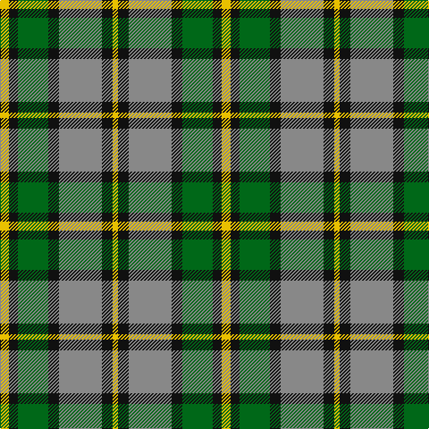

This page is one **sett** — a single exact thread-count. It belongs to the [tartan](/tartans/ly5k5g17k6o24k6ly3/)
(the same proportion at any scale), whose colour order is pattern [YKGKRKY](/stripes/ykgkrky/).

Sourced from house-of-tartan.  It is a [7 stripe tartan](/stripes/stripes7/).

Original link http://www.house-of-tartan.scotland.net/house/TartanViewjs.asp?colr=Def&tnam=1883

## Thread count
Y/10 K10 G34 K12 N48 K12 Y/6

## Palette

Palette: <strong>Tartan Register</strong>
<table><thead><tr><th>Colour</th><th>Threads</th><th>Shade</th><th>Base</th><th>OKLCh</th></tr></thead><tbody><tr><td>Y/</td><td style="text-align:right;font-variant-numeric:tabular-nums">10</td><td><code style="background-color:#E8C000;">#E8C000</code> <small style="color:#888">#E8C000</small></td><td>Y <code style="background-color:#F2BF00;">#F2BF00</code></td><td><small style="color:#888">oklch(81.9% 0.168 93.7)</small></td></tr><tr><td>K</td><td style="text-align:right;font-variant-numeric:tabular-nums">10</td><td><code style="background-color:#101010;">#101010</code> <small style="color:#888">#101010</small></td><td>K <code style="background-color:#000000;">#000000</code></td><td><small style="color:#888">oklch(17.3% 0.000 89.9)</small></td></tr><tr><td>G</td><td style="text-align:right;font-variant-numeric:tabular-nums">34</td><td><code style="background-color:#006818;">#006818</code> <small style="color:#888">#006818</small></td><td>G <code style="background-color:#006100;">#006100</code></td><td><small style="color:#888">oklch(45.0% 0.142 145.0)</small></td></tr><tr><td>K</td><td style="text-align:right;font-variant-numeric:tabular-nums">12</td><td><code style="background-color:#101010;">#101010</code> <small style="color:#888">#101010</small></td><td>K <code style="background-color:#000000;">#000000</code></td><td><small style="color:#888">oklch(17.3% 0.000 89.9)</small></td></tr><tr><td>N</td><td style="text-align:right;font-variant-numeric:tabular-nums">48</td><td><code style="background-color:#888888;">#888888</code> <small style="color:#888">#888888</small></td><td>R <code style="background-color:#CC0000;">#CC0000</code></td><td><small style="color:#888">oklch(62.7% 0.000 89.9)</small></td></tr><tr><td>K</td><td style="text-align:right;font-variant-numeric:tabular-nums">12</td><td><code style="background-color:#101010;">#101010</code> <small style="color:#888">#101010</small></td><td>K <code style="background-color:#000000;">#000000</code></td><td><small style="color:#888">oklch(17.3% 0.000 89.9)</small></td></tr><tr><td>Y/</td><td style="text-align:right;font-variant-numeric:tabular-nums">6</td><td><code style="background-color:#E8C000;">#E8C000</code> <small style="color:#888">#E8C000</small></td><td>Y <code style="background-color:#F2BF00;">#F2BF00</code></td><td><small style="color:#888">oklch(81.9% 0.168 93.7)</small></td></tr></tbody></table>

# Sample pattern

## Nearest tartans

The nearest existing variants by ΔTartan distance, with this tartan at the top so the swatches line up against it.

ΔTartan

Tartan

Sett

—

<a href="/ttd/edit/#slug=ly5k5g17k6o24k6ly3~x2">Cape Breton District Tartan Tartan Number: 1883. Earliest known date: 1957 In 1907, Mrs Lillian Crewe Walsh of Glace Bay, Cape Breton, wrote a poem in praise of Cape Breton. This poem was given by Mrs Walsh to Mrs Grant in 1957 and the tartan designed to accord with the poem. Grey for our Cape Breton Steel, Green for our lofty See products available Copyright © Blair Urquhart, Comrie, 2015</a> <a class="nn-out" href="/setts/s7/ly5k5g17k6o24k6ly3~x2/" title="open its dictionary page">↗</a>

0.79

<a href="/ttd/edit/#slug=ly5k5g17k6y24k6ly3~x2">Cape Breton</a> <a class="nn-out" href="/setts/s7/ly5k5g17k6y24k6ly3~x2/" title="open its dictionary page">↗</a>

0.93

<a href="/setts/s8/g6k1r1t2r2~x4/">Wilson's No.193</a>

0.99

<a href="/ttd/edit/#slug=k3g25o3k15lr24g3~x2">Un-named (D C Dalgliesh) #3</a> <a class="nn-out" href="/setts/s6/k3g25o3k15lr24g3~x2/" title="open its dictionary page">↗</a>

1.00

<a href="/ttd/edit/#slug=dg8g6dg48w31o42g6o8">Bannockbane, Green</a> <a class="nn-out" href="/setts/s7/dg8g6dg48w31o42g6o8/" title="open its dictionary page">↗</a>

1.01

<a href="/ttd/edit/#slug=r2ly1b8r1g7ly1r2~x6">Cercle de Fermieres de St-Elie . . .</a> <a class="nn-out" href="/setts/s7/r2ly1b8r1g7ly1r2~x6/" title="open its dictionary page">↗</a>

1.02

<a href="/ttd/edit/#slug=r3w8db4g14r4db2~x2">MacIntosh, dress</a> <a class="nn-out" href="/setts/s6/r3w8db4g14r4db2~x2/" title="open its dictionary page">↗</a>

1.06

<a href="/setts/s8/g6ly1r1t2r2~x4/">Wilson's No.179</a>

1.06

<a href="/ttd/edit/#slug=dg4g3dg24w15lo21g3lo4~x2">Bannockbane Dark Green</a> <a class="nn-out" href="/setts/s7/dg4g3dg24w15lo21g3lo4~x2/" title="open its dictionary page">↗</a>

1.10

<a href="/ttd/edit/#slug=k3g2k10w11g1dy10g2dy3~x6">Dalveen (1981)</a> <a class="nn-out" href="/setts/s8/k3g2k10w11g1dy10g2dy3~x6/" title="open its dictionary page">↗</a>

1.10

<a href="/ttd/edit/#slug=r3w8db4dg14r4db2~x4">MacKintosh Dress (Scott Adie)</a> <a class="nn-out" href="/setts/s6/r3w8db4dg14r4db2~x4/" title="open its dictionary page">↗</a>

## Neighbour map

Every grey dot is one of 14299 variants placed by the first two principal components of the ΔTartan feature space (44% of its variance). Red is this tartan; blue dots are its nearest — click one to open its page.

<svg viewBox="0 0 640 380" role="img" style="max-width:100%;height:auto;border:1px solid #e0e0e0;border-radius:4px;display:block" xmlns="http://www.w3.org/2000/svg"><image href="/nn/cloud.v1.png" width="640" height="380"/><a href="/setts/s7/ly5k5g17k6y24k6ly3~x2/"><circle cx="132.8" cy="200.0" r="4" fill="#3465a4"><title>Cape Breton</title></circle></a><a href="/setts/s8/g6k1r1t2r2~x4/"><circle cx="164.3" cy="218.3" r="4" fill="#3465a4"><title>Wilson's No.193</title></circle></a><a href="/setts/s6/k3g25o3k15lr24g3~x2/"><circle cx="180.1" cy="205.9" r="4" fill="#3465a4"><title>Un-named (D C Dalgliesh) #3</title></circle></a><a href="/setts/s7/dg8g6dg48w31o42g6o8/"><circle cx="143.0" cy="184.1" r="4" fill="#3465a4"><title>Bannockbane, Green</title></circle></a><a href="/setts/s7/r2ly1b8r1g7ly1r2~x6/"><circle cx="185.4" cy="203.4" r="4" fill="#3465a4"><title>Cercle de Fermieres de St-Elie . . .</title></circle></a><a href="/setts/s6/r3w8db4g14r4db2~x2/"><circle cx="151.1" cy="216.1" r="4" fill="#3465a4"><title>MacIntosh, dress</title></circle></a><a href="/setts/s8/g6ly1r1t2r2~x4/"><circle cx="162.1" cy="212.9" r="4" fill="#3465a4"><title>Wilson's No.179</title></circle></a><a href="/setts/s7/dg4g3dg24w15lo21g3lo4~x2/"><circle cx="144.8" cy="184.5" r="4" fill="#3465a4"><title>Bannockbane Dark Green</title></circle></a><a href="/setts/s8/k3g2k10w11g1dy10g2dy3~x6/"><circle cx="126.2" cy="181.6" r="4" fill="#3465a4"><title>Dalveen (1981)</title></circle></a><a href="/setts/s6/r3w8db4dg14r4db2~x4/"><circle cx="150.6" cy="213.9" r="4" fill="#3465a4"><title>MacKintosh Dress (Scott Adie)</title></circle></a><circle cx="152.5" cy="207.8" r="5" fill="#c00000"/></svg>

ID: /setts/s7/ly5k5g17k6o24k6ly3~x2/
