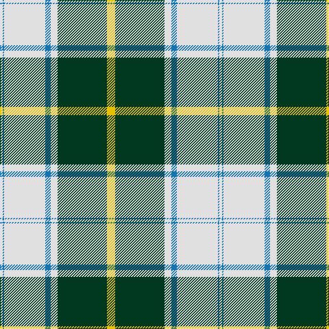

**Bands:** [WBWBWGY](/stripes/wbwbwgy/) · **Stripes:** [W B W B W DG LY](/stripes/stripes7/) W B W B W DG LY

This was sourced from tartans-authority.  It is a [7 band tartan](/bands/bands7/).

Original link http://www.tartansauthority.com/tartan-ferret/display/8096/

## Thread count
LN/4 B2 LN60 B8 LN10 DG72 Y/12

## Palette
Each colour and its ΔE from the base-6 reference it is a variant of.

| Colour | Shade | Base | ΔE (OKLab) |
|---|---|---|---|
| B | <code style="background-color:#1474B4;">#1474B4</code> `#1474B4` | B <code style="background-color:#2A418A;">#2A418A</code> | 0.15 |
| DG | <code style="background-color:#003820;">#003820</code> `#003820` | G <code style="background-color:#006100;">#006100</code> | 0.15 |
| LN | <code style="background-color:#E0E0E0;">#E0E0E0</code> `#E0E0E0` | W <code style="background-color:#F7F7F7;">#F7F7F7</code> | 0.07 |
| Y | <code style="background-color:#E8C000;">#E8C000</code> `#E8C000` | Y <code style="background-color:#F2BF00;">#F2BF00</code> | 0.02 |

# Sample pattern

## Nearest tartans

The nearest existing variants by ΔTartan distance.

1. [British Columbia #2](/setts/s8/dg4dr14dg14o6dr1w30dg2dr1~x2/) — ΔT 1.14
1. [Unidentified (shirt fabric)](/setts/s9/w5db3w25k2w2k16g8k1w4/) — ΔT 1.21
1. [McClurg (Name)](/setts/s8/ly4g1ly2g1ly32ly3db32t4~x2/) — ΔT 1.21
1. [Longniddry Green Error (Dance)](/setts/s8/g42ly1w2ly1g5dg12w32g4~x2/) — ΔT 1.25
1. [Dogwood](/setts/s8/dg4do10dg10o6do1w26dg2do1~x4/) — ΔT 1.31
1. [Michigan State University](/setts/s7/g18w55o19g20w2g20k5/) — ΔT 1.34
1. [Longniddry Green (Dance)](/setts/s8/g42g2w2g2g5dt12w32g4~x2/) — ΔT 1.37
1. [Dogwood Trade Tartan Tartan Number: 913. Earliest known date: 1968 The registered tartan of the Dinwiddie Clan. Dinwiddies are normally associated with the Maxwells, but Lord Lyon stated, in 1988, that Dinwiddies were a sept of no other clan. See products available Copyright © Blair Urquhart, Comrie, 2015](/setts/s8/g3r12g12lo5r1w25g2r1~x2/) — ΔT 1.48
1. [MacPherson Dress (1842)](/setts/s7/w3r1w30k20w3k9ly1~x2/) — ΔT 1.48
1. [Fiander, Julian (Personal)](/setts/s9/r6g2w21ly2k8ly2g32w1k3~x2/) — ΔT 1.50

## Neighbour map

Every grey dot is one of 14313 variants placed by the first two principal components of the ΔTartan feature space (44% of its variance). Red is this tartan; blue dots are its nearest — click one to open its page.

<svg viewBox="0 0 640 380" role="img" style="max-width:100%;height:auto;border:1px solid #e0e0e0;border-radius:4px;display:block" xmlns="http://www.w3.org/2000/svg"><image href="/nn/cloud.v1.png" width="640" height="380"/><a href="/setts/s8/dg4dr14dg14o6dr1w30dg2dr1~x2/"><circle cx="215.9" cy="111.1" r="4" fill="#3465a4"><title>British Columbia #2</title></circle></a><a href="/setts/s9/w5db3w25k2w2k16g8k1w4/"><circle cx="278.5" cy="117.8" r="4" fill="#3465a4"><title>Unidentified (shirt fabric)</title></circle></a><a href="/setts/s8/ly4g1ly2g1ly32ly3db32t4~x2/"><circle cx="276.2" cy="87.7" r="4" fill="#3465a4"><title>McClurg (Name)</title></circle></a><a href="/setts/s8/g42ly1w2ly1g5dg12w32g4~x2/"><circle cx="304.2" cy="103.9" r="4" fill="#3465a4"><title>Longniddry Green Error (Dance)</title></circle></a><a href="/setts/s8/dg4do10dg10o6do1w26dg2do1~x4/"><circle cx="218.0" cy="118.3" r="4" fill="#3465a4"><title>Dogwood</title></circle></a><a href="/setts/s7/g18w55o19g20w2g20k5/"><circle cx="219.3" cy="145.2" r="4" fill="#3465a4"><title>Michigan State University</title></circle></a><a href="/setts/s8/g42g2w2g2g5dt12w32g4~x2/"><circle cx="266.8" cy="129.4" r="4" fill="#3465a4"><title>Longniddry Green (Dance)</title></circle></a><a href="/setts/s8/g3r12g12lo5r1w25g2r1~x2/"><circle cx="223.5" cy="124.8" r="4" fill="#3465a4"><title>Dogwood Trade Tartan Tartan Number: 913. Earliest known date: 1968 The registered tartan of the Dinwiddie Clan. Dinwiddies are normally associated with the Maxwells, but Lord Lyon stated, in 1988, that Dinwiddies were a sept of no other clan. See products available Copyright © Blair Urquhart, Comrie, 2015</title></circle></a><a href="/setts/s7/w3r1w30k20w3k9ly1~x2/"><circle cx="322.9" cy="120.9" r="4" fill="#3465a4"><title>MacPherson Dress (1842)</title></circle></a><a href="/setts/s9/r6g2w21ly2k8ly2g32w1k3~x2/"><circle cx="217.5" cy="86.7" r="4" fill="#3465a4"><title>Fiander, Julian (Personal)</title></circle></a><circle cx="270.1" cy="114.7" r="5" fill="#c00000"/></svg>

ID: /setts/s7/ly6dg36w5b4w30b1w2~x2/
