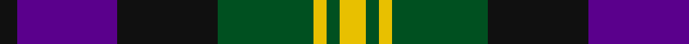
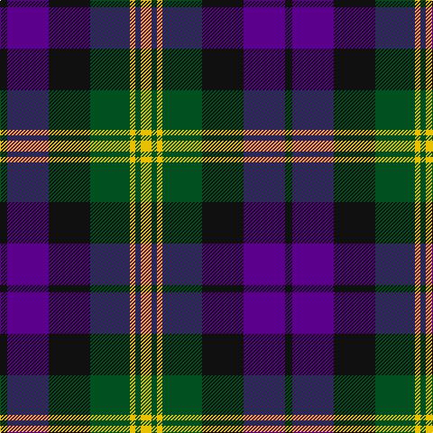

**Bands:** [KBKGYGY](/stripes/kbkgygy/) · **Stripes:** [K DP K DG LY DG LY](/stripes/stripes7/) K DP K DG LY DG LY

This was sourced from register-of-tartans.  It is a [7 band tartan](/bands/bands7/).

Original link https://www.tartanregister.gov.uk/tartanDetails.aspx?ref=1464

## Register references

External register numbers recorded for this tartan.

- Scottish Register of Tartans: [1464](https://www.tartanregister.gov.uk/tartanDetails.aspx?ref=1464)
- Scottish Tartans World Register: 1064

## Thread count
K/8 P46 K46 G44 Y6 G6 Y/12

## Palette
Each colour and its ΔE from the base-6 reference it is a variant of.

| Colour | Shade | Base | ΔE (OKLab) |
|---|---|---|---|
| G | <code style="background-color:#005020;">#005020</code> `#005020` | G <code style="background-color:#006100;">#006100</code> | 0.07 |
| K | <code style="background-color:#101010;">#101010</code> `#101010` | K <code style="background-color:#000000;">#000000</code> | 0.17 |
| P | <code style="background-color:#5A008C;">#5A008C</code> `#5A008C` | B <code style="background-color:#2A418A;">#2A418A</code> | 0.13 |
| Y | <code style="background-color:#E8C000;">#E8C000</code> `#E8C000` | Y <code style="background-color:#F2BF00;">#F2BF00</code> | 0.02 |

# Sample pattern

## Nearest tartans

The nearest existing variants by ΔTartan distance.

1. [Edinburgh International Conference Centre](/setts/s6/o4db19o3k20o24db3~x2/) — ΔT 0.50
1. [Gordon of Esslemont Family Tartan Tartan Number: 1064. Earliest known date: c.1830 This sett is called 'Gordon of Esslemont' according to Captain Wolrige-Gordon of Esslemont in recent research. It was previously listed as 'Ancient Gordon' before the story of its origin came to light. Apparently the Duke of Gordon was offered tartans with one, two, and three stripes when he applied to Forsythe of Huntly to provide kilts for his troops. He chose the single stripe and called in the Heads of the families to choose from the others. Esslemont took the three stripe version. See products available Copyright © Blair Urquhart, Comrie, 2015](/setts/s7/ly6g3ly3g22k23dp23k4~x2/) — ΔT 0.60
1. [Oceanic (Corporate?)](/setts/s7/ly8k4o39k37dt36k6dt7/) — ΔT 0.66
1. [Baird](/setts/s8/db3k2db8k8g8p1g1p3~x2/) — ΔT 0.81
1. [Utah (US State)](/setts/s8/w2r3dg9r3db2r3db3w1~x6/) — ΔT 0.89
1. [Hudson Valley Reg. Police P & D (Cor](/setts/s6/ly5g16k16db16k2db2~x2/) — ΔT 0.92
1. [Unidentified No 26](/setts/s6/w4db4dg22k20db20w3/) — ΔT 0.93
1. [Wilson's No.158](/setts/s10/g19w2g4k13dp12k3dp12k13g4w2~x2/) — ΔT 0.95
1. [Fletcher of Dunans](/setts/s7/db6k1db6k8r1g8r2~x2/) — ΔT 0.96
1. [Baillie (Highland Society)](/setts/s7/dp3k1dp8k6dg8k1w2~x2/) — ΔT 1.00

## Neighbour map

Every grey dot is one of 14313 variants placed by the first two principal components of the ΔTartan feature space (44% of its variance). Red is this tartan; blue dots are its nearest — click one to open its page.

<svg viewBox="0 0 640 380" role="img" style="max-width:100%;height:auto;border:1px solid #e0e0e0;border-radius:4px;display:block" xmlns="http://www.w3.org/2000/svg"><image href="/nn/cloud.v1.png" width="640" height="380"/><a href="/setts/s6/o4db19o3k20o24db3~x2/"><circle cx="153.2" cy="222.9" r="4" fill="#3465a4"><title>Edinburgh International Conference Centre</title></circle></a><a href="/setts/s7/ly6g3ly3g22k23dp23k4~x2/"><circle cx="143.6" cy="210.8" r="4" fill="#3465a4"><title>Gordon of Esslemont Family Tartan Tartan Number: 1064. Earliest known date: c.1830 This sett is called 'Gordon of Esslemont' according to Captain Wolrige-Gordon of Esslemont in recent research. It was previously listed as 'Ancient Gordon' before the story of its origin came to light. Apparently the Duke of Gordon was offered tartans with one, two, and three stripes when he applied to Forsythe of Huntly to provide kilts for his troops. He chose the single stripe and called in the Heads of the families to choose from the others. Esslemont took the three stripe version. See products available Copyright © Blair Urquhart, Comrie, 2015</title></circle></a><a href="/setts/s7/ly8k4o39k37dt36k6dt7/"><circle cx="173.0" cy="209.2" r="4" fill="#3465a4"><title>Oceanic (Corporate?)</title></circle></a><a href="/setts/s8/db3k2db8k8g8p1g1p3~x2/"><circle cx="129.4" cy="216.8" r="4" fill="#3465a4"><title>Baird</title></circle></a><a href="/setts/s8/w2r3dg9r3db2r3db3w1~x6/"><circle cx="158.7" cy="206.4" r="4" fill="#3465a4"><title>Utah (US State)</title></circle></a><a href="/setts/s6/ly5g16k16db16k2db2~x2/"><circle cx="151.2" cy="238.7" r="4" fill="#3465a4"><title>Hudson Valley Reg. Police P &amp; D (Cor</title></circle></a><a href="/setts/s6/w4db4dg22k20db20w3/"><circle cx="149.9" cy="239.6" r="4" fill="#3465a4"><title>Unidentified No 26</title></circle></a><a href="/setts/s10/g19w2g4k13dp12k3dp12k13g4w2~x2/"><circle cx="163.3" cy="204.5" r="4" fill="#3465a4"><title>Wilson's No.158</title></circle></a><a href="/setts/s7/db6k1db6k8r1g8r2~x2/"><circle cx="147.0" cy="227.7" r="4" fill="#3465a4"><title>Fletcher of Dunans</title></circle></a><a href="/setts/s7/dp3k1dp8k6dg8k1w2~x2/"><circle cx="177.0" cy="225.7" r="4" fill="#3465a4"><title>Baillie (Highland Society)</title></circle></a><circle cx="148.6" cy="217.0" r="5" fill="#c00000"/></svg>

ID: /setts/s7/ly6dg3ly3dg22k23dp23k4~x2/
