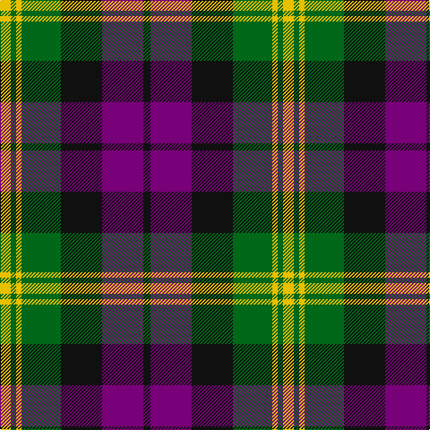

In pattern [KBKGYGY](/stripes/kbkgygy/).

This was sourced from house-of-tartan.  It is a [7 stripe tartan](/stripes/stripes7/).

Original link http://www.house-of-tartan.scotland.net/house/TartanViewjs.asp?colr=Def&tnam=1064

## Thread count
Y/12 G6 Y6 G44 K46 P46 K/8

## Palette
Each colour and its ΔE from the base-6 reference it is a variant of.

| Colour | Shade | Base | ΔE (OKLab) |
|---|---|---|---|
| G | <code style="background-color:#006818;">#006818</code> `#006818` | G <code style="background-color:#006100;">#006100</code> | 0.02 |
| K | <code style="background-color:#101010;">#101010</code> `#101010` | K <code style="background-color:#000000;">#000000</code> | 0.17 |
| P | <code style="background-color:#780078;">#780078</code> `#780078` | B <code style="background-color:#2A418A;">#2A418A</code> | 0.17 |
| Y | <code style="background-color:#E8C000;">#E8C000</code> `#E8C000` | Y <code style="background-color:#F2BF00;">#F2BF00</code> | 0.02 |

# Sample pattern

## Nearest tartans

The nearest existing variants by ΔTartan distance.

1. [Gordon of Esslemont](/setts/s7/ly6dg3ly3dg22k23dp23k4~x2/) — ΔT 0.60
1. [Edinburgh International Conference Centre](/setts/s6/o4db19o3k20o24db3~x2/) — ΔT 0.68
1. [Utah (US State)](/setts/s8/w2r3dg9r3db2r3db3w1~x6/) — ΔT 0.76
1. [Gordon of Esslemont](/setts/s7/ly6g3ly3g22k23p23k4~x2/) — ΔT 0.82
1. [Oceanic (Corporate?)](/setts/s7/ly8k4o39k37dt36k6dt7/) — ΔT 0.93
1. [Stevenson (Name)](/setts/s9/r1g6ly1r2ly1r2ly1db6ly1~x8/) — ΔT 0.94
1. [Wilson's, No 100](/setts/s6/k3g17ly2k18p17g3~x2/) — ΔT 1.05
1. [Wilson's No.158](/setts/s10/g19w2g4k13dp12k3~x2/) — ΔT 1.05
1. [Wilson's No.160](/setts/s10/g19ly2g4k13dp12k3~x2/) — ΔT 1.05
1. [Wilson's, No 76](/setts/s6/k3g17w2k18p17g3~x2/) — ΔT 1.06

## Neighbour map

Every grey dot is one of 14299 variants placed by the first two principal components of the ΔTartan feature space (44% of its variance). Red is this tartan; blue dots are its nearest — click one to open its page.

<svg viewBox="0 0 640 380" role="img" style="max-width:100%;height:auto;border:1px solid #e0e0e0;border-radius:4px;display:block" xmlns="http://www.w3.org/2000/svg"><image href="/nn/cloud.v1.png" width="640" height="380"/><a href="/setts/s7/ly6dg3ly3dg22k23dp23k4~x2/"><circle cx="148.7" cy="217.0" r="4" fill="#3465a4"><title>Gordon of Esslemont</title></circle></a><a href="/setts/s6/o4db19o3k20o24db3~x2/"><circle cx="153.4" cy="222.8" r="4" fill="#3465a4"><title>Edinburgh International Conference Centre</title></circle></a><a href="/setts/s8/w2r3dg9r3db2r3db3w1~x6/"><circle cx="158.7" cy="206.3" r="4" fill="#3465a4"><title>Utah (US State)</title></circle></a><a href="/setts/s7/ly6g3ly3g22k23p23k4~x2/"><circle cx="122.3" cy="201.6" r="4" fill="#3465a4"><title>Gordon of Esslemont</title></circle></a><a href="/setts/s7/ly8k4o39k37dt36k6dt7/"><circle cx="173.1" cy="209.2" r="4" fill="#3465a4"><title>Oceanic (Corporate?)</title></circle></a><a href="/setts/s9/r1g6ly1r2ly1r2ly1db6ly1~x8/"><circle cx="114.6" cy="197.4" r="4" fill="#3465a4"><title>Stevenson (Name)</title></circle></a><a href="/setts/s6/k3g17ly2k18p17g3~x2/"><circle cx="155.9" cy="212.6" r="4" fill="#3465a4"><title>Wilson's, No 100</title></circle></a><a href="/setts/s10/g19w2g4k13dp12k3~x2/"><circle cx="163.4" cy="204.5" r="4" fill="#3465a4"><title>Wilson's No.158</title></circle></a><a href="/setts/s10/g19ly2g4k13dp12k3~x2/"><circle cx="167.2" cy="206.2" r="4" fill="#3465a4"><title>Wilson's No.160</title></circle></a><a href="/setts/s6/k3g17w2k18p17g3~x2/"><circle cx="154.9" cy="212.3" r="4" fill="#3465a4"><title>Wilson's, No 76</title></circle></a><circle cx="143.7" cy="210.8" r="5" fill="#c00000"/></svg>

ID: /setts/s7/ly6g3ly3g22k23dp23k4~x2/
