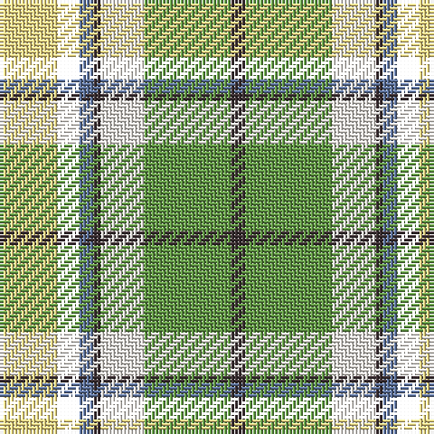

This page is one **sett** — a single exact thread-count. It belongs to the [tartan](/tartans/ly8m3b2t1w6lg12t2/)
(the same proportion at any scale), whose colour order is pattern [BGWBBKY](/stripes/bgwbbky/).

Sourced from register-of-tartans.  It is a [7 stripe tartan](/stripes/stripes7/).

Original link https://www.tartanregister.gov.uk/tartanDetails.aspx?ref=10340

## Register references

External register numbers recorded for this tartan.

- Scottish Register of Tartans: [10340](https://www.tartanregister.gov.uk/tartanDetails.aspx?ref=10340)

## Thread count
LY/16 M6 B4 T2 W12 LG24 T/4

## Palette
Each colour and the base-6 reference it is a variant of.

| Colour | Shade | Base |
|---|---|---|
| B | <code style="background-color:#5F749C;">#5F749C</code> `oklch(55.8% 0.067 262.9)` <small>#5F749C</small> | B <code style="background-color:#2A418A;">#2A418A</code> |
| LG | <code style="background-color:#649848;">#649848</code> `oklch(62.4% 0.125 135.7)` <small>#649848</small> | G <code style="background-color:#006100;">#006100</code> |
| LY | <code style="background-color:#F8E38C;">#F8E38C</code> `oklch(91.4% 0.110 96.2)` <small>#F8E38C</small> | Y <code style="background-color:#F2BF00;">#F2BF00</code> |
| T | <code style="background-color:#3D3134;">#3D3134</code> `oklch(32.7% 0.018 1.4)` <small>#3D3134</small> | B <code style="background-color:#2A418A;">#2A418A</code> |
| W | <code style="background-color:#F9F5EF;">#F9F5EF</code> `oklch(97.2% 0.009 78.3)` <small>#F9F5EF</small> | W <code style="background-color:#F7F7F7;">#F7F7F7</code> |

# Sample pattern

## Nearest tartans

The nearest existing variants by ΔTartan distance, with this tartan at the top so the swatches line up against it.

ΔTartan

Tartan

Sett

—

<a href="/ttd/edit/#slug=ly8k3t2do1w6g12do2~x2">Carmen Lau (Hong Kong) (Personal)</a> <a class="nn-out" href="/setts/s7/ly8k3t2do1w6g12do2~x2/" title="open its dictionary page">↗</a>

0.32

<a href="/ttd/edit/#slug=ly8r3b2db1w6g12db2~x2">Carmen Lau (Hong Kong) (Personal)</a> <a class="nn-out" href="/setts/s7/ly8r3b2db1w6g12db2~x2/" title="open its dictionary page">↗</a>

0.99

<a href="/ttd/edit/#slug=ly6k2g12r4g8k10w24b2w3b2~x2">Gillies Dress, Green (Dance)</a> <a class="nn-out" href="/setts/s10/ly6k2g12r4g8k10w24b2w3b2~x2/" title="open its dictionary page">↗</a>

1.02

<a href="/ttd/edit/#slug=db7w30k13g9r6g16k2ly7~x2">MacLaren dress</a> <a class="nn-out" href="/setts/s8/db7w30k13g9r6g16k2ly7~x2/" title="open its dictionary page">↗</a>

1.07

<a href="/ttd/edit/#slug=lo13g8k5lb3w2r1~x4">Ball Hunting</a> <a class="nn-out" href="/setts/s6/lo13g8k5lb3w2r1~x4/" title="open its dictionary page">↗</a>

1.07

<a href="/ttd/edit/#slug=r6w20g12o3g8t20k2t3~x2">Coulter Dress (Personal)</a> <a class="nn-out" href="/setts/s8/r6w20g12o3g8t20k2t3~x2/" title="open its dictionary page">↗</a>

1.12

<a href="/ttd/edit/#slug=ly6k2g15r6g8k12w25t2w3t2~x2">Gillies, dress Green</a> <a class="nn-out" href="/setts/s10/ly6k2g15r6g8k12w25t2w3t2~x2/" title="open its dictionary page">↗</a>

1.20

<a href="/ttd/edit/#slug=db2w12k8g8r2g8k1lo2~x2">MacLaren Dress</a> <a class="nn-out" href="/setts/s8/db2w12k8g8r2g8k1lo2~x2/" title="open its dictionary page">↗</a>

1.20

<a href="/ttd/edit/#slug=dy17o5db2w12db2ly4g7~x2">Ontario Northern Canadian District Tartan Tartan Number: 956. Earliest known date: 1967 The six colours represent the nickel bearing rocks (grey), the snow (white), the sky and the lakes (blue), gold, the forests and fields (green), and the Indian Nation (red brown). See products available Copyright © Blair Urquhart, Comrie, 2015</a> <a class="nn-out" href="/setts/s7/dy17o5db2w12db2ly4g7~x2/" title="open its dictionary page">↗</a>

1.25

<a href="/ttd/edit/#slug=r2k2w16dg13g6ly2k2w2~x2">Madewell Dress</a> <a class="nn-out" href="/setts/s8/r2k2w16dg13g6ly2k2w2~x2/" title="open its dictionary page">↗</a>

1.28

<a href="/ttd/edit/#slug=w13lg13t13k10w7ly1r1~x4">Lachine Historic</a> <a class="nn-out" href="/setts/s7/w13lg13t13k10w7ly1r1~x4/" title="open its dictionary page">↗</a>

## Neighbour map

Every grey dot is one of 14299 variants placed by the first two principal components of the ΔTartan feature space (44% of its variance). Red is this tartan; blue dots are its nearest — click one to open its page.

<svg viewBox="0 0 640 380" role="img" style="max-width:100%;height:auto;border:1px solid #e0e0e0;border-radius:4px;display:block" xmlns="http://www.w3.org/2000/svg"><image href="/nn/cloud.v1.png" width="640" height="380"/><a href="/setts/s7/ly8r3b2db1w6g12db2~x2/"><circle cx="89.6" cy="144.4" r="4" fill="#3465a4"><title>Carmen Lau (Hong Kong) (Personal)</title></circle></a><a href="/setts/s10/ly6k2g12r4g8k10w24b2w3b2~x2/"><circle cx="92.6" cy="115.0" r="4" fill="#3465a4"><title>Gillies Dress, Green (Dance)</title></circle></a><a href="/setts/s8/db7w30k13g9r6g16k2ly7~x2/"><circle cx="75.9" cy="132.5" r="4" fill="#3465a4"><title>MacLaren dress</title></circle></a><a href="/setts/s6/lo13g8k5lb3w2r1~x4/"><circle cx="141.5" cy="152.8" r="4" fill="#3465a4"><title>Ball Hunting</title></circle></a><a href="/setts/s8/r6w20g12o3g8t20k2t3~x2/"><circle cx="82.4" cy="153.0" r="4" fill="#3465a4"><title>Coulter Dress (Personal)</title></circle></a><a href="/setts/s10/ly6k2g15r6g8k12w25t2w3t2~x2/"><circle cx="84.5" cy="116.5" r="4" fill="#3465a4"><title>Gillies, dress Green</title></circle></a><a href="/setts/s8/db2w12k8g8r2g8k1lo2~x2/"><circle cx="98.0" cy="144.7" r="4" fill="#3465a4"><title>MacLaren Dress</title></circle></a><a href="/setts/s7/dy17o5db2w12db2ly4g7~x2/"><circle cx="87.7" cy="166.4" r="4" fill="#3465a4"><title>Ontario Northern Canadian District Tartan Tartan Number: 956. Earliest known date: 1967 The six colours represent the nickel bearing rocks (grey), the snow (white), the sky and the lakes (blue), gold, the forests and fields (green), and the Indian Nation (red brown). See products available Copyright © Blair Urquhart, Comrie, 2015</title></circle></a><a href="/setts/s8/r2k2w16dg13g6ly2k2w2~x2/"><circle cx="111.6" cy="138.7" r="4" fill="#3465a4"><title>Madewell Dress</title></circle></a><a href="/setts/s7/w13lg13t13k10w7ly1r1~x4/"><circle cx="71.2" cy="153.5" r="4" fill="#3465a4"><title>Lachine Historic</title></circle></a><circle cx="83.4" cy="140.7" r="5" fill="#c00000"/></svg>

ID: /setts/s7/ly8k3t2do1w6g12do2~x2/
