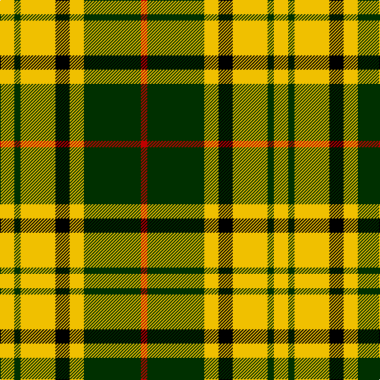

In pattern [RGYKYGY](/stripes/rgykygy/).

This was sourced from weddslist.  It is a [7 stripe tartan](/stripes/stripes7/).

Original link http://www.weddslist.com/cgi-bin/tartans/pg.pl?source=sts

## Thread count
Y/18 DG8 Y44 K18 Y18 DG72 R/8

## Palette
Each colour and the base-6 reference it is a variant of.

| Colour | Shade | Base |
|---|---|---|
| DG | <code style="background-color:#003000;">#003000</code> `oklch(26.8% 0.091 142.5)` <small>#003000</small> | G <code style="background-color:#006100;">#006100</code> |
| K | <code style="background-color:#000000;">#000000</code> `oklch(0.0% 0.000 0.0)` <small>#000000</small> | K <code style="background-color:#000000;">#000000</code> |
| R | <code style="background-color:#C00000;">#C00000</code> `oklch(50.7% 0.208 29.2)` <small>#C00000</small> | R <code style="background-color:#CC0000;">#CC0000</code> |
| Y | <code style="background-color:#F0C000;">#F0C000</code> `oklch(82.7% 0.169 90.5)` <small>#F0C000</small> | Y <code style="background-color:#F2BF00;">#F2BF00</code> |

# Sample pattern

## Nearest tartans

The nearest existing variants by ΔTartan distance.

1. [Harmer (Corporate)](/setts/s7/lo12dg4lo24k9lo8dg36r4/) — ΔT 1.30
1. [MacDuck (Corporate)](/setts/s6/k4r5k2ly21g8k2~x2/) — ΔT 1.34
1. [Unidentfied (Ligioner Highland Games](/setts/s6/do4g25lo10g3lo18r4~x2/) — ΔT 1.41
1. [MacLeod #3](/setts/s6/k6ly1k6ly9r1ly2~x2/) — ΔT 1.44
1. [Unnamed C21st - Fashion](/setts/s6/k4ly32k16r3k16ly4~x2/) — ΔT 1.46
1. [MacDuck #2](/setts/s6/k4r5k2lo21g8k2~x2/) — ΔT 1.48
1. [Cornish National Small Set Tartan Tartan Number: 7651. Earliest known date: See products available Copyright © Blair Urquhart, Comrie, 2015](/setts/s6/w2k11ly11t3k1r1~x2/) — ΔT 1.49
1. [Black & White Golf (Corporate)](/setts/s7/lo9k32g6lb20lo3lb9k5~x2/) — ΔT 1.50
1. [Eire (District?)](/setts/s9/g6lr2g10k3r1k3lo10lr2lo6~x4/) — ΔT 1.56
1. [Cornish National #2](/setts/s6/w2k11ly11db3k1r1~x2/) — ΔT 1.57

## Neighbour map

Every grey dot is one of 14299 variants placed by the first two principal components of the ΔTartan feature space (44% of its variance). Red is this tartan; blue dots are its nearest — click one to open its page.

<svg viewBox="0 0 640 380" role="img" style="max-width:100%;height:auto;border:1px solid #e0e0e0;border-radius:4px;display:block" xmlns="http://www.w3.org/2000/svg"><image href="/nn/cloud.v1.png" width="640" height="380"/><a href="/setts/s7/lo12dg4lo24k9lo8dg36r4/"><circle cx="238.8" cy="207.3" r="4" fill="#3465a4"><title>Harmer (Corporate)</title></circle></a><a href="/setts/s6/k4r5k2ly21g8k2~x2/"><circle cx="227.9" cy="171.9" r="4" fill="#3465a4"><title>MacDuck (Corporate)</title></circle></a><a href="/setts/s6/do4g25lo10g3lo18r4~x2/"><circle cx="222.4" cy="205.2" r="4" fill="#3465a4"><title>Unidentfied (Ligioner Highland Games</title></circle></a><a href="/setts/s6/k6ly1k6ly9r1ly2~x2/"><circle cx="256.2" cy="216.7" r="4" fill="#3465a4"><title>MacLeod #3</title></circle></a><a href="/setts/s6/k4ly32k16r3k16ly4~x2/"><circle cx="267.6" cy="198.2" r="4" fill="#3465a4"><title>Unnamed C21st - Fashion</title></circle></a><a href="/setts/s6/k4r5k2lo21g8k2~x2/"><circle cx="247.2" cy="181.5" r="4" fill="#3465a4"><title>MacDuck #2</title></circle></a><a href="/setts/s6/w2k11ly11t3k1r1~x2/"><circle cx="173.7" cy="158.0" r="4" fill="#3465a4"><title>Cornish National Small Set Tartan Tartan Number: 7651. Earliest known date: See products available Copyright © Blair Urquhart, Comrie, 2015</title></circle></a><a href="/setts/s7/lo9k32g6lb20lo3lb9k5~x2/"><circle cx="190.2" cy="179.7" r="4" fill="#3465a4"><title>Black &amp; White Golf (Corporate)</title></circle></a><a href="/setts/s9/g6lr2g10k3r1k3lo10lr2lo6~x4/"><circle cx="135.7" cy="175.7" r="4" fill="#3465a4"><title>Eire (District?)</title></circle></a><a href="/setts/s6/w2k11ly11db3k1r1~x2/"><circle cx="174.5" cy="158.9" r="4" fill="#3465a4"><title>Cornish National #2</title></circle></a><circle cx="196.4" cy="187.4" r="5" fill="#c00000"/></svg>

ID: /setts/s7/ly9dg4ly22k9ly9dg36r4~x2/
