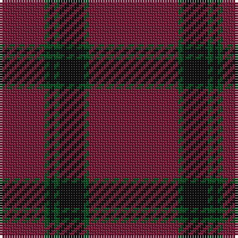

**Bands:** [RGKGKGR](/stripes/rgkgkgr/) · **Stripes:** [M DG K DG K DG M](/stripes/stripes7/) M DG K DG K DG M

This was sourced from register-of-tartans.  It is a [7 band tartan](/bands/bands7/).

Original link https://www.tartanregister.gov.uk/tartanDetails.aspx?ref=1842

## Register references

External register numbers recorded for this tartan.

- Scottish Register of Tartans: [1842](https://www.tartanregister.gov.uk/tartanDetails.aspx?ref=1842)
- Scottish Tartans World Register: 1470

## Thread count
DR/18 G2 K2 G2 K10 G2 DR/36

## Palette
Each colour and its ΔE from the base-6 reference it is a variant of.

| Colour | Shade | Base | ΔE (OKLab) |
|---|---|---|---|
| DR | <code style="background-color:#781C38;">#781C38</code> `#781C38` | R <code style="background-color:#CC0000;">#CC0000</code> | 0.18 |
| G | <code style="background-color:#005020;">#005020</code> `#005020` | G <code style="background-color:#006100;">#006100</code> | 0.07 |
| K | <code style="background-color:#101010;">#101010</code> `#101010` | K <code style="background-color:#000000;">#000000</code> | 0.17 |

# Sample pattern

## Nearest tartans

The nearest existing variants by ΔTartan distance.

1. [Fitzgibbon Red (Name)](/setts/s9/r2k6r24g2r2r1r6k1r2~x2/) — ΔT 1.77
1. [KaDeWe](/setts/s8/r100dg4r8dg18r3dg18r8dg4~x2/) — ΔT 1.80
1. [Glen Shee Trade Tartan Tartan Number: 1662. Earliest known date: pre 2003 May have been obtained from a hand made design procured in the Highlands for The Highland Society of London. See products available Copyright © Blair Urquhart, Comrie, 2015](/setts/s5/m37dy9m3g9dy3~x2/) — ΔT 1.91
1. [Hunt (Personal)](/setts/s8/r9y2r45y20lo3y20r45y2~x2/) — ΔT 1.99
1. [Glen Shee](/setts/s5/r37o9r3g9o3~x2/) — ΔT 1.99
1. [Hunt (Personal)](/setts/s5/r9y2r45y20lo3~x2/) — ΔT 2.01
1. [Dunbar, John Telfer (Personal)](/setts/s7/o5k2o28k10o26k4o4~x2/) — ΔT 2.05
1. [Balmoral (Pendleton)](/setts/s12/n3k2n19r3k1n3r4n3k1n2k1n2~x4/) — ΔT 2.11
1. [Fitzgibbon Red](/setts/s9/r2dt6r24dg2r2r1r6dt1r2~x2/) — ΔT 2.12
1. [Glen Shee #1 (Fashion)](/setts/s5/r37do9r3g9do3~x2/) — ΔT 2.15

## Neighbour map

Every grey dot is one of 14313 variants placed by the first two principal components of the ΔTartan feature space (44% of its variance). Red is this tartan; blue dots are its nearest — click one to open its page.

<svg viewBox="0 0 640 380" role="img" style="max-width:100%;height:auto;border:1px solid #e0e0e0;border-radius:4px;display:block" xmlns="http://www.w3.org/2000/svg"><image href="/nn/cloud.v1.png" width="640" height="380"/><a href="/setts/s9/r2k6r24g2r2r1r6k1r2~x2/"><circle cx="564.9" cy="160.8" r="4" fill="#3465a4"><title>Fitzgibbon Red (Name)</title></circle></a><a href="/setts/s8/r100dg4r8dg18r3dg18r8dg4~x2/"><circle cx="626.0" cy="193.0" r="4" fill="#3465a4"><title>KaDeWe</title></circle></a><a href="/setts/s5/m37dy9m3g9dy3~x2/"><circle cx="495.3" cy="241.5" r="4" fill="#3465a4"><title>Glen Shee Trade Tartan Tartan Number: 1662. Earliest known date: pre 2003 May have been obtained from a hand made design procured in the Highlands for The Highland Society of London. See products available Copyright © Blair Urquhart, Comrie, 2015</title></circle></a><a href="/setts/s8/r9y2r45y20lo3y20r45y2~x2/"><circle cx="500.9" cy="195.9" r="4" fill="#3465a4"><title>Hunt (Personal)</title></circle></a><a href="/setts/s5/r37o9r3g9o3~x2/"><circle cx="488.5" cy="239.9" r="4" fill="#3465a4"><title>Glen Shee</title></circle></a><a href="/setts/s5/r9y2r45y20lo3~x2/"><circle cx="517.0" cy="209.2" r="4" fill="#3465a4"><title>Hunt (Personal)</title></circle></a><a href="/setts/s7/o5k2o28k10o26k4o4~x2/"><circle cx="602.7" cy="251.1" r="4" fill="#3465a4"><title>Dunbar, John Telfer (Personal)</title></circle></a><a href="/setts/s12/n3k2n19r3k1n3r4n3k1n2k1n2~x4/"><circle cx="529.4" cy="176.1" r="4" fill="#3465a4"><title>Balmoral (Pendleton)</title></circle></a><a href="/setts/s9/r2dt6r24dg2r2r1r6dt1r2~x2/"><circle cx="602.2" cy="178.7" r="4" fill="#3465a4"><title>Fitzgibbon Red</title></circle></a><a href="/setts/s5/r37do9r3g9do3~x2/"><circle cx="515.3" cy="257.3" r="4" fill="#3465a4"><title>Glen Shee #1 (Fashion)</title></circle></a><circle cx="588.5" cy="221.7" r="5" fill="#c00000"/></svg>

ID: /setts/s7/m18dg1k5dg1k1dg1m9~x2/
