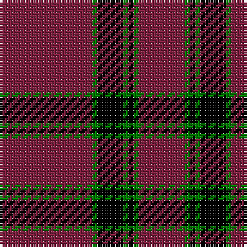

This page is one **sett** — a single exact thread-count. It belongs to the [tartan](/tartans/dr18g1k5g1k1g1dr9/)
(the same proportion at any scale), whose colour order is pattern [RGKGKGR](/stripes/rgkgkgr/).

Sourced from weddslist.  It is a [7 stripe tartan](/stripes/stripes7/).

Original link http://www.weddslist.com/cgi-bin/tartans/pg.pl?source=sts

## Also known as

This cloth is also recorded under:

- Inverness, Augustus

## Thread count
DR/36 G2 K10 G2 K2 G2 DR/18

## Palette
Each colour and the base-6 reference it is a variant of.

| Colour | Shade | Base |
|---|---|---|
| DR | <code style="background-color:#802040;">#802040</code> `oklch(40.8% 0.132 5.2)` <small>#802040</small> | R <code style="background-color:#CC0000;">#CC0000</code> |
| G | <code style="background-color:#008000;">#008000</code> `oklch(52.0% 0.177 142.5)` <small>#008000</small> | G <code style="background-color:#006100;">#006100</code> |
| K | <code style="background-color:#000000;">#000000</code> `oklch(0.0% 0.000 0.0)` <small>#000000</small> | K <code style="background-color:#000000;">#000000</code> |

# Sample pattern

## Nearest tartans

The nearest existing variants by ΔTartan distance, with this tartan at the top so the swatches line up against it.

ΔTartan

Tartan

Sett

—

<a href="/ttd/edit/#slug=m18g1k5g1k1g1m9~x2">Inverness, Augustus</a> <a class="nn-out" href="/setts/s7/m18g1k5g1k1g1m9~x2/" title="open its dictionary page">↗</a>

1.52

<a href="/ttd/edit/#slug=r64k8w3k8w3b4w3r18~x2">Inverness - 2000 (Fashion)</a> <a class="nn-out" href="/setts/s8/r64k8w3k8w3b4w3r18~x2/" title="open its dictionary page">↗</a>

1.61

<a href="/ttd/edit/#slug=k5dr40k4w2k4dr10w4dr5w1~x2">Southern Illinois University - Carbondale</a> <a class="nn-out" href="/setts/s9/k5dr40k4w2k4dr10w4dr5w1~x2/" title="open its dictionary page">↗</a>

1.63

<a href="/ttd/edit/#slug=r32k2r4k2r2k8r30lb3~x2">University of Chicago (Corporate)</a> <a class="nn-out" href="/setts/s8/r32k2r4k2r2k8r30lb3~x2/" title="open its dictionary page">↗</a>

1.65

<a href="/ttd/edit/#slug=k5r40k4w2k4r10w4r5w1~x2">Southern Illinois University (Corp.)</a> <a class="nn-out" href="/setts/s9/k5r40k4w2k4r10w4r5w1~x2/" title="open its dictionary page">↗</a>

1.66

<a href="/ttd/edit/#slug=k30r3k2r3k2r27k30r4~x2">Murray of Ochtertyre #2</a> <a class="nn-out" href="/setts/s8/k30r3k2r3k2r27k30r4~x2/" title="open its dictionary page">↗</a>

1.66

<a href="/ttd/edit/#slug=k59r3k6r3k8r15k2ly3~x2">Royal Army PTC Assoc. (Military)</a> <a class="nn-out" href="/setts/s8/k59r3k6r3k8r15k2ly3~x2/" title="open its dictionary page">↗</a>

1.66

<a href="/ttd/edit/#slug=r12dp3r7dp52dg4dp4~x2">Lynch Variant</a> <a class="nn-out" href="/setts/s6/r12dp3r7dp52dg4dp4~x2/" title="open its dictionary page">↗</a>

1.67

<a href="/ttd/edit/#slug=dg2r28db6r5db2r2db2r11lr2~x2">Rose</a> <a class="nn-out" href="/setts/s9/dg2r28db6r5db2r2db2r11lr2~x2/" title="open its dictionary page">↗</a>

1.67

<a href="/ttd/edit/#slug=dg2r28db6r5db2r2db2r11lr2">Rose</a> <a class="nn-out" href="/setts/s9/dg2r28db6r5db2r2db2r11lr2/" title="open its dictionary page">↗</a>

1.69

<a href="/ttd/edit/#slug=lb3r3k4lb2r18k1r2k2~x4">Lougheed</a> <a class="nn-out" href="/setts/s8/lb3r3k4lb2r18k1r2k2~x4/" title="open its dictionary page">↗</a>

## Neighbour map

Every grey dot is one of 14299 variants placed by the first two principal components of the ΔTartan feature space (44% of its variance). Red is this tartan; blue dots are its nearest — click one to open its page.

<svg viewBox="0 0 640 380" role="img" style="max-width:100%;height:auto;border:1px solid #e0e0e0;border-radius:4px;display:block" xmlns="http://www.w3.org/2000/svg"><image href="/nn/cloud.v1.png" width="640" height="380"/><a href="/setts/s8/r64k8w3k8w3b4w3r18~x2/"><circle cx="484.4" cy="126.4" r="4" fill="#3465a4"><title>Inverness - 2000 (Fashion)</title></circle></a><a href="/setts/s9/k5dr40k4w2k4dr10w4dr5w1~x2/"><circle cx="513.6" cy="120.2" r="4" fill="#3465a4"><title>Southern Illinois University - Carbondale</title></circle></a><a href="/setts/s8/r32k2r4k2r2k8r30lb3~x2/"><circle cx="564.6" cy="175.0" r="4" fill="#3465a4"><title>University of Chicago (Corporate)</title></circle></a><a href="/setts/s9/k5r40k4w2k4r10w4r5w1~x2/"><circle cx="525.6" cy="119.2" r="4" fill="#3465a4"><title>Southern Illinois University (Corp.)</title></circle></a><a href="/setts/s8/k30r3k2r3k2r27k30r4~x2/"><circle cx="438.1" cy="204.6" r="4" fill="#3465a4"><title>Murray of Ochtertyre #2</title></circle></a><a href="/setts/s8/k59r3k6r3k8r15k2ly3~x2/"><circle cx="539.9" cy="149.2" r="4" fill="#3465a4"><title>Royal Army PTC Assoc. (Military)</title></circle></a><a href="/setts/s6/r12dp3r7dp52dg4dp4~x2/"><circle cx="530.0" cy="190.3" r="4" fill="#3465a4"><title>Lynch Variant</title></circle></a><a href="/setts/s9/dg2r28db6r5db2r2db2r11lr2~x2/"><circle cx="507.9" cy="156.5" r="4" fill="#3465a4"><title>Rose</title></circle></a><a href="/setts/s9/dg2r28db6r5db2r2db2r11lr2/"><circle cx="507.9" cy="156.5" r="4" fill="#3465a4"><title>Rose</title></circle></a><a href="/setts/s8/lb3r3k4lb2r18k1r2k2~x4/"><circle cx="423.4" cy="155.6" r="4" fill="#3465a4"><title>Lougheed</title></circle></a><circle cx="508.5" cy="180.1" r="5" fill="#c00000"/></svg>

ID: /setts/s7/m18g1k5g1k1g1m9~x2/
