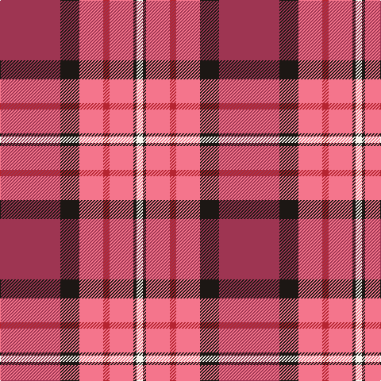

**Bands:** [RKRRRKW](/stripes/rkrrrkw/) · **Stripes:** [M K R R R K W](/stripes/stripes7/) M K R R R K W

This was sourced from register-of-tartans.  It is a [7 band tartan](/bands/bands7/).

Original link https://www.tartanregister.gov.uk/tartanDetails.aspx?ref=10305

## Register references

External register numbers recorded for this tartan.

- Scottish Register of Tartans: [10305](https://www.tartanregister.gov.uk/tartanDetails.aspx?ref=10305)

## Thread count
DR/76 K24 LR30 R8 LR30 K4 W/8

## Palette
Each colour and its ΔE from the base-6 reference it is a variant of.

| Colour | Shade | Base | ΔE (OKLab) |
|---|---|---|---|
| DR | <code style="background-color:#9E3552;">#9E3552</code> `#9E3552` | R <code style="background-color:#CC0000;">#CC0000</code> | 0.11 |
| K | <code style="background-color:#1C1714;">#1C1714</code> `#1C1714` | K <code style="background-color:#000000;">#000000</code> | 0.21 |
| LR | <code style="background-color:#F4758C;">#F4758C</code> `#F4758C` | R <code style="background-color:#CC0000;">#CC0000</code> | 0.20 |
| R | <code style="background-color:#B62531;">#B62531</code> `#B62531` | R <code style="background-color:#CC0000;">#CC0000</code> | 0.05 |
| W | <code style="background-color:#F9F5EF;">#F9F5EF</code> `#F9F5EF` | W <code style="background-color:#F7F7F7;">#F7F7F7</code> | 0.01 |

# Sample pattern

## Nearest tartans

The nearest existing variants by ΔTartan distance.

1. [Ferguson's Promise (Commemorative)](/setts/s7/r38k12r15r4r15k2w4~x2/) — ΔT 0.89
1. [Afternoon Tea / Apple Tea](/setts/s6/ly15r98do72m25do8w15/) — ΔT 0.93
1. [Rose VS](/setts/s9/k4r32db9r6db2r3db2r12lb3/) — ΔT 1.35
1. [MIT1951](/setts/s10/r24r5lr7dt2lr4dt14r11dt3r3w4~x2/) — ΔT 1.39
1. [Afternoon Tea / Assam](/setts/s6/r15r98dp72t25dp8w15/) — ΔT 1.39
1. [Manitoba Masonic](/setts/s8/ly3n8w3n34r34g4r4w2~x2/) — ΔT 1.42
1. [Superfast Ferries (Corporate)](/setts/s6/db1r16db6ly4db6w1~x4/) — ΔT 1.48
1. [Drummond of Perth Dress #2](/setts/s9/r41ly3y7db3w24r10y7db7w3~x2/) — ΔT 1.53
1. [Scottish American Society of Michigan (Official)](/setts/s6/r48t16lo5dg17w8k3~x2/) — ΔT 1.54
1. [MacKeever](/setts/s11/ly4k1r12db3r3db16r3db3r12k1w4~x2/) — ΔT 1.54

## Neighbour map

Every grey dot is one of 14313 variants placed by the first two principal components of the ΔTartan feature space (44% of its variance). Red is this tartan; blue dots are its nearest — click one to open its page.

<svg viewBox="0 0 640 380" role="img" style="max-width:100%;height:auto;border:1px solid #e0e0e0;border-radius:4px;display:block" xmlns="http://www.w3.org/2000/svg"><image href="/nn/cloud.v1.png" width="640" height="380"/><a href="/setts/s7/r38k12r15r4r15k2w4~x2/"><circle cx="235.5" cy="139.0" r="4" fill="#3465a4"><title>Ferguson's Promise (Commemorative)</title></circle></a><a href="/setts/s6/ly15r98do72m25do8w15/"><circle cx="221.4" cy="162.3" r="4" fill="#3465a4"><title>Afternoon Tea / Apple Tea</title></circle></a><a href="/setts/s9/k4r32db9r6db2r3db2r12lb3/"><circle cx="238.8" cy="113.4" r="4" fill="#3465a4"><title>Rose VS</title></circle></a><a href="/setts/s10/r24r5lr7dt2lr4dt14r11dt3r3w4~x2/"><circle cx="232.4" cy="143.0" r="4" fill="#3465a4"><title>MIT1951</title></circle></a><a href="/setts/s6/r15r98dp72t25dp8w15/"><circle cx="237.3" cy="178.3" r="4" fill="#3465a4"><title>Afternoon Tea / Assam</title></circle></a><a href="/setts/s8/ly3n8w3n34r34g4r4w2~x2/"><circle cx="289.5" cy="130.4" r="4" fill="#3465a4"><title>Manitoba Masonic</title></circle></a><a href="/setts/s6/db1r16db6ly4db6w1~x4/"><circle cx="279.9" cy="168.4" r="4" fill="#3465a4"><title>Superfast Ferries (Corporate)</title></circle></a><a href="/setts/s9/r41ly3y7db3w24r10y7db7w3~x2/"><circle cx="245.7" cy="122.0" r="4" fill="#3465a4"><title>Drummond of Perth Dress #2</title></circle></a><a href="/setts/s6/r48t16lo5dg17w8k3~x2/"><circle cx="232.4" cy="134.7" r="4" fill="#3465a4"><title>Scottish American Society of Michigan (Official)</title></circle></a><a href="/setts/s11/ly4k1r12db3r3db16r3db3r12k1w4~x2/"><circle cx="243.2" cy="126.6" r="4" fill="#3465a4"><title>MacKeever</title></circle></a><circle cx="242.7" cy="141.0" r="5" fill="#c00000"/></svg>

ID: /setts/s7/m38k12r15r4r15k2w4~x2/
