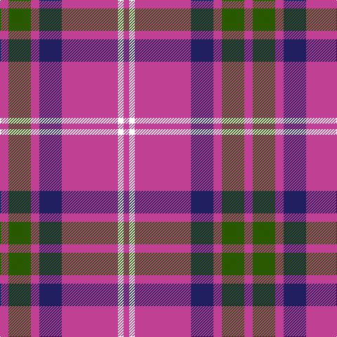

This page is one **sett** — a single exact thread-count. It belongs to the [tartan](/tartans/p3g8p3db8p20w2p2/)
(the same proportion at any scale), whose colour order is pattern [RGRBRWR](/stripes/rgrbrwr/).

Sourced from tartans-authority.  It is a [7 stripe tartan](/stripes/stripes7/).

Original link http://www.tartansauthority.com/tartan-ferret/display/8417/

## Thread count
P/12 G32 P12 DB32 P80 W8 P/8

## Palette
Each colour and the base-6 reference it is a variant of.

| Colour | Shade | Base |
|---|---|---|
| DB | <code style="background-color:#202060;">#202060</code> `oklch(28.9% 0.111 276.9)` <small>#202060</small> | B <code style="background-color:#2A418A;">#2A418A</code> |
| G | <code style="background-color:#285800;">#285800</code> `oklch(41.0% 0.122 135.8)` <small>#285800</small> | G <code style="background-color:#006100;">#006100</code> |
| P | <code style="background-color:#C04094;">#C04094</code> `oklch(57.9% 0.185 344.2)` <small>#C04094</small> | R <code style="background-color:#CC0000;">#CC0000</code> |
| W | <code style="background-color:#FCFCFC;">#FCFCFC</code> `oklch(99.1% 0.000 89.9)` <small>#FCFCFC</small> | W <code style="background-color:#F7F7F7;">#F7F7F7</code> |

# Sample pattern

## Nearest tartans

The nearest existing variants by ΔTartan distance, with this tartan at the top so the swatches line up against it.

ΔTartan

Tartan

Sett

—

<a href="/ttd/edit/#slug=m3dg8m3db8m20w2m2~x4">Unnamed C21st (Lady's Jacket) (Fash)</a> <a class="nn-out" href="/setts/s7/m3dg8m3db8m20w2m2~x4/" title="open its dictionary page">↗</a>

1.02

<a href="/ttd/edit/#slug=dp30m5dp5b4dp4g12~x2">International Festival of Authors (C</a> <a class="nn-out" href="/setts/s6/dp30m5dp5b4dp4g12~x2/" title="open its dictionary page">↗</a>

1.18

<a href="/ttd/edit/#slug=r15n3w10n7dp40w3dp6~x2">Loughborough Sport</a> <a class="nn-out" href="/setts/s7/r15n3w10n7dp40w3dp6~x2/" title="open its dictionary page">↗</a>

1.38

<a href="/ttd/edit/#slug=dp24k4lb10db3dp3w2~x2">Cramer (Personal)</a> <a class="nn-out" href="/setts/s6/dp24k4lb10db3dp3w2~x2/" title="open its dictionary page">↗</a>

1.38

<a href="/ttd/edit/#slug=db11w1r12db6r1db6w1~x4">Coronation (1936) #2</a> <a class="nn-out" href="/setts/s7/db11w1r12db6r1db6w1~x4/" title="open its dictionary page">↗</a>

1.40

<a href="/ttd/edit/#slug=db2r7db2r7db22ly2~x2">MacQueen variant</a> <a class="nn-out" href="/setts/s6/db2r7db2r7db22ly2~x2/" title="open its dictionary page">↗</a>

1.40

<a href="/ttd/edit/#slug=db3r24db3r3db25w3~x2">Matthews (Personal)</a> <a class="nn-out" href="/setts/s6/db3r24db3r3db25w3~x2/" title="open its dictionary page">↗</a>

1.41

<a href="/ttd/edit/#slug=db48r18db6r13ly4r14~x2">Butler</a> <a class="nn-out" href="/setts/s6/db48r18db6r13ly4r14~x2/" title="open its dictionary page">↗</a>

1.43

<a href="/ttd/edit/#slug=db9r1db2r1r4w1~x12">McIntosh, Georgina (Personal)</a> <a class="nn-out" href="/setts/s6/db9r1db2r1r4w1~x12/" title="open its dictionary page">↗</a>

1.44

<a href="/ttd/edit/#slug=db11w1r12db6r1db6w1~x2">Coronation</a> <a class="nn-out" href="/setts/s7/db11w1r12db6r1db6w1~x2/" title="open its dictionary page">↗</a>

1.49

<a href="/ttd/edit/#slug=m8w4m50k12m4k15m5~x2">Instakilt, Pink (Fashion)</a> <a class="nn-out" href="/setts/s7/m8w4m50k12m4k15m5~x2/" title="open its dictionary page">↗</a>

## Neighbour map

Every grey dot is one of 14299 variants placed by the first two principal components of the ΔTartan feature space (44% of its variance). Red is this tartan; blue dots are its nearest — click one to open its page.

<svg viewBox="0 0 640 380" role="img" style="max-width:100%;height:auto;border:1px solid #e0e0e0;border-radius:4px;display:block" xmlns="http://www.w3.org/2000/svg"><image href="/nn/cloud.v1.png" width="640" height="380"/><a href="/setts/s6/dp30m5dp5b4dp4g12~x2/"><circle cx="364.8" cy="209.6" r="4" fill="#3465a4"><title>International Festival of Authors (C</title></circle></a><a href="/setts/s7/r15n3w10n7dp40w3dp6~x2/"><circle cx="291.6" cy="154.1" r="4" fill="#3465a4"><title>Loughborough Sport</title></circle></a><a href="/setts/s6/dp24k4lb10db3dp3w2~x2/"><circle cx="299.1" cy="155.9" r="4" fill="#3465a4"><title>Cramer (Personal)</title></circle></a><a href="/setts/s7/db11w1r12db6r1db6w1~x4/"><circle cx="361.5" cy="208.9" r="4" fill="#3465a4"><title>Coronation (1936) #2</title></circle></a><a href="/setts/s6/db2r7db2r7db22ly2~x2/"><circle cx="394.4" cy="206.7" r="4" fill="#3465a4"><title>MacQueen variant</title></circle></a><a href="/setts/s6/db3r24db3r3db25w3~x2/"><circle cx="332.0" cy="211.1" r="4" fill="#3465a4"><title>Matthews (Personal)</title></circle></a><a href="/setts/s6/db48r18db6r13ly4r14~x2/"><circle cx="348.9" cy="213.1" r="4" fill="#3465a4"><title>Butler</title></circle></a><a href="/setts/s6/db9r1db2r1r4w1~x12/"><circle cx="285.6" cy="201.3" r="4" fill="#3465a4"><title>McIntosh, Georgina (Personal)</title></circle></a><a href="/setts/s7/db11w1r12db6r1db6w1~x2/"><circle cx="378.4" cy="218.1" r="4" fill="#3465a4"><title>Coronation</title></circle></a><a href="/setts/s7/m8w4m50k12m4k15m5~x2/"><circle cx="365.9" cy="153.6" r="4" fill="#3465a4"><title>Instakilt, Pink (Fashion)</title></circle></a><circle cx="334.5" cy="185.1" r="5" fill="#c00000"/></svg>

ID: /setts/s7/m3dg8m3db8m20w2m2~x4/
