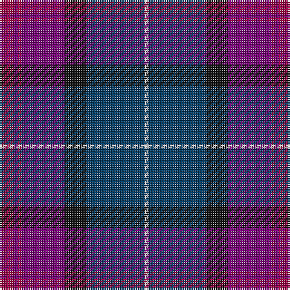

This page is one **sett** — a single exact thread-count. It belongs to the [tartan](/tartans/r4p1r1p12k6db16ln1/)
(the same proportion at any scale), whose colour order is pattern [RBRBKBW](/stripes/rbrbkbw/).

Sourced from tartans-authority.  It is a [7 stripe tartan](/stripes/stripes7/).

Original link http://www.tartansauthority.com/tartan-ferret/display/6904/

## Thread count
R/8 P2 R2 P24 K12 DB32 LN/2

## Palette
Each colour and the base-6 reference it is a variant of.

| Colour | Shade | Base |
|---|---|---|
| DB | <code style="background-color:#003C64;">#003C64</code> `oklch(34.5% 0.089 246.0)` <small>#003C64</small> | B <code style="background-color:#2A418A;">#2A418A</code> |
| K | <code style="background-color:#101010;">#101010</code> `oklch(17.3% 0.000 89.9)` <small>#101010</small> | K <code style="background-color:#000000;">#000000</code> |
| LN | <code style="background-color:#E0E0E0;">#E0E0E0</code> `oklch(90.7% 0.000 89.9)` <small>#E0E0E0</small> | W <code style="background-color:#F7F7F7;">#F7F7F7</code> |
| P | <code style="background-color:#780078;">#780078</code> `oklch(40.2% 0.185 328.4)` <small>#780078</small> | B <code style="background-color:#2A418A;">#2A418A</code> |
| R | <code style="background-color:#A00048;">#A00048</code> `oklch(45.4% 0.182 5.3)` <small>#A00048</small> | R <code style="background-color:#CC0000;">#CC0000</code> |

# Sample pattern

## Nearest tartans

The nearest existing variants by ΔTartan distance, with this tartan at the top so the swatches line up against it.

ΔTartan

Tartan

Sett

—

<a href="/ttd/edit/#slug=m4dp1m1dp12k6dt16w1~x2">First (Corporate)</a> <a class="nn-out" href="/setts/s7/m4dp1m1dp12k6dt16w1~x2/" title="open its dictionary page">↗</a>

0.38

<a href="/ttd/edit/#slug=dp1m4dp1m1dp12k6dt16w1~x2">First</a> <a class="nn-out" href="/setts/s8/dp1m4dp1m1dp12k6dt16w1~x2/" title="open its dictionary page">↗</a>

0.86

<a href="/ttd/edit/#slug=dp22lo10dp6lr18dp50db71k6">Charleston Police Department</a> <a class="nn-out" href="/setts/s7/dp22lo10dp6lr18dp50db71k6/" title="open its dictionary page">↗</a>

0.95

<a href="/ttd/edit/#slug=k4dp30k3dp2db2r2g12k3db18r3~x2">Wardlaw</a> <a class="nn-out" href="/setts/s10/k4dp30k3dp2db2r2g12k3db18r3~x2/" title="open its dictionary page">↗</a>

1.08

<a href="/ttd/edit/#slug=dp24dt2g3m2g3k11dt29w2~x2">Alba</a> <a class="nn-out" href="/setts/s8/dp24dt2g3m2g3k11dt29w2~x2/" title="open its dictionary page">↗</a>

1.27

<a href="/ttd/edit/#slug=db20k4g5dp14w1db2~x2">Riley's Theme (Fashion)</a> <a class="nn-out" href="/setts/s6/db20k4g5dp14w1db2~x2/" title="open its dictionary page">↗</a>

1.28

<a href="/ttd/edit/#slug=r12lo2db3k3db30k20dr6k10lo2dr4~x2">KPMG (Corporate)</a> <a class="nn-out" href="/setts/s10/r12lo2db3k3db30k20dr6k10lo2dr4~x2/" title="open its dictionary page">↗</a>

1.39

<a href="/ttd/edit/#slug=k2m1db17m17dt1ly2~x4">Murdoch</a> <a class="nn-out" href="/setts/s6/k2m1db17m17dt1ly2~x4/" title="open its dictionary page">↗</a>

1.43

<a href="/ttd/edit/#slug=db4dg2r17r9dg10db30n2~x2">Dempster, Ross (Personal)</a> <a class="nn-out" href="/setts/s7/db4dg2r17r9dg10db30n2~x2/" title="open its dictionary page">↗</a>

1.44

<a href="/ttd/edit/#slug=db22r3db2r3db2k17dy18g4~x2">Scotch House 2000 Antique</a> <a class="nn-out" href="/setts/s8/db22r3db2r3db2k17dy18g4~x2/" title="open its dictionary page">↗</a>

1.45

<a href="/ttd/edit/#slug=lb2db20n2dt15r9lb2~x2">Open Championship (1998)</a> <a class="nn-out" href="/setts/s6/lb2db20n2dt15r9lb2~x2/" title="open its dictionary page">↗</a>

## Neighbour map

Every grey dot is one of 14299 variants placed by the first two principal components of the ΔTartan feature space (44% of its variance). Red is this tartan; blue dots are its nearest — click one to open its page.

<svg viewBox="0 0 640 380" role="img" style="max-width:100%;height:auto;border:1px solid #e0e0e0;border-radius:4px;display:block" xmlns="http://www.w3.org/2000/svg"><image href="/nn/cloud.v1.png" width="640" height="380"/><a href="/setts/s8/dp1m4dp1m1dp12k6dt16w1~x2/"><circle cx="254.7" cy="171.7" r="4" fill="#3465a4"><title>First</title></circle></a><a href="/setts/s7/dp22lo10dp6lr18dp50db71k6/"><circle cx="262.2" cy="200.0" r="4" fill="#3465a4"><title>Charleston Police Department</title></circle></a><a href="/setts/s10/k4dp30k3dp2db2r2g12k3db18r3~x2/"><circle cx="249.3" cy="153.4" r="4" fill="#3465a4"><title>Wardlaw</title></circle></a><a href="/setts/s8/dp24dt2g3m2g3k11dt29w2~x2/"><circle cx="237.1" cy="154.0" r="4" fill="#3465a4"><title>Alba</title></circle></a><a href="/setts/s6/db20k4g5dp14w1db2~x2/"><circle cx="311.4" cy="197.1" r="4" fill="#3465a4"><title>Riley's Theme (Fashion)</title></circle></a><a href="/setts/s10/r12lo2db3k3db30k20dr6k10lo2dr4~x2/"><circle cx="217.8" cy="163.8" r="4" fill="#3465a4"><title>KPMG (Corporate)</title></circle></a><a href="/setts/s6/k2m1db17m17dt1ly2~x4/"><circle cx="314.4" cy="171.7" r="4" fill="#3465a4"><title>Murdoch</title></circle></a><a href="/setts/s7/db4dg2r17r9dg10db30n2~x2/"><circle cx="281.3" cy="195.0" r="4" fill="#3465a4"><title>Dempster, Ross (Personal)</title></circle></a><a href="/setts/s8/db22r3db2r3db2k17dy18g4~x2/"><circle cx="213.2" cy="197.6" r="4" fill="#3465a4"><title>Scotch House 2000 Antique</title></circle></a><a href="/setts/s6/lb2db20n2dt15r9lb2~x2/"><circle cx="205.3" cy="203.6" r="4" fill="#3465a4"><title>Open Championship (1998)</title></circle></a><circle cx="252.4" cy="183.2" r="5" fill="#c00000"/></svg>

ID: /setts/s7/m4dp1m1dp12k6dt16w1~x2/
