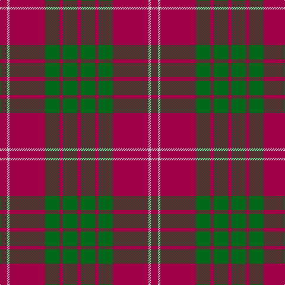

In pattern [RGRGRWR](/stripes/rgrgrwr/).

This was sourced from register-of-tartans.  It is a [7 stripe tartan](/stripes/stripes7/).

Original link https://www.tartanregister.gov.uk/tartanDetails.aspx?ref=799

## Register references

External register numbers recorded for this tartan.

- Scottish Register of Tartans: [799](https://www.tartanregister.gov.uk/tartanDetails.aspx?ref=799)
- Scottish Tartans Authority (ITI): 1515
- Scottish Tartans World Register: 1515

## Thread count
R/12 N4 R60 G24 R6 G24 R/6

## Palette
Each colour and its ΔE from the base-6 reference it is a variant of.

| Colour | Shade | Base | ΔE (OKLab) |
|---|---|---|---|
| G | <code style="background-color:#006818;">#006818</code> `#006818` | G <code style="background-color:#006100;">#006100</code> | 0.02 |
| N | <code style="background-color:#C0C0C0;">#C0C0C0</code> `#C0C0C0` | W <code style="background-color:#F7F7F7;">#F7F7F7</code> | 0.17 |
| R | <code style="background-color:#A00048;">#A00048</code> `#A00048` | R <code style="background-color:#CC0000;">#CC0000</code> | 0.12 |

# Sample pattern

## Nearest tartans

The nearest existing variants by ΔTartan distance.

1. [Crawford (Clan)](/setts/s7/m6w2m30g12m3g12m3~x2/) — ΔT 0.20
1. [Crawford](/setts/s7/r6w2r30g12r3g12r3~x2/) — ΔT 0.80
1. [Monica](/setts/s6/r3o10r3o4r20lb1~x4/) — ΔT 0.86
1. [MacKintosh, Plaid](/setts/s6/r16db6r2g6r2db1~x2/) — ΔT 0.86
1. [MacKintosh Plaid](/setts/s6/r16db6r2dg6r2db1~x2/) — ΔT 0.98
1. [Auld Reekie](/setts/s6/db4r3db3r22g8r2~x2/) — ΔT 1.06
1. [MacKintosh D](/setts/s6/r22db5r2dg11r3db1~x2/) — ΔT 1.07
1. [Grant of Lurg](/setts/s6/db2r25g10r2db10r2~x2/) — ΔT 1.10
1. [MacKintosh](/setts/s6/r24db6r3dg12r4db1~x2/) — ΔT 1.12
1. [MacKintosh 3](/setts/s6/r68db18r9g34r9db3~x2/) — ΔT 1.14

## Neighbour map

Every grey dot is one of 14299 variants placed by the first two principal components of the ΔTartan feature space (44% of its variance). Red is this tartan; blue dots are its nearest — click one to open its page.

<svg viewBox="0 0 640 380" role="img" style="max-width:100%;height:auto;border:1px solid #e0e0e0;border-radius:4px;display:block" xmlns="http://www.w3.org/2000/svg"><image href="/nn/cloud.v1.png" width="640" height="380"/><a href="/setts/s7/m6w2m30g12m3g12m3~x2/"><circle cx="420.8" cy="200.3" r="4" fill="#3465a4"><title>Crawford (Clan)</title></circle></a><a href="/setts/s7/r6w2r30g12r3g12r3~x2/"><circle cx="411.0" cy="198.0" r="4" fill="#3465a4"><title>Crawford</title></circle></a><a href="/setts/s6/r3o10r3o4r20lb1~x4/"><circle cx="462.0" cy="199.1" r="4" fill="#3465a4"><title>Monica</title></circle></a><a href="/setts/s6/r16db6r2g6r2db1~x2/"><circle cx="402.7" cy="201.7" r="4" fill="#3465a4"><title>MacKintosh, Plaid</title></circle></a><a href="/setts/s6/r16db6r2dg6r2db1~x2/"><circle cx="402.9" cy="199.9" r="4" fill="#3465a4"><title>MacKintosh Plaid</title></circle></a><a href="/setts/s6/db4r3db3r22g8r2~x2/"><circle cx="417.3" cy="207.2" r="4" fill="#3465a4"><title>Auld Reekie</title></circle></a><a href="/setts/s6/r22db5r2dg11r3db1~x2/"><circle cx="428.4" cy="191.6" r="4" fill="#3465a4"><title>MacKintosh D</title></circle></a><a href="/setts/s6/db2r25g10r2db10r2~x2/"><circle cx="370.3" cy="206.8" r="4" fill="#3465a4"><title>Grant of Lurg</title></circle></a><a href="/setts/s6/r24db6r3dg12r4db1~x2/"><circle cx="430.6" cy="192.7" r="4" fill="#3465a4"><title>MacKintosh</title></circle></a><a href="/setts/s6/r68db18r9g34r9db3~x2/"><circle cx="419.1" cy="187.8" r="4" fill="#3465a4"><title>MacKintosh 3</title></circle></a><circle cx="426.8" cy="203.4" r="5" fill="#c00000"/></svg>

ID: /setts/s7/m6lb2m30g12m3g12m3~x2/
