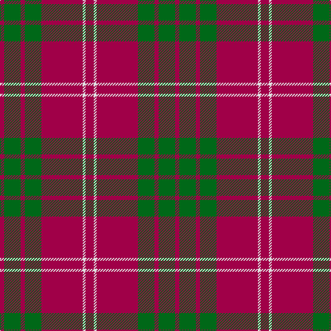

**Bands:** [RGRGRWR](/stripes/rgrgrwr/) · **Stripes:** [M G M G M W M](/stripes/stripes7/) M G M G M W M

This was sourced from tartans-authority.  It is a [7 band tartan](/bands/bands7/).

Original link http://www.tartansauthority.com/tartan-ferret/display/1515/

## Attestations

This cloth appears in 2 source records; the oldest owns this page.

- 1842 — Crawford (Clan) (tartans-authority, [record](http://www.tartansauthority.com/tartan-ferret/display/1515/))
- undated — Crawford Clan Tartan Tartan Number: 1515. Earliest known date: 1842 From a story about the early days of the Black Watch, in 1739, we know that there was no Crawford tartan at that time. The first record is in the Vestiarium Scoticum of 1842. It would appear that the tartan was designed sometime between these dates possibly by the Sobieski Stuart brothers. See products available Copyright © Blair Urquhart, Comrie, 2015 (house-of-tartan, [record](http://www.house-of-tartan.scotland.net/house/TartanViewjs.asp?colr=Def&tnam=1515))

## Thread count
R/6 G24 R6 G24 R60 LN4 R/12

## Palette
Each colour and its ΔE from the base-6 reference it is a variant of.

| Colour | Shade | Base | ΔE (OKLab) |
|---|---|---|---|
| G | <code style="background-color:#006818;">#006818</code> `#006818` | G <code style="background-color:#006100;">#006100</code> | 0.02 |
| LN | <code style="background-color:#E0E0E0;">#E0E0E0</code> `#E0E0E0` | W <code style="background-color:#F7F7F7;">#F7F7F7</code> | 0.07 |
| R | <code style="background-color:#A00048;">#A00048</code> `#A00048` | R <code style="background-color:#CC0000;">#CC0000</code> | 0.12 |

# Sample pattern

## Nearest tartans

The nearest existing variants by ΔTartan distance.

1. [Crawford](/setts/s7/m6lb2m30g12m3g12m3~x2/) — ΔT 0.20
1. [Crawford](/setts/s7/r6w2r30g12r3g12r3~x2/) — ΔT 0.71
1. [MacKintosh, Plaid](/setts/s6/r16db6r2g6r2db1~x2/) — ΔT 0.86
1. [Monica](/setts/s6/r3o10r3o4r20lb1~x4/) — ΔT 0.94
1. [MacKintosh Plaid](/setts/s6/r16db6r2dg6r2db1~x2/) — ΔT 0.97
1. [Auld Reekie](/setts/s6/db4r3db3r22g8r2~x2/) — ΔT 1.04
1. [Grant of Lurg](/setts/s6/db2r25g10r2db10r2~x2/) — ΔT 1.08
1. [Crawford](/setts/s7/r6lb2r30dg12r3dg12r3/) — ΔT 1.12
1. [MacGregor of Cardney](/setts/s6/m18g9m2g3k1w1~x4/) — ΔT 1.12
1. [Robertson - 1988 (Corporate)](/setts/s7/r2db1r16db4r1g10r1~x4/) — ΔT 1.12

## Neighbour map

Every grey dot is one of 14313 variants placed by the first two principal components of the ΔTartan feature space (44% of its variance). Red is this tartan; blue dots are its nearest — click one to open its page.

<svg viewBox="0 0 640 380" role="img" style="max-width:100%;height:auto;border:1px solid #e0e0e0;border-radius:4px;display:block" xmlns="http://www.w3.org/2000/svg"><image href="/nn/cloud.v1.png" width="640" height="380"/><a href="/setts/s7/m6lb2m30g12m3g12m3~x2/"><circle cx="427.1" cy="203.6" r="4" fill="#3465a4"><title>Crawford</title></circle></a><a href="/setts/s7/r6w2r30g12r3g12r3~x2/"><circle cx="411.3" cy="198.3" r="4" fill="#3465a4"><title>Crawford</title></circle></a><a href="/setts/s6/r16db6r2g6r2db1~x2/"><circle cx="403.1" cy="201.9" r="4" fill="#3465a4"><title>MacKintosh, Plaid</title></circle></a><a href="/setts/s6/r3o10r3o4r20lb1~x4/"><circle cx="462.4" cy="199.3" r="4" fill="#3465a4"><title>Monica</title></circle></a><a href="/setts/s6/r16db6r2dg6r2db1~x2/"><circle cx="403.2" cy="200.1" r="4" fill="#3465a4"><title>MacKintosh Plaid</title></circle></a><a href="/setts/s6/db4r3db3r22g8r2~x2/"><circle cx="417.7" cy="207.4" r="4" fill="#3465a4"><title>Auld Reekie</title></circle></a><a href="/setts/s6/db2r25g10r2db10r2~x2/"><circle cx="370.7" cy="206.9" r="4" fill="#3465a4"><title>Grant of Lurg</title></circle></a><a href="/setts/s7/r6lb2r30dg12r3dg12r3/"><circle cx="417.6" cy="193.7" r="4" fill="#3465a4"><title>Crawford</title></circle></a><a href="/setts/s6/m18g9m2g3k1w1~x4/"><circle cx="396.7" cy="173.3" r="4" fill="#3465a4"><title>MacGregor of Cardney</title></circle></a><a href="/setts/s7/r2db1r16db4r1g10r1~x4/"><circle cx="376.0" cy="177.6" r="4" fill="#3465a4"><title>Robertson - 1988 (Corporate)</title></circle></a><circle cx="421.1" cy="200.5" r="5" fill="#c00000"/></svg>

ID: /setts/s7/m6w2m30g12m3g12m3~x2/
