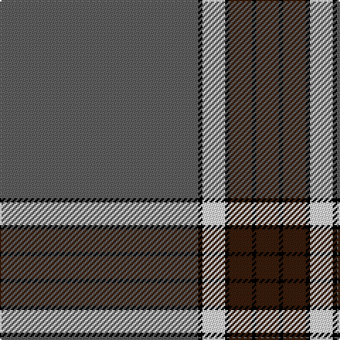

In pattern [BKBKWKB](/stripes/bkbkwkb/).

This was sourced from register-of-tartans.  It is a [7 stripe tartan](/stripes/stripes7/).

Original link https://www.tartanregister.gov.uk/tartanDetails.aspx?ref=790

## Register references

External register numbers recorded for this tartan.

- Scottish Register of Tartans: [790](https://www.tartanregister.gov.uk/tartanDetails.aspx?ref=790)
- Scottish Tartans Authority (ITI): 4604

## Thread count
N/140 Ka3 LN16 Ka3 K16 Ka3 K/16

## Palette
Each colour and the base-6 reference it is a variant of.

| Colour | Shade | Base |
|---|---|---|
| K | <code style="background-color:#381C0C;">#381C0C</code> `oklch(26.2% 0.051 48.9)` <small>#381C0C</small> | B <code style="background-color:#2A418A;">#2A418A</code> |
| Ka | <code style="background-color:#000000;">#000000</code> `oklch(0.0% 0.000 0.0)` <small>#000000</small> | K <code style="background-color:#000000;">#000000</code> |
| LN | <code style="background-color:#E0E0E0;">#E0E0E0</code> `oklch(90.7% 0.000 89.9)` <small>#E0E0E0</small> | W <code style="background-color:#F7F7F7;">#F7F7F7</code> |
| N | <code style="background-color:#606060;">#606060</code> `oklch(48.9% 0.000 89.9)` <small>#606060</small> | B <code style="background-color:#2A418A;">#2A418A</code> |

# Sample pattern

## Nearest tartans

The nearest existing variants by ΔTartan distance.

1. [Brooks Brothers Signature Corporate Tartan Tartan Number: 10652. Earliest known date: 01/05/2012 Brooks Brothers' Scottish roots originate in Perthshire's Glen Lyon. Thomas Lyon emigrated from Glen Lyon to the USA in the 1600s. It was his granddaughter, Lavinia, who married Henry Sands Brooks, founder of the Brooks empire. Brooks opened his first store in Cherry Street, New York in 1818. This simple and elegant tartan contains elements of the traditional 1819 Campbell tartan (the major clan in Glen Lyon) and incorporates the gold from the Brooks Brothers famous Golden Fleece logo and their equally famous necktie design, No. 1 stripe. See products available Copyright © Blair Urquhart, Comrie, 2015](/setts/s9/dt5ly1g7r1dt45r5ly3dt4ly3~x2/) — ΔT 1.14
1. [President High School](/setts/s8/n83k7w6n10r7k3r20w3~x2/) — ΔT 1.30
1. [Melrose Newbigging Grey (Name)](/setts/s10/n1k6n35k6n2dp3n1k6n2w1~x2/) — ΔT 1.46
1. [Kinfauns Castle (Corporate)](/setts/s6/r4dp12g2dp2g46w1~x2/) — ΔT 1.47
1. [Lochnagar Dress (Fashion)](/setts/s10/y5k1y33dp1y9k9dp5k1r2k4~x2/) — ΔT 1.51
1. [Miyuki](/setts/s10/dt40lo1dt1r9dt1lo1dt6lo1dt1r9~x2/) — ΔT 1.52
1. [Salvation Army, Hunting](/setts/s7/db40g8k1ly2k1g8db5~x4/) — ΔT 1.54
1. [Gairloch](/setts/s8/y24y1k9y1y9y2w2db2~x2/) — ΔT 1.58
1. [Salvation Army, dress](/setts/s7/db80r21k2ly4k2r16db10~x2/) — ΔT 1.59
1. [Orkney Slate](/setts/s8/dt8y74k8dt42y11k2y16dt4/) — ΔT 1.66

## Neighbour map

Every grey dot is one of 14299 variants placed by the first two principal components of the ΔTartan feature space (44% of its variance). Red is this tartan; blue dots are its nearest — click one to open its page.

<svg viewBox="0 0 640 380" role="img" style="max-width:100%;height:auto;border:1px solid #e0e0e0;border-radius:4px;display:block" xmlns="http://www.w3.org/2000/svg"><image href="/nn/cloud.v1.png" width="640" height="380"/><a href="/setts/s9/dt5ly1g7r1dt45r5ly3dt4ly3~x2/"><circle cx="508.0" cy="114.1" r="4" fill="#3465a4"><title>Brooks Brothers Signature Corporate Tartan Tartan Number: 10652. Earliest known date: 01/05/2012 Brooks Brothers' Scottish roots originate in Perthshire's Glen Lyon. Thomas Lyon emigrated from Glen Lyon to the USA in the 1600s. It was his granddaughter, Lavinia, who married Henry Sands Brooks, founder of the Brooks empire. Brooks opened his first store in Cherry Street, New York in 1818. This simple and elegant tartan contains elements of the traditional 1819 Campbell tartan (the major clan in Glen Lyon) and incorporates the gold from the Brooks Brothers famous Golden Fleece logo and their equally famous necktie design, No. 1 stripe. See products available Copyright © Blair Urquhart, Comrie, 2015</title></circle></a><a href="/setts/s8/n83k7w6n10r7k3r20w3~x2/"><circle cx="454.6" cy="130.2" r="4" fill="#3465a4"><title>President High School</title></circle></a><a href="/setts/s10/n1k6n35k6n2dp3n1k6n2w1~x2/"><circle cx="475.8" cy="126.2" r="4" fill="#3465a4"><title>Melrose Newbigging Grey (Name)</title></circle></a><a href="/setts/s6/r4dp12g2dp2g46w1~x2/"><circle cx="518.5" cy="140.9" r="4" fill="#3465a4"><title>Kinfauns Castle (Corporate)</title></circle></a><a href="/setts/s10/y5k1y33dp1y9k9dp5k1r2k4~x2/"><circle cx="468.2" cy="137.2" r="4" fill="#3465a4"><title>Lochnagar Dress (Fashion)</title></circle></a><a href="/setts/s10/dt40lo1dt1r9dt1lo1dt6lo1dt1r9~x2/"><circle cx="527.0" cy="126.4" r="4" fill="#3465a4"><title>Miyuki</title></circle></a><a href="/setts/s7/db40g8k1ly2k1g8db5~x4/"><circle cx="487.3" cy="143.1" r="4" fill="#3465a4"><title>Salvation Army, Hunting</title></circle></a><a href="/setts/s8/y24y1k9y1y9y2w2db2~x2/"><circle cx="471.5" cy="147.0" r="4" fill="#3465a4"><title>Gairloch</title></circle></a><a href="/setts/s7/db80r21k2ly4k2r16db10~x2/"><circle cx="475.8" cy="132.3" r="4" fill="#3465a4"><title>Salvation Army, dress</title></circle></a><a href="/setts/s8/dt8y74k8dt42y11k2y16dt4/"><circle cx="432.2" cy="150.8" r="4" fill="#3465a4"><title>Orkney Slate</title></circle></a><circle cx="502.6" cy="111.6" r="5" fill="#c00000"/></svg>

ID: /setts/s7/n140k3w16k3do16k3do16/
