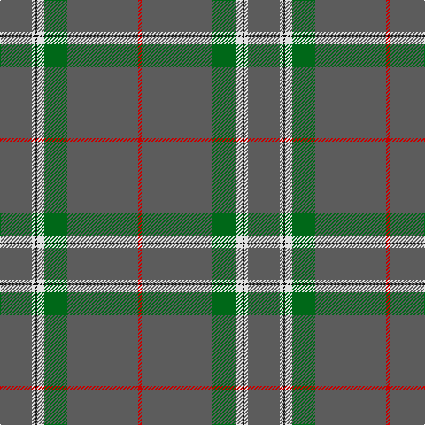

**Bands:** [RBGWKWB](/stripes/rbgwkwb/) · **Stripes:** [R N G W K W N](/stripes/stripes7/) R N G W K W N

This was sourced from tartans-authority.  It is a [7 band tartan](/bands/bands7/).

Original link http://www.tartansauthority.com/tartan-ferret/display/10533/

## Thread count
N/36 LN4 K2 LN8 G26 N80 R/4

## Palette
Each colour and its ΔE from the base-6 reference it is a variant of.

| Colour | Shade | Base | ΔE (OKLab) |
|---|---|---|---|
| G | <code style="background-color:#006818;">#006818</code> `#006818` | G <code style="background-color:#006100;">#006100</code> | 0.02 |
| K | <code style="background-color:#101010;">#101010</code> `#101010` | K <code style="background-color:#000000;">#000000</code> | 0.17 |
| LN | <code style="background-color:#E0E0E0;">#E0E0E0</code> `#E0E0E0` | W <code style="background-color:#F7F7F7;">#F7F7F7</code> | 0.07 |
| N | <code style="background-color:#5C5C5C;">#5C5C5C</code> `#5C5C5C` | B <code style="background-color:#2A418A;">#2A418A</code> | 0.15 |
| R | <code style="background-color:#C80000;">#C80000</code> `#C80000` | R <code style="background-color:#CC0000;">#CC0000</code> | 0.01 |

# Sample pattern

## Nearest tartans

The nearest existing variants by ΔTartan distance.

1. [Puxty-Dunne](/setts/s7/dt18w2k1w4dg13dt40r2~x2/) — ΔT 0.94
1. [Highland Autumn (Fashion)](/setts/s8/r2n2k2n28k8n9k1lo2~x2/) — ΔT 1.43
1. [Lochnagar Dark (Fashion)](/setts/s10/do6o1do40n1do12o12dp6o2r2o4~x2/) — ΔT 1.53
1. [Dark Lochnagar](/setts/s10/do6o1do40n1do12o12n6o2r2o4~x2/) — ΔT 1.61
1. [Historic Caledonian Railway Enthusiasts', The](/setts/s11/n6k1lo6k1n28w1k2w1n16w1r5~x2/) — ΔT 1.68
1. [Norsemen, The](/setts/s6/n65k2n4k2n10r24~x2/) — ΔT 1.70
1. [Dunning Primary (School)](/setts/s5/n30do9w1r5ly1~x4/) — ΔT 1.71
1. [St. Giles Cathedral (Corporate)](/setts/s6/db2n2lb1n18lb2r2~x4/) — ΔT 1.74
1. [London Scottish Rugby Club](/setts/s6/r5dt40w1dt13g8k4~x2/) — ΔT 1.76
1. [Norsemen (Corporate)](/setts/s6/n65k2n4lr2n10r24~x2/) — ΔT 1.77

## Neighbour map

Every grey dot is one of 14299 variants placed by the first two principal components of the ΔTartan feature space (44% of its variance). Red is this tartan; blue dots are its nearest — click one to open its page.

<svg viewBox="0 0 640 380" role="img" style="max-width:100%;height:auto;border:1px solid #e0e0e0;border-radius:4px;display:block" xmlns="http://www.w3.org/2000/svg"><image href="/nn/cloud.v1.png" width="640" height="380"/><a href="/setts/s7/dt18w2k1w4dg13dt40r2~x2/"><circle cx="504.1" cy="152.9" r="4" fill="#3465a4"><title>Puxty-Dunne</title></circle></a><a href="/setts/s8/r2n2k2n28k8n9k1lo2~x2/"><circle cx="518.2" cy="164.7" r="4" fill="#3465a4"><title>Highland Autumn (Fashion)</title></circle></a><a href="/setts/s10/do6o1do40n1do12o12dp6o2r2o4~x2/"><circle cx="478.1" cy="125.3" r="4" fill="#3465a4"><title>Lochnagar Dark (Fashion)</title></circle></a><a href="/setts/s10/do6o1do40n1do12o12n6o2r2o4~x2/"><circle cx="503.7" cy="146.8" r="4" fill="#3465a4"><title>Dark Lochnagar</title></circle></a><a href="/setts/s11/n6k1lo6k1n28w1k2w1n16w1r5~x2/"><circle cx="476.0" cy="117.4" r="4" fill="#3465a4"><title>Historic Caledonian Railway Enthusiasts', The</title></circle></a><a href="/setts/s6/n65k2n4k2n10r24~x2/"><circle cx="552.5" cy="177.1" r="4" fill="#3465a4"><title>Norsemen, The</title></circle></a><a href="/setts/s5/n30do9w1r5ly1~x4/"><circle cx="465.9" cy="176.2" r="4" fill="#3465a4"><title>Dunning Primary (School)</title></circle></a><a href="/setts/s6/db2n2lb1n18lb2r2~x4/"><circle cx="521.7" cy="185.3" r="4" fill="#3465a4"><title>St. Giles Cathedral (Corporate)</title></circle></a><a href="/setts/s6/r5dt40w1dt13g8k4~x2/"><circle cx="524.8" cy="170.5" r="4" fill="#3465a4"><title>London Scottish Rugby Club</title></circle></a><a href="/setts/s6/n65k2n4lr2n10r24~x2/"><circle cx="579.5" cy="186.5" r="4" fill="#3465a4"><title>Norsemen (Corporate)</title></circle></a><circle cx="508.2" cy="150.2" r="5" fill="#c00000"/></svg>

ID: /setts/s7/n18w2k1w4g13n40r2~x2/
