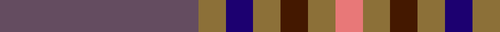
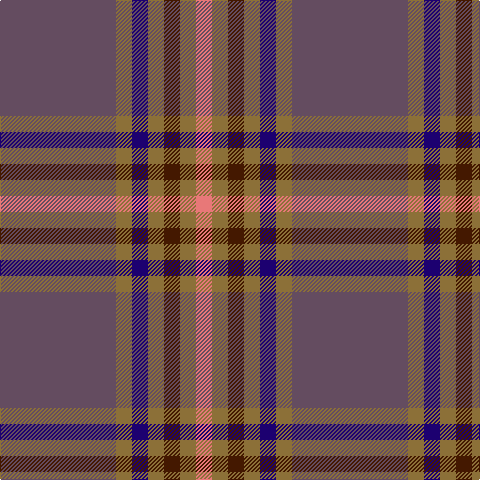

In pattern [BGBGBGR](/stripes/bgbgbgr/).

This was sourced from register-of-tartans.  It is a [7 stripe tartan](/stripes/stripes7/).

Original link https://www.tartanregister.gov.uk/tartanDetails.aspx?ref=2834

## Attestations

This cloth appears in 2 source records; the oldest owns this page.

- 01/01/1983 — Marino (register-of-tartans, [record](https://www.tartanregister.gov.uk/tartanDetails.aspx?ref=2834))
- pre 1983 — Marino (Fashion) (tartans-authority, [record](http://www.tartansauthority.com/tartan-ferret/display/5704/))

## Register references

External register numbers recorded for this tartan.

- Scottish Register of Tartans: [2834](https://www.tartanregister.gov.uk/tartanDetails.aspx?ref=2834)
- Scottish Tartans Authority (ITI): 5704

## Thread count
N/116 LT16 DB16 LT16 DR16 LT16 LR/16

## Palette
Each colour and its ΔE from the base-6 reference it is a variant of.

| Colour | Shade | Base | ΔE (OKLab) |
|---|---|---|---|
| DB | <code style="background-color:#1C0070;">#1C0070</code> `#1C0070` | B <code style="background-color:#2A418A;">#2A418A</code> | 0.14 |
| DR | <code style="background-color:#441800;">#441800</code> `#441800` | B <code style="background-color:#2A418A;">#2A418A</code> | 0.23 |
| LR | <code style="background-color:#E87878;">#E87878</code> `#E87878` | R <code style="background-color:#CC0000;">#CC0000</code> | 0.19 |
| LT | <code style="background-color:#8C7038;">#8C7038</code> `#8C7038` | G <code style="background-color:#006100;">#006100</code> | 0.18 |
| N | <code style="background-color:#644C60;">#644C60</code> `#644C60` | B <code style="background-color:#2A418A;">#2A418A</code> | 0.12 |

# Sample pattern

## Nearest tartans

The nearest existing variants by ΔTartan distance.

1. [Scotch Mist](/setts/s8/n4o4n4k4n18k3do38w3~x2/) — ΔT 1.39
1. [Tenmaya Corporate Tartan Tartan Number: 2346. Earliest known date: 1996 May 1996 for Tenmaya Department Store Ltd in Okayama, Japan. Sample in STA Johnston Collection. Designed for British promotion October/November 1996 which demonstrated weaving and woven by Archie Snmall from Selkirk who was sent to Fukuoka to demonstrate weaving. See products available Copyright © Blair Urquhart, Comrie, 2015](/setts/s8/lb1n12r1dt1r1dt2r5lb1~x4/) — ΔT 1.48
1. [Hebridean Granite Fashion Tartan Tartan Number: 6821. Earliest known date: 2005 For a new House of Edgar collection. Intended to emulate the gray morning suit perhaps. See products available Copyright © Blair Urquhart, Comrie, 2015](/setts/s8/o3lr4o4do4o18do3n36w3~x2/) — ΔT 1.52
1. [Balfour blue & brown](/setts/s6/db18ly2o6ly2o19r3~x2/) — ΔT 1.64
1. [Cameron, hunting](/setts/s6/o15r5o30db32o4ly3~x2/) — ΔT 1.65
1. [MacArthur-Fox, dress](/setts/s6/r2db13r3db3r16t2~x4/) — ΔT 1.68
1. [Bressuire (District)](/setts/s7/r1g4lo1g3r4n15w1~x4/) — ΔT 1.70
1. [Tenmaya Check](/setts/s8/lb1o12r1dt1r1dt2r5lb1~x4/) — ΔT 1.71
1. [Dama Classic](/setts/s8/y30ly3y3ly3y12do30k3do5~x2/) — ΔT 1.72
1. [Dundhuin Dress (Personal)](/setts/s5/o62t17ly12g8dg8~x2/) — ΔT 1.72

## Neighbour map

Every grey dot is one of 14299 variants placed by the first two principal components of the ΔTartan feature space (44% of its variance). Red is this tartan; blue dots are its nearest — click one to open its page.

<svg viewBox="0 0 640 380" role="img" style="max-width:100%;height:auto;border:1px solid #e0e0e0;border-radius:4px;display:block" xmlns="http://www.w3.org/2000/svg"><image href="/nn/cloud.v1.png" width="640" height="380"/><a href="/setts/s8/n4o4n4k4n18k3do38w3~x2/"><circle cx="329.9" cy="186.1" r="4" fill="#3465a4"><title>Scotch Mist</title></circle></a><a href="/setts/s8/lb1n12r1dt1r1dt2r5lb1~x4/"><circle cx="336.9" cy="182.1" r="4" fill="#3465a4"><title>Tenmaya Corporate Tartan Tartan Number: 2346. Earliest known date: 1996 May 1996 for Tenmaya Department Store Ltd in Okayama, Japan. Sample in STA Johnston Collection. Designed for British promotion October/November 1996 which demonstrated weaving and woven by Archie Snmall from Selkirk who was sent to Fukuoka to demonstrate weaving. See products available Copyright © Blair Urquhart, Comrie, 2015</title></circle></a><a href="/setts/s8/o3lr4o4do4o18do3n36w3~x2/"><circle cx="303.0" cy="173.3" r="4" fill="#3465a4"><title>Hebridean Granite Fashion Tartan Tartan Number: 6821. Earliest known date: 2005 For a new House of Edgar collection. Intended to emulate the gray morning suit perhaps. See products available Copyright © Blair Urquhart, Comrie, 2015</title></circle></a><a href="/setts/s6/db18ly2o6ly2o19r3~x2/"><circle cx="317.3" cy="226.5" r="4" fill="#3465a4"><title>Balfour blue &amp; brown</title></circle></a><a href="/setts/s6/o15r5o30db32o4ly3~x2/"><circle cx="378.9" cy="245.0" r="4" fill="#3465a4"><title>Cameron, hunting</title></circle></a><a href="/setts/s6/r2db13r3db3r16t2~x4/"><circle cx="348.0" cy="244.8" r="4" fill="#3465a4"><title>MacArthur-Fox, dress</title></circle></a><a href="/setts/s7/r1g4lo1g3r4n15w1~x4/"><circle cx="332.7" cy="183.3" r="4" fill="#3465a4"><title>Bressuire (District)</title></circle></a><a href="/setts/s8/lb1o12r1dt1r1dt2r5lb1~x4/"><circle cx="341.6" cy="181.8" r="4" fill="#3465a4"><title>Tenmaya Check</title></circle></a><a href="/setts/s8/y30ly3y3ly3y12do30k3do5~x2/"><circle cx="335.9" cy="212.2" r="4" fill="#3465a4"><title>Dama Classic</title></circle></a><a href="/setts/s5/o62t17ly12g8dg8~x2/"><circle cx="315.4" cy="209.5" r="4" fill="#3465a4"><title>Dundhuin Dress (Personal)</title></circle></a><circle cx="339.2" cy="207.4" r="5" fill="#c00000"/></svg>

ID: /setts/s7/n29y4db4y4do4y4r4~x4/
