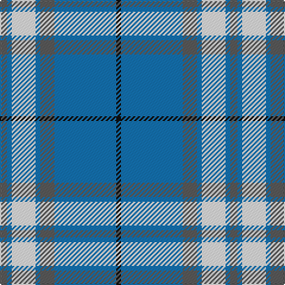

In pattern [BBWBBBK](/stripes/bbwbbbk/).

This was sourced from register-of-tartans.  It is a [7 stripe tartan](/stripes/stripes7/).

Original link https://www.tartanregister.gov.uk/tartanDetails.aspx?ref=5162

## Register references

External register numbers recorded for this tartan.

- Scottish Register of Tartans: [5162](https://www.tartanregister.gov.uk/tartanDetails.aspx?ref=5162)
- Scottish Tartans Authority (ITI): 3329

## Thread count
N/6 B4 W20 B4 N12 B52 K/4

## Palette
Each colour and the base-6 reference it is a variant of.

| Colour | Shade | Base |
|---|---|---|
| B | <code style="background-color:#1474B4;">#1474B4</code> `oklch(54.0% 0.129 245.1)` <small>#1474B4</small> | B <code style="background-color:#2A418A;">#2A418A</code> |
| K | <code style="background-color:#101010;">#101010</code> `oklch(17.3% 0.000 89.9)` <small>#101010</small> | K <code style="background-color:#000000;">#000000</code> |
| N | <code style="background-color:#5C5C5C;">#5C5C5C</code> `oklch(47.5% 0.000 89.9)` <small>#5C5C5C</small> | B <code style="background-color:#2A418A;">#2A418A</code> |
| W | <code style="background-color:#FCFCFC;">#FCFCFC</code> `oklch(99.1% 0.000 89.9)` <small>#FCFCFC</small> | W <code style="background-color:#F7F7F7;">#F7F7F7</code> |

# Sample pattern

## Nearest tartans

The nearest existing variants by ΔTartan distance, with this tartan at the top so the swatches line up against it.

ΔTartan

Tartan

Sett

—

<a href="/ttd/edit/#slug=n3b2w10b2n6b26k2~x2">MacLintock #2</a> <a class="nn-out" href="/setts/s7/n3b2w10b2n6b26k2~x2/" title="open its dictionary page">↗</a>

1.12

<a href="/ttd/edit/#slug=db9lb27db2k4db2lb10db2w3~x2">Alaska Highlanders Pipes &amp; Drums Corporate Tartan Tartan Number: 8433. Earliest known date: pre 2001 Found on http://www.alaskahighlanders.com/alaska-flag-tartan: Captain Cook's own Alaska Highlanders was reformed in 1987 by the late great Pipe Major Iain MacPherson. We are a dedicated pipe band that is open to new discovery and experiences. We have played all over Alaska, Scotland twice and London in 2005. Our band has been represented at the Pipefest in 1995, 2000 and 2005. On August 23, 2005 (when his family and fellow Scots were finally allowed to hold a public funeral and memorial service 700 years to the day after his execution, we had the honor of escorting the spirit of the braveheart Sir William Wallace on his first mile home to Scotland. At the invitation of Clan Wallace Society convienor David Ross provided an Honour Guard with swords and led the funeral procession from the site of his execution thru the streets of London to the London Welsh Center where a Wake was held. The Highlanders wear the Alaska Flag Tartan and our uniforms reflect those worn by those pipers and drummers who sailed with Captain James Cook in 1778, when he discovered Alaska. (State of Alaska) See products available Copyright © Blair Urquhart, Comrie, 2015</a> <a class="nn-out" href="/setts/s8/db9lb27db2k4db2lb10db2w3~x2/" title="open its dictionary page">↗</a>

1.16

<a href="/ttd/edit/#slug=db9lb27db2ly4db2lb10db2w3~x2">Alaska Highlanders P &amp; D (Corporate)</a> <a class="nn-out" href="/setts/s8/db9lb27db2ly4db2lb10db2w3~x2/" title="open its dictionary page">↗</a>

1.22

<a href="/ttd/edit/#slug=ly8w3b40k12w3ly3~x2">Wolverine (Corporate)</a> <a class="nn-out" href="/setts/s6/ly8w3b40k12w3ly3~x2/" title="open its dictionary page">↗</a>

1.24

<a href="/ttd/edit/#slug=b120g9r7ly12g33ly33b26">Supporter.com</a> <a class="nn-out" href="/setts/s7/b120g9r7ly12g33ly33b26/" title="open its dictionary page">↗</a>

1.28

<a href="/ttd/edit/#slug=b30r2b2k5b3dy2b3dy22b3k2b3~x2">Dunbarton Weft</a> <a class="nn-out" href="/setts/s11/b30r2b2k5b3dy2b3dy22b3k2b3~x2/" title="open its dictionary page">↗</a>

1.29

<a href="/ttd/edit/#slug=y8ly4y35db2lt8db2y4db21y4~x2">Bedford Academy</a> <a class="nn-out" href="/setts/s9/y8ly4y35db2lt8db2y4db21y4~x2/" title="open its dictionary page">↗</a>

1.32

<a href="/ttd/edit/#slug=t42k2w2k2t5n12w32t4~x2">Longniddry, dress (Turquoise)</a> <a class="nn-out" href="/setts/s8/t42k2w2k2t5n12w32t4~x2/" title="open its dictionary page">↗</a>

1.32

<a href="/ttd/edit/#slug=db41t2w2t2db5b12w31db4~x2">Harmony, Eildon</a> <a class="nn-out" href="/setts/s8/db41t2w2t2db5b12w31db4~x2/" title="open its dictionary page">↗</a>

1.38

<a href="/ttd/edit/#slug=t45w4db4w2ly14db2w2db2~x4">Madras 1 (Fashion)</a> <a class="nn-out" href="/setts/s8/t45w4db4w2ly14db2w2db2~x4/" title="open its dictionary page">↗</a>

1.42

<a href="/ttd/edit/#slug=lb1lg11k6lg3lb1lg1lb1~x4">Angle, Blue (Fashion)</a> <a class="nn-out" href="/setts/s7/lb1lg11k6lg3lb1lg1lb1~x4/" title="open its dictionary page">↗</a>

## Neighbour map

Every grey dot is one of 14299 variants placed by the first two principal components of the ΔTartan feature space (44% of its variance). Red is this tartan; blue dots are its nearest — click one to open its page.

<svg viewBox="0 0 640 380" role="img" style="max-width:100%;height:auto;border:1px solid #e0e0e0;border-radius:4px;display:block" xmlns="http://www.w3.org/2000/svg"><image href="/nn/cloud.v1.png" width="640" height="380"/><a href="/setts/s8/db9lb27db2k4db2lb10db2w3~x2/"><circle cx="320.1" cy="150.0" r="4" fill="#3465a4"><title>Alaska Highlanders Pipes &amp; Drums Corporate Tartan Tartan Number: 8433. Earliest known date: pre 2001 Found on http://www.alaskahighlanders.com/alaska-flag-tartan: Captain Cook's own Alaska Highlanders was reformed in 1987 by the late great Pipe Major Iain MacPherson. We are a dedicated pipe band that is open to new discovery and experiences. We have played all over Alaska, Scotland twice and London in 2005. Our band has been represented at the Pipefest in 1995, 2000 and 2005. On August 23, 2005 (when his family and fellow Scots were finally allowed to hold a public funeral and memorial service 700 years to the day after his execution, we had the honor of escorting the spirit of the braveheart Sir William Wallace on his first mile home to Scotland. At the invitation of Clan Wallace Society convienor David Ross provided an Honour Guard with swords and led the funeral procession from the site of his execution thru the streets of London to the London Welsh Center where a Wake was held. The Highlanders wear the Alaska Flag Tartan and our uniforms reflect those worn by those pipers and drummers who sailed with Captain James Cook in 1778, when he discovered Alaska. (State of Alaska) See products available Copyright © Blair Urquhart, Comrie, 2015</title></circle></a><a href="/setts/s8/db9lb27db2ly4db2lb10db2w3~x2/"><circle cx="333.6" cy="153.4" r="4" fill="#3465a4"><title>Alaska Highlanders P &amp; D (Corporate)</title></circle></a><a href="/setts/s6/ly8w3b40k12w3ly3~x2/"><circle cx="302.7" cy="170.9" r="4" fill="#3465a4"><title>Wolverine (Corporate)</title></circle></a><a href="/setts/s7/b120g9r7ly12g33ly33b26/"><circle cx="341.0" cy="165.8" r="4" fill="#3465a4"><title>Supporter.com</title></circle></a><a href="/setts/s11/b30r2b2k5b3dy2b3dy22b3k2b3~x2/"><circle cx="327.1" cy="139.4" r="4" fill="#3465a4"><title>Dunbarton Weft</title></circle></a><a href="/setts/s9/y8ly4y35db2lt8db2y4db21y4~x2/"><circle cx="337.2" cy="159.2" r="4" fill="#3465a4"><title>Bedford Academy</title></circle></a><a href="/setts/s8/t42k2w2k2t5n12w32t4~x2/"><circle cx="297.4" cy="137.8" r="4" fill="#3465a4"><title>Longniddry, dress (Turquoise)</title></circle></a><a href="/setts/s8/db41t2w2t2db5b12w31db4~x2/"><circle cx="286.7" cy="135.3" r="4" fill="#3465a4"><title>Harmony, Eildon</title></circle></a><a href="/setts/s8/t45w4db4w2ly14db2w2db2~x4/"><circle cx="353.3" cy="119.1" r="4" fill="#3465a4"><title>Madras 1 (Fashion)</title></circle></a><a href="/setts/s7/lb1lg11k6lg3lb1lg1lb1~x4/"><circle cx="338.8" cy="191.8" r="4" fill="#3465a4"><title>Angle, Blue (Fashion)</title></circle></a><circle cx="315.8" cy="169.4" r="5" fill="#c00000"/></svg>

ID: /setts/s7/n3b2w10b2n6b26k2~x2/
