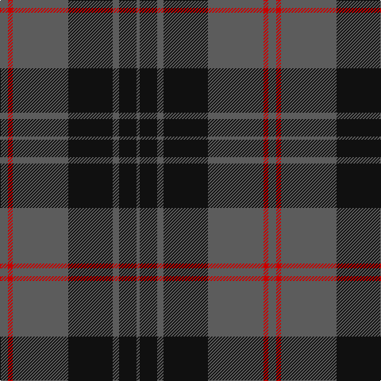

In pattern [BKBKBRB](/stripes/bkbkbrb/).

This was sourced from tartans-authority.  It is a [7 stripe tartan](/stripes/stripes7/).

Original link http://www.tartansauthority.com/tartan-ferret/display/10074/

## Also known as

This cloth is also recorded under:

- Korner-Macpherson

## Thread count
N/10 R6 N70 K56 N8 K22 N/4

## Palette
Each colour and its ΔE from the base-6 reference it is a variant of.

| Colour | Shade | Base | ΔE (OKLab) |
|---|---|---|---|
| K | <code style="background-color:#101010;">#101010</code> `#101010` | K <code style="background-color:#000000;">#000000</code> | 0.17 |
| N | <code style="background-color:#5C5C5C;">#5C5C5C</code> `#5C5C5C` | B <code style="background-color:#2A418A;">#2A418A</code> | 0.15 |
| R | <code style="background-color:#C80000;">#C80000</code> `#C80000` | R <code style="background-color:#CC0000;">#CC0000</code> | 0.01 |

# Sample pattern

## Nearest tartans

The nearest existing variants by ΔTartan distance.

1. [TACC (Corporate)](/setts/s7/n34k7n12k40n3k4t3~x2/) — ΔT 0.51
1. [Tartan Army Children's Charity (Corp](/setts/s7/n34k7n12k39n3k4lg3~x2/) — ΔT 0.58
1. [Perthshire (New) District Tartan Tartan Number: 2188. Earliest known date: 1992 The New Perthshire District tartan has established itself through use and wont since 1992. It provides a useful alternative to the Drummond pattern which was always closely associated with Perthshire. See products available Copyright © Blair Urquhart, Comrie, 2015](/setts/s6/db26r6g16db8g3r2~x2/) — ΔT 1.11
1. [Scottish National Party (Corporate)](/setts/s6/k3n31k3n3k27ly3~x2/) — ΔT 1.14
1. [Melange](/setts/s9/k80n4k44n50k36n4y12k12y45/) — ΔT 1.27
1. [Mountain Rescue Association Honor Guard](/setts/s7/k32b2k6b2k13n30w2~x2/) — ΔT 1.32
1. [Keepers of the Quaich](/setts/s6/lo3dy33db24dy2db2dy2~x2/) — ΔT 1.33
1. [Kelley Oliphint](/setts/s5/k3w2n27k31p3~x2/) — ΔT 1.33
1. [Silver Mist (Corporate)](/setts/s6/k13n2k13n31k1n1~x4/) — ΔT 1.35
1. [Connecticut State Police Pipe Band](/setts/s6/k42n2k2n17db8lo4~x2/) — ΔT 1.35

## Neighbour map

Every grey dot is one of 14299 variants placed by the first two principal components of the ΔTartan feature space (44% of its variance). Red is this tartan; blue dots are its nearest — click one to open its page.

<svg viewBox="0 0 640 380" role="img" style="max-width:100%;height:auto;border:1px solid #e0e0e0;border-radius:4px;display:block" xmlns="http://www.w3.org/2000/svg"><image href="/nn/cloud.v1.png" width="640" height="380"/><a href="/setts/s7/n34k7n12k40n3k4t3~x2/"><circle cx="369.9" cy="223.4" r="4" fill="#3465a4"><title>TACC (Corporate)</title></circle></a><a href="/setts/s7/n34k7n12k39n3k4lg3~x2/"><circle cx="363.1" cy="223.0" r="4" fill="#3465a4"><title>Tartan Army Children's Charity (Corp</title></circle></a><a href="/setts/s6/db26r6g16db8g3r2~x2/"><circle cx="353.1" cy="236.6" r="4" fill="#3465a4"><title>Perthshire (New) District Tartan Tartan Number: 2188. Earliest known date: 1992 The New Perthshire District tartan has established itself through use and wont since 1992. It provides a useful alternative to the Drummond pattern which was always closely associated with Perthshire. See products available Copyright © Blair Urquhart, Comrie, 2015</title></circle></a><a href="/setts/s6/k3n31k3n3k27ly3~x2/"><circle cx="341.9" cy="222.5" r="4" fill="#3465a4"><title>Scottish National Party (Corporate)</title></circle></a><a href="/setts/s9/k80n4k44n50k36n4y12k12y45/"><circle cx="372.1" cy="209.5" r="4" fill="#3465a4"><title>Melange</title></circle></a><a href="/setts/s7/k32b2k6b2k13n30w2~x2/"><circle cx="377.2" cy="202.6" r="4" fill="#3465a4"><title>Mountain Rescue Association Honor Guard</title></circle></a><a href="/setts/s6/lo3dy33db24dy2db2dy2~x2/"><circle cx="440.9" cy="220.7" r="4" fill="#3465a4"><title>Keepers of the Quaich</title></circle></a><a href="/setts/s5/k3w2n27k31p3~x2/"><circle cx="341.1" cy="206.8" r="4" fill="#3465a4"><title>Kelley Oliphint</title></circle></a><a href="/setts/s6/k13n2k13n31k1n1~x4/"><circle cx="463.1" cy="213.5" r="4" fill="#3465a4"><title>Silver Mist (Corporate)</title></circle></a><a href="/setts/s6/k42n2k2n17db8lo4~x2/"><circle cx="388.3" cy="187.1" r="4" fill="#3465a4"><title>Connecticut State Police Pipe Band</title></circle></a><circle cx="389.2" cy="211.8" r="5" fill="#c00000"/></svg>

ID: /setts/s7/n5r3n35k28n4k11n2~x2/
