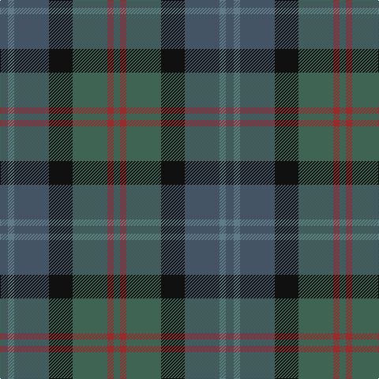

In pattern [BBBKGRG](/stripes/bbbkgrg/).

This was sourced from register-of-tartans.  It is a [7 stripe tartan](/stripes/stripes7/).

Original link https://www.tartanregister.gov.uk/tartanDetails.aspx?ref=463

## Attestations

This cloth appears in 2 source records; the oldest owns this page.

- 01/01/2006 — Cairngorm #2 (register-of-tartans, [record](https://www.tartanregister.gov.uk/tartanDetails.aspx?ref=463))
- pre 2006 — Cairngorm #2 (tartans-authority, [record](http://www.tartansauthority.com/tartan-ferret/display/7071/))

## Register references

External register numbers recorded for this tartan.

- Scottish Register of Tartans: [463](https://www.tartanregister.gov.uk/tartanDetails.aspx?ref=463)
- Scottish Tartans Authority (ITI): 7071

## Thread count
Na/10 B8 Na44 K30 N44 DR8 N/8

## Palette
Each colour and its ΔE from the base-6 reference it is a variant of.

| Colour | Shade | Base | ΔE (OKLab) |
|---|---|---|---|
| B | <code style="background-color:#607C88;">#607C88</code> `#607C88` | B <code style="background-color:#2A418A;">#2A418A</code> | 0.20 |
| DR | <code style="background-color:#982C2C;">#982C2C</code> `#982C2C` | R <code style="background-color:#CC0000;">#CC0000</code> | 0.10 |
| K | <code style="background-color:#101010;">#101010</code> `#101010` | K <code style="background-color:#000000;">#000000</code> | 0.17 |
| N | <code style="background-color:#406454;">#406454</code> `#406454` | G <code style="background-color:#006100;">#006100</code> | 0.11 |
| Na | <code style="background-color:#445464;">#445464</code> `#445464` | B <code style="background-color:#2A418A;">#2A418A</code> | 0.10 |

# Sample pattern

## Nearest tartans

The nearest existing variants by ΔTartan distance.

1. [House of Bruar (Corporate)](/setts/s6/dr6do26dt28g26dt8y3~x2/) — ΔT 1.24
1. [Swankie](/setts/s7/dg3dt22dr10o5dg21r6dt3~x2/) — ΔT 1.31
1. [Bennachie (Whisky)](/setts/s7/dt14k5dp5k5dt14dg32r4~x2/) — ΔT 1.37
1. [Saorsa (Corporate)](/setts/s6/db11g15k2n5db3n11~x2/) — ΔT 1.40
1. [Sound of Mull](/setts/s9/db30dt4dy6n4dy6n6dy12n13dr4~x2/) — ΔT 1.41
1. [Limerick, County](/setts/s11/do6lo4do3dt2do5dt2do3dt2y14r3dt2~x2/) — ΔT 1.43
1. [Baron of Crawfordjohn (Personal)](/setts/s7/dt8db10dt22dg7g10dg22dp3~x2/) — ΔT 1.49
1. [Royal Highland Society (Corporate)](/setts/s8/ly4dg17k10dt3k3dt17r3dt3~x2/) — ΔT 1.52
1. [Dewar (WCWM)](/setts/s6/dt1dy1dt7dy5y7lr1~x4/) — ΔT 1.52
1. [I Y](/setts/s6/k4dg16k13db16t3db3~x2/) — ΔT 1.52

## Neighbour map

Every grey dot is one of 14299 variants placed by the first two principal components of the ΔTartan feature space (44% of its variance). Red is this tartan; blue dots are its nearest — click one to open its page.

<svg viewBox="0 0 640 380" role="img" style="max-width:100%;height:auto;border:1px solid #e0e0e0;border-radius:4px;display:block" xmlns="http://www.w3.org/2000/svg"><image href="/nn/cloud.v1.png" width="640" height="380"/><a href="/setts/s6/dr6do26dt28g26dt8y3~x2/"><circle cx="251.6" cy="272.8" r="4" fill="#3465a4"><title>House of Bruar (Corporate)</title></circle></a><a href="/setts/s7/dg3dt22dr10o5dg21r6dt3~x2/"><circle cx="217.3" cy="248.4" r="4" fill="#3465a4"><title>Swankie</title></circle></a><a href="/setts/s7/dt14k5dp5k5dt14dg32r4~x2/"><circle cx="252.6" cy="242.9" r="4" fill="#3465a4"><title>Bennachie (Whisky)</title></circle></a><a href="/setts/s6/db11g15k2n5db3n11~x2/"><circle cx="186.0" cy="261.8" r="4" fill="#3465a4"><title>Saorsa (Corporate)</title></circle></a><a href="/setts/s9/db30dt4dy6n4dy6n6dy12n13dr4~x2/"><circle cx="223.7" cy="228.6" r="4" fill="#3465a4"><title>Sound of Mull</title></circle></a><a href="/setts/s11/do6lo4do3dt2do5dt2do3dt2y14r3dt2~x2/"><circle cx="224.6" cy="228.3" r="4" fill="#3465a4"><title>Limerick, County</title></circle></a><a href="/setts/s7/dt8db10dt22dg7g10dg22dp3~x2/"><circle cx="242.0" cy="294.3" r="4" fill="#3465a4"><title>Baron of Crawfordjohn (Personal)</title></circle></a><a href="/setts/s8/ly4dg17k10dt3k3dt17r3dt3~x2/"><circle cx="197.4" cy="245.0" r="4" fill="#3465a4"><title>Royal Highland Society (Corporate)</title></circle></a><a href="/setts/s6/dt1dy1dt7dy5y7lr1~x4/"><circle cx="256.2" cy="272.5" r="4" fill="#3465a4"><title>Dewar (WCWM)</title></circle></a><a href="/setts/s6/k4dg16k13db16t3db3~x2/"><circle cx="238.7" cy="310.4" r="4" fill="#3465a4"><title>I Y</title></circle></a><circle cx="218.4" cy="268.9" r="5" fill="#c00000"/></svg>

ID: /setts/s7/n5t4n22k15y22o4y4~x2/
