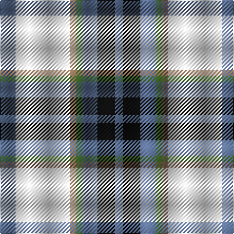

This page is one **sett** — a single exact thread-count. It belongs to the [tartan](/tartans/n8w28o3g3n8k9n4/)
(the same proportion at any scale), whose colour order is pattern [BKBGRWB](/stripes/bkbgrwb/).

Sourced from register-of-tartans.  It is a [7 stripe tartan](/stripes/stripes7/).

Original link https://www.tartanregister.gov.uk/tartanDetails.aspx?ref=10731

2 attestations — the source records this cloth was collapsed from (oldest owns this page)

<ul>
<li>18/02/1845 — MacTavish of Dunardry Dress (register-of-tartans, <a href="https://www.tartanregister.gov.uk/tartanDetails.aspx?ref=10731">record</a>)</li>
<li>undated — MacTavish of Dunardry Dress Clan Tartan Tartan Number: 10731. Earliest known date: 6 November 2012 A 'new' MacTavish Clan tartan, re-creating the Dunardry tartan known to Isobel, daughter of MacLachlan of that Ilk, paternal grandmother to Sheriff Dugald MacTavish of Dunardry. Evidence for the existence of this design can be found in a letter from Sheriff Dugald MacTavish at Kilchrist to John MacTavish, 18 February 1845, the original of which is held in the National Archives of Canada (Library and Archives Canada, James Hargrave and family fonds MG19-A21, Series 2 Mactavish family papers, volume 25/2, “D.M. to John McTavish. Regarding Scottish costume for son John, who will become the lineal representative of the Thane of Knapdale”, February 18th 1845, Kilchrist). The letter describes a tartan that ‘should have as much white as there was yellow in the MacLachlans tartan’. The registration of this Clan tartan has been approved by the current Clan Chief. Registrant details: Steven MacTavish of Dunardry, 27th Chief Clan MacTavish P.O. Box 93093, Burlington, Ontario, Canada, L7M 4A3 See products available Copyright © Blair Urquhart, Comrie, 2015 (house-of-tartan, <a href="http://www.house-of-tartan.scotland.net/house/TartanViewjs.asp?colr=Def&tnam=10731">record</a>)</li>
</ul>

## Register references

External register numbers recorded for this tartan.

- Scottish Register of Tartans: [10731](https://www.tartanregister.gov.uk/tartanDetails.aspx?ref=10731)

## Thread count
B/16 W56 LT6 G6 B16 K18 B/8

## Palette

Palette: <strong>Tartan Register</strong> <small style="color:#888">(2 of 5 colours)</small>
<table><thead><tr><th>Colour</th><th>Threads</th><th>Shade</th><th>Base</th><th>OKLCh</th></tr></thead><tbody><tr><td>B/</td><td style="text-align:right;font-variant-numeric:tabular-nums">16</td><td><code style="background-color:#5A6E90;">#5A6E90</code> <small style="color:#888">#5A6E90</small></td><td>B <code style="background-color:#2A418A;">#2A418A</code></td><td><small style="color:#888">oklch(53.6% 0.059 260.9)</small></td></tr><tr><td>W</td><td style="text-align:right;font-variant-numeric:tabular-nums">56</td><td><code style="background-color:#FFFFFF;">#FFFFFF</code> <small style="color:#888">#FFFFFF</small></td><td>W <code style="background-color:#F7F7F7;">#F7F7F7</code></td><td><small style="color:#888">oklch(100.0% 0.000 89.9)</small></td></tr><tr><td>LT</td><td style="text-align:right;font-variant-numeric:tabular-nums">6</td><td><code style="background-color:#95765B;">#95765B</code> <small style="color:#888">#95765B</small></td><td>R <code style="background-color:#CC0000;">#CC0000</code></td><td><small style="color:#888">oklch(58.9% 0.055 62.5)</small></td></tr><tr><td>G</td><td style="text-align:right;font-variant-numeric:tabular-nums">6</td><td><code style="background-color:#487731;">#487731</code> <small style="color:#888">#487731</small></td><td>G <code style="background-color:#006100;">#006100</code></td><td><small style="color:#888">oklch(51.9% 0.113 136.6)</small></td></tr><tr><td>B</td><td style="text-align:right;font-variant-numeric:tabular-nums">16</td><td><code style="background-color:#5A6E90;">#5A6E90</code> <small style="color:#888">#5A6E90</small></td><td>B <code style="background-color:#2A418A;">#2A418A</code></td><td><small style="color:#888">oklch(53.6% 0.059 260.9)</small></td></tr><tr><td>K</td><td style="text-align:right;font-variant-numeric:tabular-nums">18</td><td><code style="background-color:#101010;">#101010</code> <small style="color:#888">#101010</small></td><td>K <code style="background-color:#000000;">#000000</code></td><td><small style="color:#888">oklch(17.3% 0.000 89.9)</small></td></tr><tr><td>B/</td><td style="text-align:right;font-variant-numeric:tabular-nums">8</td><td><code style="background-color:#5A6E90;">#5A6E90</code> <small style="color:#888">#5A6E90</small></td><td>B <code style="background-color:#2A418A;">#2A418A</code></td><td><small style="color:#888">oklch(53.6% 0.059 260.9)</small></td></tr></tbody></table>

# Sample pattern

## Nearest tartans

The nearest existing variants by ΔTartan distance, with this tartan at the top so the swatches line up against it.

ΔTartan

Tartan

Sett

—

<a href="/ttd/edit/#slug=n8w28o3g3n8k9n4~x2">MacTavish of Dunardry Dress</a> <a class="nn-out" href="/setts/s7/n8w28o3g3n8k9n4~x2/" title="open its dictionary page">↗</a>

0.54

<a href="/ttd/edit/#slug=t8w28lo3g3t8k9t4~x2">MacTavish of Dunardry (Clan)</a> <a class="nn-out" href="/setts/s7/t8w28lo3g3t8k9t4~x2/" title="open its dictionary page">↗</a>

0.89

<a href="/ttd/edit/#slug=g4w28p8ly2db17g4~x2">Manx, dress</a> <a class="nn-out" href="/setts/s6/g4w28p8ly2db17g4~x2/" title="open its dictionary page">↗</a>

0.94

<a href="/ttd/edit/#slug=db2w14p4ly1g8db2~x2">Manx Laxey, dress green</a> <a class="nn-out" href="/setts/s6/db2w14p4ly1g8db2~x2/" title="open its dictionary page">↗</a>

0.98

<a href="/ttd/edit/#slug=w8g5dp10t24w30g2lp2~x2">Shiel, Purple V2 (Dance)</a> <a class="nn-out" href="/setts/s7/w8g5dp10t24w30g2lp2~x2/" title="open its dictionary page">↗</a>

1.01

<a href="/ttd/edit/#slug=r2db2w26g25k14db13w26db2r2~x2">MacNaughton Dress</a> <a class="nn-out" href="/setts/s9/r2db2w26g25k14db13w26db2r2~x2/" title="open its dictionary page">↗</a>

1.04

<a href="/ttd/edit/#slug=g4w28dp8ly2db17g4~x2">Manx Dress</a> <a class="nn-out" href="/setts/s6/g4w28dp8ly2db17g4~x2/" title="open its dictionary page">↗</a>

1.06

<a href="/ttd/edit/#slug=w8g5t10dp24w30g2lp2~x2">Shiel, Purple (Dance)</a> <a class="nn-out" href="/setts/s7/w8g5t10dp24w30g2lp2~x2/" title="open its dictionary page">↗</a>

1.06

<a href="/ttd/edit/#slug=r5w2t20ly2k16w18k2w5~x2">Ailsa Craig (District)</a> <a class="nn-out" href="/setts/s8/r5w2t20ly2k16w18k2w5~x2/" title="open its dictionary page">↗</a>

1.10

<a href="/ttd/edit/#slug=w8b5t10dp24w30b2dg2~x2">Shiel, Magenta (Dance)</a> <a class="nn-out" href="/setts/s7/w8b5t10dp24w30b2dg2~x2/" title="open its dictionary page">↗</a>

1.11

<a href="/ttd/edit/#slug=w4k13w17lo2r2lo24w2w2~x2">Lalage (Personal)</a> <a class="nn-out" href="/setts/s8/w4k13w17lo2r2lo24w2w2~x2/" title="open its dictionary page">↗</a>

## Neighbour map

Every grey dot is one of 14299 variants placed by the first two principal components of the ΔTartan feature space (44% of its variance). Red is this tartan; blue dots are its nearest — click one to open its page.

<svg viewBox="0 0 640 380" role="img" style="max-width:100%;height:auto;border:1px solid #e0e0e0;border-radius:4px;display:block" xmlns="http://www.w3.org/2000/svg"><image href="/nn/cloud.v1.png" width="640" height="380"/><a href="/setts/s7/t8w28lo3g3t8k9t4~x2/"><circle cx="177.0" cy="161.3" r="4" fill="#3465a4"><title>MacTavish of Dunardry (Clan)</title></circle></a><a href="/setts/s6/g4w28p8ly2db17g4~x2/"><circle cx="184.6" cy="151.6" r="4" fill="#3465a4"><title>Manx, dress</title></circle></a><a href="/setts/s6/db2w14p4ly1g8db2~x2/"><circle cx="187.5" cy="152.3" r="4" fill="#3465a4"><title>Manx Laxey, dress green</title></circle></a><a href="/setts/s7/w8g5dp10t24w30g2lp2~x2/"><circle cx="208.7" cy="144.4" r="4" fill="#3465a4"><title>Shiel, Purple V2 (Dance)</title></circle></a><a href="/setts/s9/r2db2w26g25k14db13w26db2r2~x2/"><circle cx="168.8" cy="140.4" r="4" fill="#3465a4"><title>MacNaughton Dress</title></circle></a><a href="/setts/s6/g4w28dp8ly2db17g4~x2/"><circle cx="181.6" cy="150.5" r="4" fill="#3465a4"><title>Manx Dress</title></circle></a><a href="/setts/s7/w8g5t10dp24w30g2lp2~x2/"><circle cx="198.8" cy="137.3" r="4" fill="#3465a4"><title>Shiel, Purple (Dance)</title></circle></a><a href="/setts/s8/r5w2t20ly2k16w18k2w5~x2/"><circle cx="116.4" cy="147.8" r="4" fill="#3465a4"><title>Ailsa Craig (District)</title></circle></a><a href="/setts/s7/w8b5t10dp24w30b2dg2~x2/"><circle cx="208.5" cy="140.3" r="4" fill="#3465a4"><title>Shiel, Magenta (Dance)</title></circle></a><a href="/setts/s8/w4k13w17lo2r2lo24w2w2~x2/"><circle cx="166.7" cy="133.9" r="4" fill="#3465a4"><title>Lalage (Personal)</title></circle></a><circle cx="163.8" cy="152.1" r="5" fill="#c00000"/></svg>

ID: /setts/s7/n8w28o3g3n8k9n4~x2/
