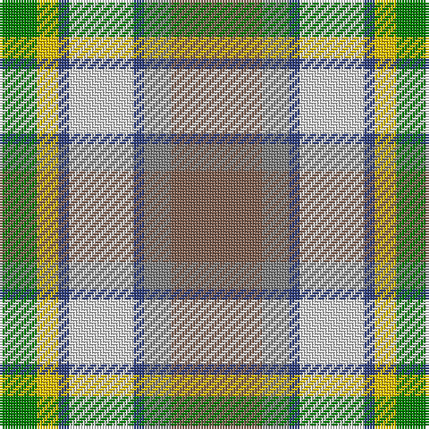

This page is one **sett** — a single exact thread-count. It belongs to the [tartan](/tartans/lt17n5b2ln12b2y4g7/)
(the same proportion at any scale), whose colour order is pattern [GYBWBGR](/stripes/gybwbgr/).

Sourced from weddslist.  It is a [7 stripe tartan](/stripes/stripes7/).

Original link http://www.weddslist.com/cgi-bin/tartans/pg.pl?source=sts

## Thread count
LT/34 N10 B4 LN24 B4 Y8 G/14

## Palette
Each colour and the base-6 reference it is a variant of.

| Colour | Shade | Base |
|---|---|---|
| B | <code style="background-color:#304080;">#304080</code> `oklch(39.4% 0.109 270.2)` <small>#304080</small> | B <code style="background-color:#2A418A;">#2A418A</code> |
| G | <code style="background-color:#008000;">#008000</code> `oklch(52.0% 0.177 142.5)` <small>#008000</small> | G <code style="background-color:#006100;">#006100</code> |
| LN | <code style="background-color:#E0E0E0;">#E0E0E0</code> `oklch(90.7% 0.000 89.9)` <small>#E0E0E0</small> | W <code style="background-color:#F7F7F7;">#F7F7F7</code> |
| LT | <code style="background-color:#806050;">#806050</code> `oklch(51.7% 0.049 47.8)` <small>#806050</small> | R <code style="background-color:#CC0000;">#CC0000</code> |
| N | <code style="background-color:#808080;">#808080</code> `oklch(60.0% 0.000 89.9)` <small>#808080</small> | G <code style="background-color:#006100;">#006100</code> |
| Y | <code style="background-color:#F0C000;">#F0C000</code> `oklch(82.7% 0.169 90.5)` <small>#F0C000</small> | Y <code style="background-color:#F2BF00;">#F2BF00</code> |

# Sample pattern

## Nearest tartans

The nearest existing variants by ΔTartan distance, with this tartan at the top so the swatches line up against it.

ΔTartan

Tartan

Sett

—

<a href="/ttd/edit/#slug=o17y5db2w12db2ly4g7~x2">Ontario, Northern</a> <a class="nn-out" href="/setts/s7/o17y5db2w12db2ly4g7~x2/" title="open its dictionary page">↗</a>

0.86

<a href="/ttd/edit/#slug=dy17o5db2w12db2ly4g7~x2">Ontario Northern Canadian District Tartan Tartan Number: 956. Earliest known date: 1967 The six colours represent the nickel bearing rocks (grey), the snow (white), the sky and the lakes (blue), gold, the forests and fields (green), and the Indian Nation (red brown). See products available Copyright © Blair Urquhart, Comrie, 2015</a> <a class="nn-out" href="/setts/s7/dy17o5db2w12db2ly4g7~x2/" title="open its dictionary page">↗</a>

0.89

<a href="/ttd/edit/#slug=w6t36lo12g19g6r6g6r28g4">Derry Family (Personal)</a> <a class="nn-out" href="/setts/s9/w6t36lo12g19g6r6g6r28g4/" title="open its dictionary page">↗</a>

1.08

<a href="/ttd/edit/#slug=r10n3db1lb8db1lo2g5~x4">Porcupine City of</a> <a class="nn-out" href="/setts/s7/r10n3db1lb8db1lo2g5~x4/" title="open its dictionary page">↗</a>

1.08

<a href="/ttd/edit/#slug=r6w20g12o3g8t20k2t3~x2">Coulter Dress (Personal)</a> <a class="nn-out" href="/setts/s8/r6w20g12o3g8t20k2t3~x2/" title="open its dictionary page">↗</a>

1.21

<a href="/ttd/edit/#slug=dg2o13dg12w3lb10w3lb12g13r2~x2">Mounth The.. Corporate Tartan Tartan Number: 120. Earliest known date: 1988 Designed for Kincardine &amp; Deeside branch of the National Trust for Scotland. Blue is a muted sky blue. Green is a dark pine green. See products available Copyright © Blair Urquhart, Comrie, 2015</a> <a class="nn-out" href="/setts/s9/dg2o13dg12w3lb10w3lb12g13r2~x2/" title="open its dictionary page">↗</a>

1.23

<a href="/ttd/edit/#slug=o30r3dg14w10r3b30~x2">Cercle de Fermières Varennes</a> <a class="nn-out" href="/setts/s6/o30r3dg14w10r3b30~x2/" title="open its dictionary page">↗</a>

1.24

<a href="/ttd/edit/#slug=dg12g24t48r23w8r23t24ly4g12dg12">Swiss Highlander (Corporate)</a> <a class="nn-out" href="/setts/s10/dg12g24t48r23w8r23t24ly4g12dg12/" title="open its dictionary page">↗</a>

1.26

<a href="/ttd/edit/#slug=r22t6db10ly4r4w4g22db8ly3">Unnamed No 14</a> <a class="nn-out" href="/setts/s9/r22t6db10ly4r4w4g22db8ly3/" title="open its dictionary page">↗</a>

1.31

<a href="/ttd/edit/#slug=m5g2m2g26k9lr9lb13w5~x2">Alexander of Menstry Hunting</a> <a class="nn-out" href="/setts/s8/m5g2m2g26k9lr9lb13w5~x2/" title="open its dictionary page">↗</a>

1.31

<a href="/ttd/edit/#slug=lo13g8k5lb3w2r1~x4">Ball Hunting</a> <a class="nn-out" href="/setts/s6/lo13g8k5lb3w2r1~x4/" title="open its dictionary page">↗</a>

## Neighbour map

Every grey dot is one of 14299 variants placed by the first two principal components of the ΔTartan feature space (44% of its variance). Red is this tartan; blue dots are its nearest — click one to open its page.

<svg viewBox="0 0 640 380" role="img" style="max-width:100%;height:auto;border:1px solid #e0e0e0;border-radius:4px;display:block" xmlns="http://www.w3.org/2000/svg"><image href="/nn/cloud.v1.png" width="640" height="380"/><a href="/setts/s7/dy17o5db2w12db2ly4g7~x2/"><circle cx="87.7" cy="166.4" r="4" fill="#3465a4"><title>Ontario Northern Canadian District Tartan Tartan Number: 956. Earliest known date: 1967 The six colours represent the nickel bearing rocks (grey), the snow (white), the sky and the lakes (blue), gold, the forests and fields (green), and the Indian Nation (red brown). See products available Copyright © Blair Urquhart, Comrie, 2015</title></circle></a><a href="/setts/s9/w6t36lo12g19g6r6g6r28g4/"><circle cx="96.3" cy="161.8" r="4" fill="#3465a4"><title>Derry Family (Personal)</title></circle></a><a href="/setts/s7/r10n3db1lb8db1lo2g5~x4/"><circle cx="116.5" cy="163.3" r="4" fill="#3465a4"><title>Porcupine City of</title></circle></a><a href="/setts/s8/r6w20g12o3g8t20k2t3~x2/"><circle cx="82.4" cy="153.0" r="4" fill="#3465a4"><title>Coulter Dress (Personal)</title></circle></a><a href="/setts/s9/dg2o13dg12w3lb10w3lb12g13r2~x2/"><circle cx="54.6" cy="186.1" r="4" fill="#3465a4"><title>Mounth The.. Corporate Tartan Tartan Number: 120. Earliest known date: 1988 Designed for Kincardine &amp; Deeside branch of the National Trust for Scotland. Blue is a muted sky blue. Green is a dark pine green. See products available Copyright © Blair Urquhart, Comrie, 2015</title></circle></a><a href="/setts/s6/o30r3dg14w10r3b30~x2/"><circle cx="147.0" cy="194.3" r="4" fill="#3465a4"><title>Cercle de Fermières Varennes</title></circle></a><a href="/setts/s10/dg12g24t48r23w8r23t24ly4g12dg12/"><circle cx="119.4" cy="160.1" r="4" fill="#3465a4"><title>Swiss Highlander (Corporate)</title></circle></a><a href="/setts/s9/r22t6db10ly4r4w4g22db8ly3/"><circle cx="89.6" cy="163.7" r="4" fill="#3465a4"><title>Unnamed No 14</title></circle></a><a href="/setts/s8/m5g2m2g26k9lr9lb13w5~x2/"><circle cx="132.4" cy="145.8" r="4" fill="#3465a4"><title>Alexander of Menstry Hunting</title></circle></a><a href="/setts/s6/lo13g8k5lb3w2r1~x4/"><circle cx="141.5" cy="152.8" r="4" fill="#3465a4"><title>Ball Hunting</title></circle></a><circle cx="105.1" cy="173.8" r="5" fill="#c00000"/></svg>

ID: /setts/s7/o17y5db2w12db2ly4g7~x2/
