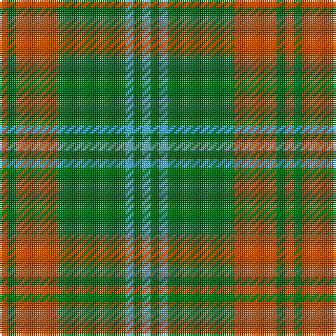

In pattern [RGRGYGY](/stripes/rgrgygy/).

This was sourced from tartans-authority.  It is a [7 stripe tartan](/stripes/stripes7/).

Original link http://www.tartansauthority.com/tartan-ferret/display/5536/

## Thread count
DO/4 G4 DO20 G32 B4 G4 B/4

## Palette
Each colour and its ΔE from the base-6 reference it is a variant of.

| Colour | Shade | Base | ΔE (OKLab) |
|---|---|---|---|
| B | <code style="background-color:#48A4C0;">#48A4C0</code> `#48A4C0` | Y <code style="background-color:#F2BF00;">#F2BF00</code> | 0.29 |
| DO | <code style="background-color:#B84C00;">#B84C00</code> `#B84C00` | R <code style="background-color:#CC0000;">#CC0000</code> | 0.08 |
| G | <code style="background-color:#006818;">#006818</code> `#006818` | G <code style="background-color:#006100;">#006100</code> | 0.02 |

# Sample pattern

## Nearest tartans

The nearest existing variants by ΔTartan distance.

1. [O'Neill Pipe Band 1983](/setts/s12/g1lg1g8o5g1o1g1o5g8lg1g1lg1~x4/) — ΔT 1.17
1. [Campbell & Co (Beauly) (Corporate)](/setts/s9/g4r5g31r5g31lo5g4lo27ly3~x2/) — ΔT 1.23
1. [Forget Family (Personal)](/setts/s6/g8lo1g8lo12r1lo1~x4/) — ΔT 1.25
1. [Lister (Name)](/setts/s7/dy8o29dy8ly3dy8o8ly3~x2/) — ΔT 1.35
1. [Maxwell Htg (Clan)](/setts/s7/g3r16g4k6g28r2g3~x2/) — ΔT 1.37
1. [North Dakota State University (Corp.](/setts/s6/lo11g5lo10g4g26lo4~x2/) — ΔT 1.44
1. [Daks, Tartan-Loden](/setts/s8/db3o7g2r2g14o2g2db3~x2/) — ΔT 1.46
1. [Romsdal](/setts/s5/g22dt5r4dt5r3~x2/) — ΔT 1.48
1. [Confederate Cavalry (Military)](/setts/s6/dg2y14dg8y3dg12lo2~x2/) — ΔT 1.50
1. [Scott Autumn (Fashion)](/setts/s7/dg16ly3dg14r16dg2r2dg3~x2/) — ΔT 1.53

## Neighbour map

Every grey dot is one of 14299 variants placed by the first two principal components of the ΔTartan feature space (44% of its variance). Red is this tartan; blue dots are its nearest — click one to open its page.

<svg viewBox="0 0 640 380" role="img" style="max-width:100%;height:auto;border:1px solid #e0e0e0;border-radius:4px;display:block" xmlns="http://www.w3.org/2000/svg"><image href="/nn/cloud.v1.png" width="640" height="380"/><a href="/setts/s12/g1lg1g8o5g1o1g1o5g8lg1g1lg1~x4/"><circle cx="378.6" cy="224.0" r="4" fill="#3465a4"><title>O'Neill Pipe Band 1983</title></circle></a><a href="/setts/s9/g4r5g31r5g31lo5g4lo27ly3~x2/"><circle cx="374.3" cy="212.1" r="4" fill="#3465a4"><title>Campbell &amp; Co (Beauly) (Corporate)</title></circle></a><a href="/setts/s6/g8lo1g8lo12r1lo1~x4/"><circle cx="375.3" cy="243.5" r="4" fill="#3465a4"><title>Forget Family (Personal)</title></circle></a><a href="/setts/s7/dy8o29dy8ly3dy8o8ly3~x2/"><circle cx="362.0" cy="233.6" r="4" fill="#3465a4"><title>Lister (Name)</title></circle></a><a href="/setts/s7/g3r16g4k6g28r2g3~x2/"><circle cx="420.1" cy="223.3" r="4" fill="#3465a4"><title>Maxwell Htg (Clan)</title></circle></a><a href="/setts/s6/lo11g5lo10g4g26lo4~x2/"><circle cx="345.8" cy="279.6" r="4" fill="#3465a4"><title>North Dakota State University (Corp.</title></circle></a><a href="/setts/s8/db3o7g2r2g14o2g2db3~x2/"><circle cx="304.8" cy="239.0" r="4" fill="#3465a4"><title>Daks, Tartan-Loden</title></circle></a><a href="/setts/s5/g22dt5r4dt5r3~x2/"><circle cx="342.0" cy="256.5" r="4" fill="#3465a4"><title>Romsdal</title></circle></a><a href="/setts/s6/dg2y14dg8y3dg12lo2~x2/"><circle cx="337.0" cy="273.8" r="4" fill="#3465a4"><title>Confederate Cavalry (Military)</title></circle></a><a href="/setts/s7/dg16ly3dg14r16dg2r2dg3~x2/"><circle cx="406.4" cy="262.3" r="4" fill="#3465a4"><title>Scott Autumn (Fashion)</title></circle></a><circle cx="369.1" cy="239.5" r="5" fill="#c00000"/></svg>

ID: /setts/s7/o1g1o5g8lg1g1lg1~x4/
