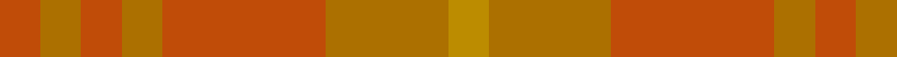
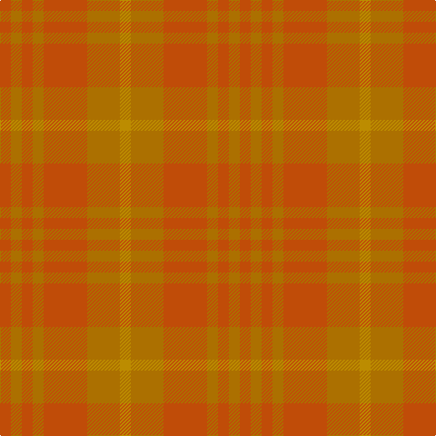

This page is one **sett** — a single exact thread-count. It belongs to the [tartan](/tartans/o1o1o1o1o4o3lo1/)
(the same proportion at any scale), whose colour order is pattern [RRRRRRY](/stripes/rrrrrry/).

Sourced from tartans-authority.  It is a [7 stripe tartan](/stripes/stripes7/).

Original link http://www.tartansauthority.com/tartan-ferret/display/8253/

## Thread count
DO/12 DYa12 DO12 DYa12 DO48 DYa36 DY/12

## Palette

Palette: <strong>Tartan Register</strong> <small style="color:#888">(1 of 3 colours)</small>
<table><thead><tr><th>Colour</th><th>Threads</th><th>Shade</th><th>Base</th><th>OKLCh</th></tr></thead><tbody><tr><td>DO/</td><td style="text-align:right;font-variant-numeric:tabular-nums">12</td><td><code style="background-color:#C04C08;">#C04C08</code> <small style="color:#888">#C04C08</small></td><td>R <code style="background-color:#CC0000;">#CC0000</code></td><td><small style="color:#888">oklch(56.4% 0.163 43.2)</small></td></tr><tr><td>DYa</td><td style="text-align:right;font-variant-numeric:tabular-nums">12</td><td><code style="background-color:#AC7000;">#AC7000</code> <small style="color:#888">#AC7000</small></td><td>R <code style="background-color:#CC0000;">#CC0000</code></td><td><small style="color:#888">oklch(59.4% 0.127 72.3)</small></td></tr><tr><td>DO</td><td style="text-align:right;font-variant-numeric:tabular-nums">12</td><td><code style="background-color:#C04C08;">#C04C08</code> <small style="color:#888">#C04C08</small></td><td>R <code style="background-color:#CC0000;">#CC0000</code></td><td><small style="color:#888">oklch(56.4% 0.163 43.2)</small></td></tr><tr><td>DYa</td><td style="text-align:right;font-variant-numeric:tabular-nums">12</td><td><code style="background-color:#AC7000;">#AC7000</code> <small style="color:#888">#AC7000</small></td><td>R <code style="background-color:#CC0000;">#CC0000</code></td><td><small style="color:#888">oklch(59.4% 0.127 72.3)</small></td></tr><tr><td>DO</td><td style="text-align:right;font-variant-numeric:tabular-nums">48</td><td><code style="background-color:#C04C08;">#C04C08</code> <small style="color:#888">#C04C08</small></td><td>R <code style="background-color:#CC0000;">#CC0000</code></td><td><small style="color:#888">oklch(56.4% 0.163 43.2)</small></td></tr><tr><td>DYa</td><td style="text-align:right;font-variant-numeric:tabular-nums">36</td><td><code style="background-color:#AC7000;">#AC7000</code> <small style="color:#888">#AC7000</small></td><td>R <code style="background-color:#CC0000;">#CC0000</code></td><td><small style="color:#888">oklch(59.4% 0.127 72.3)</small></td></tr><tr><td>DY/</td><td style="text-align:right;font-variant-numeric:tabular-nums">12</td><td><code style="background-color:#BC8C00;">#BC8C00</code> <small style="color:#888">#BC8C00</small></td><td>Y <code style="background-color:#F2BF00;">#F2BF00</code></td><td><small style="color:#888">oklch(66.8% 0.137 84.1)</small></td></tr></tbody></table>

# Sample pattern

## Nearest tartans

The nearest existing variants by ΔTartan distance, with this tartan at the top so the swatches line up against it.

ΔTartan

Tartan

Sett

—

<a href="/ttd/edit/#slug=o1o1o1o1o4o3lo1~x12">Burns' Birthplace (Commem)</a> <a class="nn-out" href="/setts/s7/o1o1o1o1o4o3lo1~x12/" title="open its dictionary page">↗</a>

2.49

<a href="/ttd/edit/#slug=r3o8r3o20o20o3o8o3~x2">Miyuki, House Check Tan, 1004A</a> <a class="nn-out" href="/setts/s8/r3o8r3o20o20o3o8o3~x2/" title="open its dictionary page">↗</a>

3.34

<a href="/ttd/edit/#slug=r1o2o1~x10">Glenmorangie, Check</a> <a class="nn-out" href="/setts/s3/r1o2o1~x10/" title="open its dictionary page">↗</a>

3.43

<a href="/ttd/edit/#slug=o12o6o2ly1~x4">Loch Garth</a> <a class="nn-out" href="/setts/s4/o12o6o2ly1~x4/" title="open its dictionary page">↗</a>

3.47

<a href="/ttd/edit/#slug=o6y2o29y29o2y6~x2">Harmony, 12</a> <a class="nn-out" href="/setts/s6/o6y2o29y29o2y6~x2/" title="open its dictionary page">↗</a>

3.93

<a href="/ttd/edit/#slug=y14n7lo6n2~x8">Outlander #3</a> <a class="nn-out" href="/setts/s4/y14n7lo6n2~x8/" title="open its dictionary page">↗</a>

3.98

<a href="/ttd/edit/#slug=r8n13r8r13r8">New Exeter Check (Fashion)</a> <a class="nn-out" href="/setts/s5/r8n13r8r13r8/" title="open its dictionary page">↗</a>

4.03

<a href="/ttd/edit/#slug=lo5n2y8n1y8n4y4n6y18lr1lo5~x2">Bute Heather, Ancient Wth'd (Fashion</a> <a class="nn-out" href="/setts/s11/lo5n2y8n1y8n4y4n6y18lr1lo5~x2/" title="open its dictionary page">↗</a>

4.17

<a href="/ttd/edit/#slug=dy6dg2dy29dg29dy2dg6~x2">Harmony 11 #2</a> <a class="nn-out" href="/setts/s6/dy6dg2dy29dg29dy2dg6~x2/" title="open its dictionary page">↗</a>

4.20

<a href="/ttd/edit/#slug=r5n35r46o5~x2">Bryce</a> <a class="nn-out" href="/setts/s4/r5n35r46o5~x2/" title="open its dictionary page">↗</a>

4.21

<a href="/ttd/edit/#slug=n7o1n6o8o1~x8">Callum (Buchan)</a> <a class="nn-out" href="/setts/s5/n7o1n6o8o1~x8/" title="open its dictionary page">↗</a>

## Neighbour map

Every grey dot is one of 14299 variants placed by the first two principal components of the ΔTartan feature space (44% of its variance). Red is this tartan; blue dots are its nearest — click one to open its page.

<svg viewBox="0 0 640 380" role="img" style="max-width:100%;height:auto;border:1px solid #e0e0e0;border-radius:4px;display:block" xmlns="http://www.w3.org/2000/svg"><image href="/nn/cloud.v1.png" width="640" height="380"/><a href="/setts/s8/r3o8r3o20o20o3o8o3~x2/"><circle cx="552.6" cy="366.0" r="4" fill="#3465a4"><title>Miyuki, House Check Tan, 1004A</title></circle></a><a href="/setts/s3/r1o2o1~x10/"><circle cx="417.1" cy="366.0" r="4" fill="#3465a4"><title>Glenmorangie, Check</title></circle></a><a href="/setts/s4/o12o6o2ly1~x4/"><circle cx="619.8" cy="354.9" r="4" fill="#3465a4"><title>Loch Garth</title></circle></a><a href="/setts/s6/o6y2o29y29o2y6~x2/"><circle cx="626.0" cy="360.1" r="4" fill="#3465a4"><title>Harmony, 12</title></circle></a><a href="/setts/s4/y14n7lo6n2~x8/"><circle cx="436.9" cy="366.0" r="4" fill="#3465a4"><title>Outlander #3</title></circle></a><a href="/setts/s5/r8n13r8r13r8/"><circle cx="422.1" cy="366.0" r="4" fill="#3465a4"><title>New Exeter Check (Fashion)</title></circle></a><a href="/setts/s11/lo5n2y8n1y8n4y4n6y18lr1lo5~x2/"><circle cx="559.6" cy="292.7" r="4" fill="#3465a4"><title>Bute Heather, Ancient Wth'd (Fashion</title></circle></a><a href="/setts/s6/dy6dg2dy29dg29dy2dg6~x2/"><circle cx="621.8" cy="366.0" r="4" fill="#3465a4"><title>Harmony 11 #2</title></circle></a><a href="/setts/s4/r5n35r46o5~x2/"><circle cx="529.3" cy="337.7" r="4" fill="#3465a4"><title>Bryce</title></circle></a><a href="/setts/s5/n7o1n6o8o1~x8/"><circle cx="375.2" cy="338.0" r="4" fill="#3465a4"><title>Callum (Buchan)</title></circle></a><circle cx="513.1" cy="366.0" r="5" fill="#c00000"/></svg>

ID: /setts/s7/o1o1o1o1o4o3lo1~x12/
