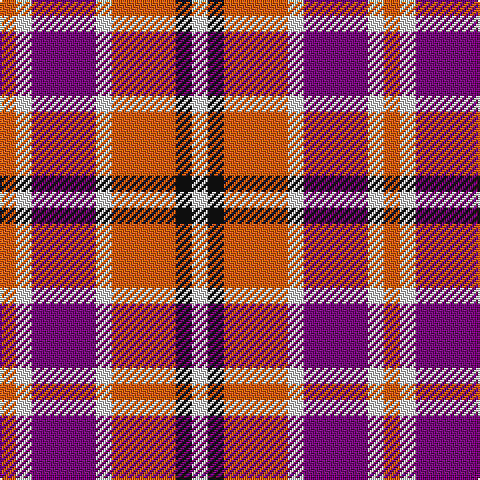

In pattern [RWBWRKW](/stripes/rwbwrkw/).

This was sourced from register-of-tartans.  It is a [7 stripe tartan](/stripes/stripes7/).

Original link https://www.tartanregister.gov.uk/tartanDetails.aspx?ref=4075

## Attestations

This cloth appears in 2 source records; the oldest owns this page.

- 01/09/2000 — Tartan Tangerine (register-of-tartans, [record](https://www.tartanregister.gov.uk/tartanDetails.aspx?ref=4075))
- 2000 — Tartan Tangerine (Corporate) (tartans-authority, [record](http://www.tartansauthority.com/tartan-ferret/display/4014/))

## Register references

External register numbers recorded for this tartan.

- Scottish Register of Tartans: [4075](https://www.tartanregister.gov.uk/tartanDetails.aspx?ref=4075)
- Scottish Tartans Authority (ITI): 4014
- Scottish Tartans World Register: 2731

## Thread count
O/8 LN8 P32 LN8 O32 K8 LN/8

## Palette
Each colour and the base-6 reference it is a variant of.

| Colour | Shade | Base |
|---|---|---|
| K | <code style="background-color:#101010;">#101010</code> `oklch(17.3% 0.000 89.9)` <small>#101010</small> | K <code style="background-color:#000000;">#000000</code> |
| LN | <code style="background-color:#E0E0E0;">#E0E0E0</code> `oklch(90.7% 0.000 89.9)` <small>#E0E0E0</small> | W <code style="background-color:#F7F7F7;">#F7F7F7</code> |
| O | <code style="background-color:#E86000;">#E86000</code> `oklch(65.3% 0.187 44.9)` <small>#E86000</small> | R <code style="background-color:#CC0000;">#CC0000</code> |
| P | <code style="background-color:#780078;">#780078</code> `oklch(40.2% 0.185 328.4)` <small>#780078</small> | B <code style="background-color:#2A418A;">#2A418A</code> |

# Sample pattern

## Nearest tartans

The nearest existing variants by ΔTartan distance.

1. [Culloden, Red (dress)](/setts/s8/g16p8r45w6p45w44p6w12/) — ΔT 1.17
1. [Brodie Dress](/setts/s5/k6r33k18w20db6~x2/) — ΔT 1.42
1. [Westgaard of Kileughterco (Personal)](/setts/s12/r15w7r10db7w3k3w3r8db5w3k3w3~x2/) — ΔT 1.54
1. [MacKintosh-Geddes (Personal?)](/setts/s7/dp2r4g12r3dp6r10w2~x2/) — ΔT 1.60
1. [Think Pink (ICF)](/setts/s5/k4db2lr13m13lb2~x4/) — ΔT 1.64
1. [Winnipeg Embroiders' Guild (Corp.)](/setts/s6/r12dt2ly2lb2dt4lb3~x2/) — ΔT 1.67
1. [Unidentified #41](/setts/s9/w6o1r4w1db4o1r8w1r2~x2/) — ΔT 1.67
1. [Aberdeen University (1992)](/setts/s5/ly4r27k12db15ly4~x2/) — ΔT 1.69
1. [Wallace Dress, Red (Dance)](/setts/s5/k3r28k10w28t3~x2/) — ΔT 1.71
1. [Banff](/setts/s7/o6ly3o20o20o3o3lb6~x2/) — ΔT 1.75

## Neighbour map

Every grey dot is one of 14299 variants placed by the first two principal components of the ΔTartan feature space (44% of its variance). Red is this tartan; blue dots are its nearest — click one to open its page.

<svg viewBox="0 0 640 380" role="img" style="max-width:100%;height:auto;border:1px solid #e0e0e0;border-radius:4px;display:block" xmlns="http://www.w3.org/2000/svg"><image href="/nn/cloud.v1.png" width="640" height="380"/><a href="/setts/s8/g16p8r45w6p45w44p6w12/"><circle cx="142.0" cy="179.8" r="4" fill="#3465a4"><title>Culloden, Red (dress)</title></circle></a><a href="/setts/s5/k6r33k18w20db6~x2/"><circle cx="136.0" cy="223.9" r="4" fill="#3465a4"><title>Brodie Dress</title></circle></a><a href="/setts/s12/r15w7r10db7w3k3w3r8db5w3k3w3~x2/"><circle cx="152.3" cy="186.5" r="4" fill="#3465a4"><title>Westgaard of Kileughterco (Personal)</title></circle></a><a href="/setts/s7/dp2r4g12r3dp6r10w2~x2/"><circle cx="201.3" cy="222.3" r="4" fill="#3465a4"><title>MacKintosh-Geddes (Personal?)</title></circle></a><a href="/setts/s5/k4db2lr13m13lb2~x4/"><circle cx="167.3" cy="202.0" r="4" fill="#3465a4"><title>Think Pink (ICF)</title></circle></a><a href="/setts/s6/r12dt2ly2lb2dt4lb3~x2/"><circle cx="221.6" cy="201.7" r="4" fill="#3465a4"><title>Winnipeg Embroiders' Guild (Corp.)</title></circle></a><a href="/setts/s9/w6o1r4w1db4o1r8w1r2~x2/"><circle cx="221.0" cy="167.9" r="4" fill="#3465a4"><title>Unidentified #41</title></circle></a><a href="/setts/s5/ly4r27k12db15ly4~x2/"><circle cx="188.0" cy="222.2" r="4" fill="#3465a4"><title>Aberdeen University (1992)</title></circle></a><a href="/setts/s5/k3r28k10w28t3~x2/"><circle cx="183.6" cy="185.9" r="4" fill="#3465a4"><title>Wallace Dress, Red (Dance)</title></circle></a><a href="/setts/s7/o6ly3o20o20o3o3lb6~x2/"><circle cx="248.2" cy="199.2" r="4" fill="#3465a4"><title>Banff</title></circle></a><circle cx="140.8" cy="209.3" r="5" fill="#c00000"/></svg>

ID: /setts/s7/o1w1dp4w1o4k1w1~x8/
